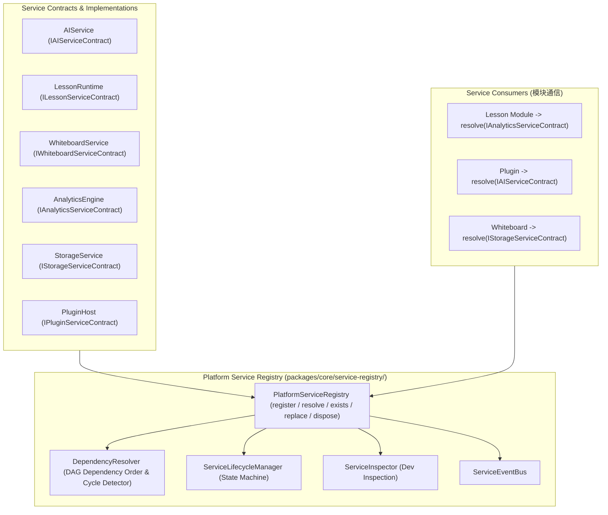

# OpenLearn Platform Service Registry Specification (平台服务注册中心规范)

## 1. Executive Summary (概述)

OpenLearn Platform Service Registry 位于 `packages/core/service-registry/` 目录下。该注册中心消除了业务模块（Lesson Engine、Whiteboard System、Analytics Engine、AI Subsystem、Plugin Host）之间的直接类依赖与代码耦合。所有模块统一注册解耦的 Service Contract，并通过统一注册中心解吸运行。

---

## 2. Service Architecture (Mermaid 架构图)

---

## 3. Service Scope Standard (服务作用域分类)

- **`Singleton`**: 全局单例服务（例：AI Provider Gateway、Database、StorageService）。
- **`Session`**: 课堂 Session 级别服务。
- **`Lesson`**: 特定课时与 Flow 运行期服务。
- **`Plugin`**: 插件激活生命周期服务。
- **`Transient`**: 每次请求重新实例化的短寿命服务。
