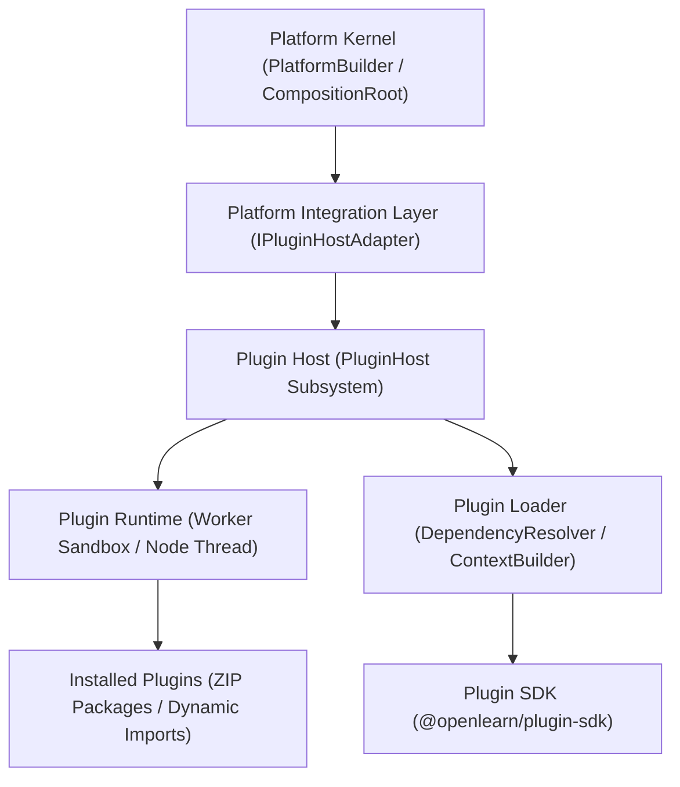

# OpenLearn Plugin Host Architecture Audit (插件宿主架构审计)

## 1. Executive Summary (概述)

本报告是对 OpenLearn V2 项目中现存插件宿主（Plugin Host，位于 `packages/core/plugin-host/` 及 `@openlearn/plugin-sdk`）的完整架构审计。

现存插件宿主采用了高性能 Worker Thread 进程隔离沙箱（Worker Sandbox）、顶层命令总线中间件（CommandBus Middleware）、独立命名空间（PluginNamespace）以及完整的插件贡献注册表（ContributionRegistry），具备优秀的扩展性与高可靠性。

---

## 2. Layered Architecture Topology (分层架构拓扑图)

---

## 3. Layer Responsibilities (各层核心职责分析)

1. **Integration Layer (`IPluginHostAdapter`)**:
   - 暴露给 Platform Kernel 的解耦接口，包括 `loadPlugin()`, `unloadPlugin()`, `health()`, `metadata()`。

2. **Plugin Host (`PluginHost`)**:
   - 负责插件宿主的中心化调度、插件注册表维持、看门狗熔断监控 (Watchdog & Circuit Breaker) 与 RPC 事件转发。

3. **Plugin Runtime (`PluginRuntime & WorkerSandbox`)**:
   - 独立 Worker Thread 进程沙箱，保障第三方插件崩溃或死循环时主服务端不宕机。

4. **Plugin Loader & Dependency Resolver (`PluginLoader & DependencyResolver`)**:
   - 负责 Manifest 校验、Topological Sort 拓扑依赖排序与依赖冲突检测。

5. **Plugin SDK & Context Builder (`packages/plugin-sdk/ & ContextBuilder`)**:
   - 注入受限的插件上线文（`PluginContext`），允许插件安全注册 Command、Event Listener、UI Slot 与 Storage。

6. **Installed Plugins (`packages/plugins/`)**:
   - 具体业务插件实体（如 Quiz Injector, Assignment Evaluator 等）。
