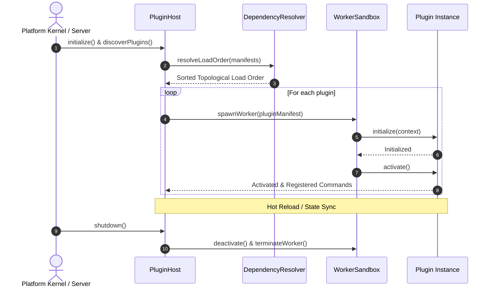

# OpenLearn Plugin Host Lifecycle Analysis (插件宿主生命周期分析报告)

## 1. Executive Summary (概述)

本报告详细分析 Plugin Host 及其托管插件的完整生命周期：发现 (Discovery)、清单加载 (Manifest Loading)、依赖拓扑解算 (Dependency Resolution)、初始化 (Initialization)、激活 (Activation)、停用 (Deactivation)、热重载 (Hot Reload) 以及关闭销毁 (Shutdown)。

---

## 2. Lifecycle Sequence Diagram (生命周期时序图)

---

## 3. Lifecycle Stages (生命周期各阶段详解)

1. **Discovery (发现)**: 扫描 `storage/plugins/` 目录与内置插件 ZIP 包。
2. **Manifest Loading (清单加载)**: 读取 `plugin.json`，校验 `id`, `name`, `version`, `permissions` 与 `contributions`。
3. **Dependency Resolution (依赖解算)**: 通过 `DependencyResolver` 计算 Directed Acyclic Graph (DAG) 拓扑排序，检测循环依赖。
4. **Initialization & Activation (初始化与激活)**: 启动 Worker 进程，构造隔离 `PluginContext` 并触发 `onActivate` 勾子。
5. **Hot Reload (热重载)**: 保存插件 `state` 快照，重新加载最新代码并恢复运行状态。
6. **Shutdown (关闭与销毁)**: 优雅关闭与资源清理。
