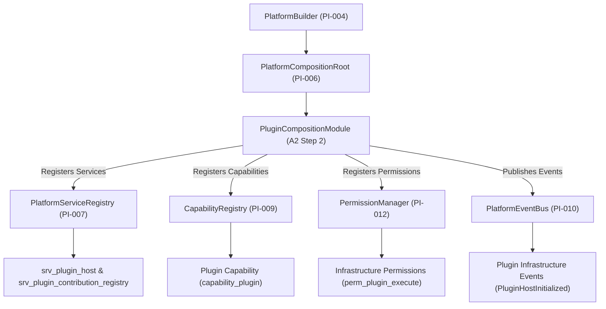

# OpenLearn Plugin Platform Integration Specification (插件平台集成规范)

## 1. Executive Summary (概述)

在 Platform Adoption Sprint A2 Step 2 中，成功实现了 **Plugin Host Integration**。本步骤通过引入 `PluginCompositionModule` (`packages/core/bootstrap/composition/plugin-composition-module.ts`)，成功将现有的 Plugin Host、Worker 隔离沙箱、UI 贡献注册表及插件生命周期事件挂载至 Platform Kernel 的生命周期，**在 100% 保留插件 Runtime、RPC 通信与 Manifest 格式前提下，完成了平台托管**。

---

## 2. Integration Architecture & Topology (Mermaid 平台集成架构图)

---

## 3. Registered Plugin Infrastructure Services & Capabilities (托管服务与能力清单)

- **Platform Services**: `srv_plugin_host`, `srv_plugin_contribution_registry`
- **Capability Registry**: `capability_plugin`
- **Infrastructure Permissions**: `perm_plugin_execute`, `perm_plugin_install`
- **Infrastructure Events**: `PluginHostInitialized`, `PluginLoaded`, `PluginActivated`
