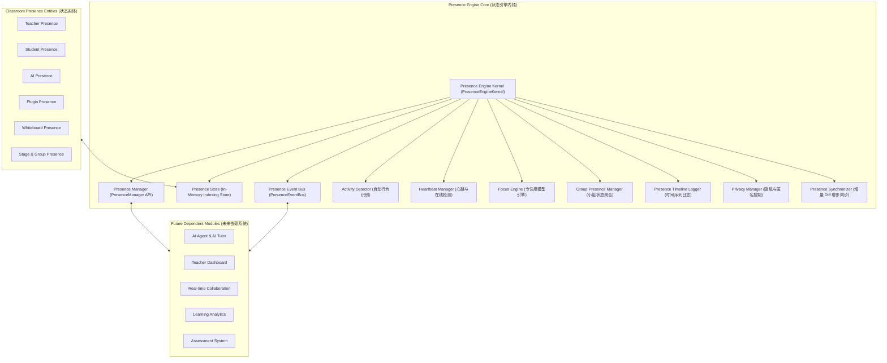

# OpenLearn Presence Engine Architecture & Design (课堂状态引擎架构设计)

## 1. Overview (概述)

OpenLearn Presence Engine（课堂状态引擎）是 OpenLearn 教学 OS 中统一的实时状态抽象与表达中枢。

系统确立了**“全员、全实体 Presence 建模”**的核心范式：
- 课堂中任何实体（**Teacher**, **Student**, **Assistant**, **AI**, **Plugin**, **Whiteboard**, **Teaching Object**, **Lesson**, **Stage**, **Group**）均拥有标准的 Presence 模型。
- 未来所有上层业务模块（**AI Agent**, **Teacher Dashboard**, **Collaboration**, **Learning Analytics**, **Assessment**）均统一建立在 Presence Engine 基础之上。

---

## 2. Presence Architecture (Mermaid 架构图)

---

## 3. Core System Subsystems (核心子系统职责)

1. **Presence Store**: 支持 1000+Presence 实体的超高性能内存索引存储，具备 Partial Diff 增量计算能力。
2. **Activity Detector**: 自动捕获鼠标移动、键盘输入、代码运行、白板绘制、Quiz 提交与讨论发言，无感自动更新实体活动与状态。
3. **Heartbeat Manager**: 维持师生、AI、插件统一心跳包，30 秒超时自动离线检测与重连处理。
4. **Focus Engine**: 维护 `Focused`, `Distracted`, `Inactive`, `Minimized`, `Background` 窗口专注度模型。
5. **Privacy Manager**: 强力保障数据安全，支持**匿名模式 (Anonymous Mode)**、**关闭采集 (Disable Collection)** 及数据留存周期管理。
6. **Presence Synchronizer**: 生成并应用 `PresenceDiff` 增量补丁，实现低带宽消耗的高频同步。
