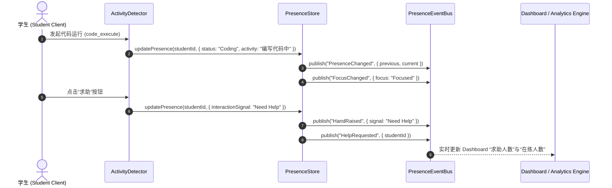

# OpenLearn Presence Event Specification (状态事件管道)

## 1. Overview (概述)

`PresenceEventBus` 提供了解耦的事件广播信道。当实体状态、专注度、举手互动或心跳发生变化时，事件总线即刻发布标准化事件包。

---

## 2. Presence Event Catalogue (事件清单)

| 事件名称 | 触发条件 | Payload 核心数据 |
|---|---|---|
| **`PresenceChanged`** | 任意实体字段发生变化 | `{ entityId, previous, current }` |
| **`StudentOnline`** | 学生首次上线或成功重连 | `{ studentId, timestamp }` |
| **`StudentOffline`** | 学生主动离线或心跳超时 | `{ studentId, timestamp }` |
| **`TeacherChanged`** | 教师教学状态变更 (教学/讲解/巡视) | `{ teacherId, newStatus, timestamp }` |
| **`PluginRunning`** | 插件开始运行、暂停或报错 | `{ pluginId, status, timestamp }` |
| **`FocusChanged`** | 实体应用窗口/焦点状态改变 | `{ entityId, focus, timestamp }` |
| **`HelpRequested`** | 学生发送求助信号 | `{ studentId, message, timestamp }` |
| **`HandRaised`** | 学生举手、表态 (同意/不同意) | `{ studentId, signal, timestamp }` |
| **`HeartbeatTimeout`** | 超过 30 秒无心跳信号 | `{ entityId, lastHeartbeat, timestamp }` |

---

## 3. Presence Event Flow (Mermaid 事件流图)

