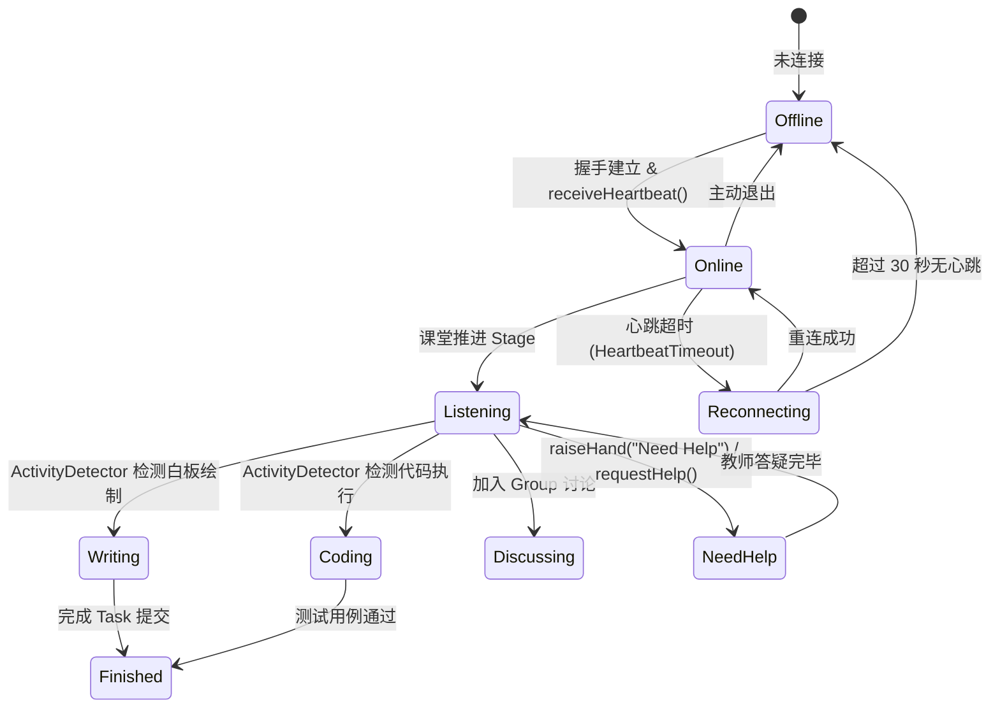

# OpenLearn Presence Entity Model & State Machine (状态实体模型)

## 1. Overview (概述)

Presence Model 定义了 OpenLearn 系统中所有实体的统一状态表达契约。每个 Presence Entity 均继承标准通用字段，并拓展特定实体的精细化状态机。

---

## 2. Standard Presence Entity Fields (统一标准字段)

```typescript
export interface PresenceEntity<TStatus extends string = EntityStatus> {
  readonly id: string;
  readonly type: EntityType;
  readonly status: TStatus;
  readonly activity: string;
  readonly focus: FocusState;
  readonly role: EntityRole;
  readonly permission: ReadonlyArray<string>;
  readonly lastActive: number;
  readonly lastHeartbeat: number;
  readonly connectionState: ConnectionState;
  readonly interactionSignal?: InteractionSignal;
  readonly device?: { readonly type: string; readonly os?: string; readonly browser?: string };
  readonly network?: { readonly latencyMs?: number; readonly quality?: 'good' | 'fair' | 'poor' };
  readonly location?: { readonly classroomId?: string; readonly seatNumber?: string };
  readonly metadata: Record<string, unknown>;
}
```

---

## 3. Entity Status Specifications (实体状态枚举)

### 3.1 教师状态 (Teacher Status)
`Preparing` (备课) | `Teaching` (授课中) | `Explaining` (讲解中) | `Writing` (板书中) | `Observing` (巡视观察) | `Reviewing` (批改作业) | `Answering` (答疑中) | `Discussing` (组织讨论) | `Waiting` (等待回应) | `Offline` (离线)

### 3.2 学生状态 (Student Status)
`Online` (在线) | `Offline` (离线) | `Reconnecting` (重连中) | `Idle` (空闲) | `Listening` (听讲中) | `Writing` (作答/书写中) | `Coding` (编写代码中) | `Answering` (回答问题中) | `Discussing` (小组讨论中) | `Watching` (观看视频/演示) | `Presenting` (上台演示中) | `Finished` (已完成任务) | `Need Help` (请求帮助) | `Away` (暂离)

### 3.3 AI 状态 (AI Status)
`Idle` (空闲待命) | `Thinking` (深度思考中) | `Generating` (生成内容中) | `Explaining` (AI 辅导讲解中) | `Evaluating` (AI 自动评测中) | `Waiting` (等待输入) | `Unavailable` (服务不可用)

### 3.4 插件与白板状态 (Plugin & Whiteboard Status)
- **Plugin**: `Loading` | `Running` | `Paused` | `Error` | `Finished`
- **Whiteboard**: `Editing` | `Presenting` | `Locked` | `ReadOnly` | `Collaborating`
- **Stage**: `Waiting` | `Running` | `Completed` | `Paused` | `Skipped`

---

## 4. Student Presence State Machine (Mermaid 状态机图)


