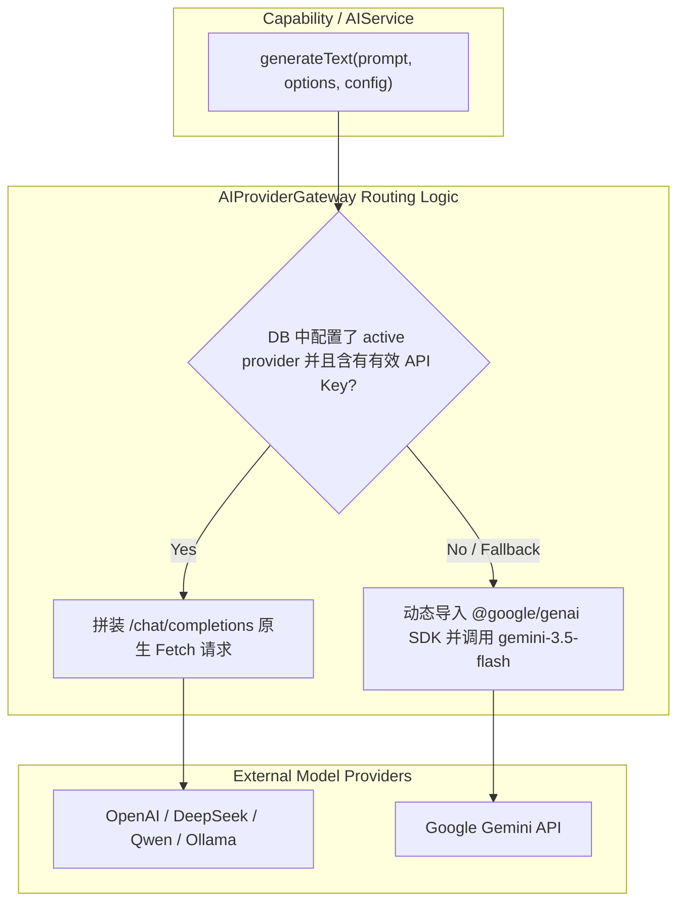

# OpenLearn Provider Gateway Specification (Provider 网关规范)

## 1. Overview (概述)

`AIProviderGateway` 是统一的 AI 模型路由网关，负责解决 DB 第三方 AI Provider 请求与环境变量 `GEMINI_API_KEY` 之间的路由、重试、日志记录与自动降级。

---

## 2. Gateway Flow (Mermaid 网关推演流向图)

---

## 3. Resilience & Telemetry (容错与监控)

1. **自动降级 (Automatic Fallback)**: 当 DB 指定的 AI Provider 返回 5xx 或网络超时错误时，网关将自动降级至系统 Gemini 兜底。
2. **统一日志 (Unified Telemetry)**: 每次网关调用的输入/输出长度、响应延时 (Latency) 和 Provider ID 均会自动输出至 `CapabilityLogger` 与 `AIEventBus` 中。
