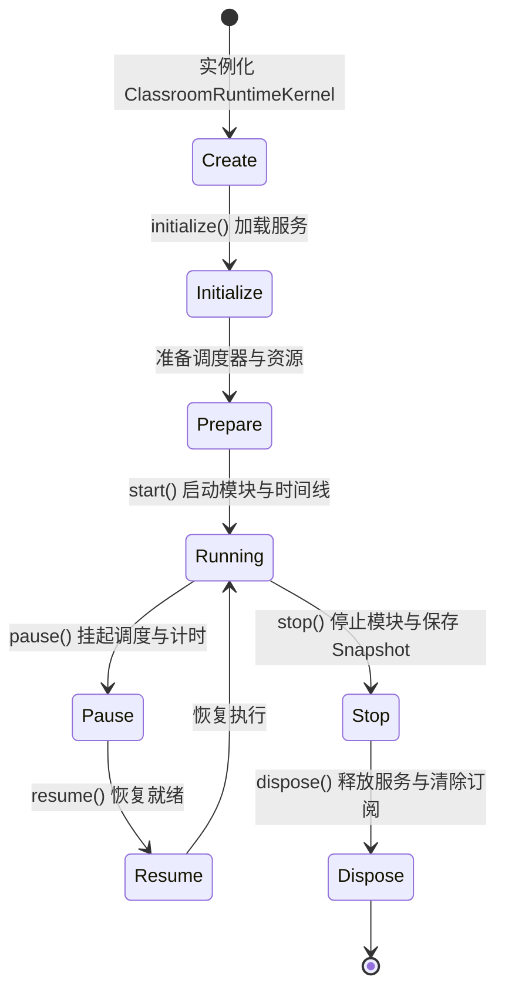

# OpenLearn Runtime Lifecycle Specification (运行时生命周期规范)

## 1. Overview (概述)

Classroom Runtime 拥有严密的生命周期状态机。从课堂实例的创建、初始化、准备、运行、暂停、恢复，直到停止与资源销毁，任何内核模块或第三方插件均可监听并响应生命周期转换事件。

---

## 2. Lifecycle State Machine (Mermaid 状态转换图)

---

## 3. Lifecycle Transitions & Hook Interceptors (转换契约与钩子)

| 阶段 | 触发方法 | 系统行为与钩子 |
|---|---|---|
| **Create** | `new ClassroomRuntimeKernel()` | 初始化 EventBus、StateManager、Registries |
| **Initialize** | `kernel.initialize()` | 依次调用所有 `IRuntimeService.initialize()` |
| **Prepare** | （自动转换） | 启动 `RuntimeScheduler` 任务处理循环 |
| **Running** | `kernel.start()` | 执行 `beforeLessonStart` 钩子 -> 启动所有 `IRuntimeModule.start()` -> 执行 `afterLessonStart` 钩子 -> 发布 `LessonStarted` |
| **Pause** | `kernel.pause()` | 挂起调度器，暂停计时，发布 `RuntimePaused` |
| **Resume** | `kernel.resume()` | 重新开启调度器，恢复运行状态 |
| **Stop** | `kernel.stop()` | 停止所有模块 -> 生成全局 Crash Recovery Snapshot |
| **Dispose** | `kernel.dispose()` | 释放所有服务，清空 Hooks 与 EventBus 监听 |
