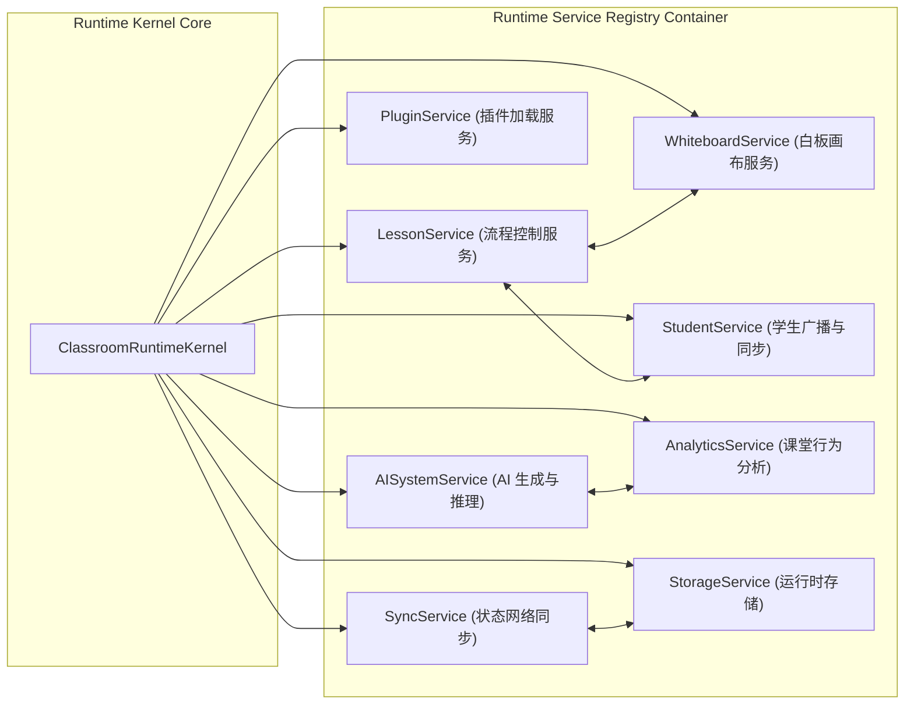

# OpenLearn Runtime Service Architecture (运行时服务中心规范)

## 1. Overview (概述)

`RuntimeServiceRegistry` 构成了 Classroom Runtime 的核心服务总线。所有内核级能力均抽象为标准服务接口，统一注册至 Runtime 容器中。

---

## 2. Runtime Service Graph (Mermaid 服务依赖关系图)



---

## 3. Standard Service Interface Contracts (标准服务契约)

全量服务继承自基础接口 `IRuntimeService`：

```typescript
export interface IRuntimeService {
  readonly serviceId: string;
  readonly name: string;
  initialize(context: RuntimeContextData): Promise<void>;
  dispose(): Promise<void>;
}
```

### 3.1 八大核心服务清单

1. **`LessonService`**: 驱动课堂启动、暂停、跳阶段等顶级流程。
2. **`WhiteboardService`**: 管理 Stage Canvas View 切换及 Teaching Object 增删改查。
3. **`StudentService`**: 维护在线学生列表，提供点对点与全员广播信道。
4. **`PluginService`**: 负责动态插件的生命周期装载与卸载。
5. **`AISystemService`**: 提供 AI Agent 文本生成、测验出题与实时辅导推理能力。
6. **`AnalyticsService`**: 实时收集学生互动行为，统计平均分与参与热度。
7. **`StorageService`**: 提供持久化 K-V 存储与崩溃状态暂存。
8. **`SyncService`**: 负责跨终端/WebSocket 状态同步与差异补丁推送。
