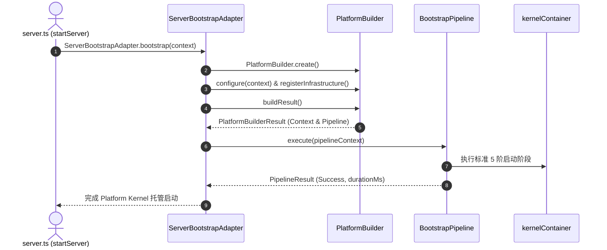

# OpenLearn Server Bootstrap Integration Specification (服务器启动集成规范)

## 1. Executive Summary (概述)

`ServerBootstrapAdapter` (`packages/core/bootstrap/adapter/`) 为平台启动过程提供了适配器模式 (Adapter Pattern) 集成方案。该适配器成功连接了 `server.ts` 入口、`PlatformBuilder` 及 `BootstrapPipeline` 启动管道，**在 100% 保持现有服务器与业务引擎初始化逻辑的前提下，实现了 Platform Kernel 统一启动托管**。

---

## 2. Server Bootstrap Sequence (Mermaid 时序与流向图)

---

## 3. Adapter Responsibilities (适配器职责)

1. **`ServerBootstrapAdapter`**: 连接 `server.ts` → `PlatformBuilder` → `BootstrapPipeline` → `Existing Startup Logic`。
2. **`StartupAdapterContext`**: 统一包装环境变量、配置参数、日志句柄、Express App、Socket.IO 及 `kernelContainer` 引用。
3. **`BootstrapRegistration`**: 抽象注册方法（`registerConfiguration()`, `registerLogger()`, `registerInfrastructure()`, `registerExistingBootstrapStages()`），避免重复侵入业务代码。
