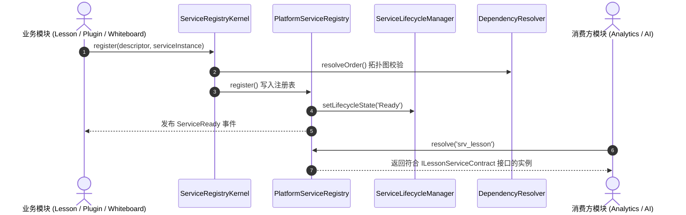

# OpenLearn Service Contract Specification (服务契约规范)

## 1. Executive Summary (概述)

为了切断 Lesson、Whiteboard、Analytics、Plugin 与 AI 模块之间的类实现硬耦合，平台定义了标准化的解耦 Service Contract。所有模块通过 Service Registry 进行依赖注入与服务解析。

---

## 2. Registry Flow (Mermaid 注册与服务解析流程图)

---

## 3. Core Standard Contracts (标准服务契约矩阵)

- **`IAIServiceContract`**: `generateText(prompt, options)`
- **`ILessonServiceContract`**: `getLesson(lessonId)`, `createLesson(title, subject)`
- **`IWhiteboardServiceContract`**: `getElements(whiteboardId)`, `createElement(whiteboardId, elementData)`
- **`IAnalyticsServiceContract`**: `getMetrics()`, `publishEvent(eventType, payload)`
- **`IStorageServiceContract`**: `readFile(path)`, `writeFile(path, content)`
- **`IPluginServiceContract`**: `getActivePlugins()`
- **`IRuntimeServiceContract`**: `getSessionState()`
