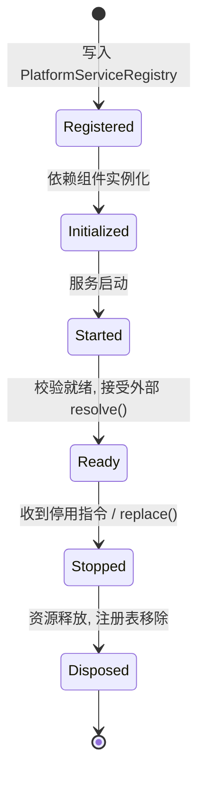

# OpenLearn Service Lifecycle Specification (服务生命周期规范)

## 1. Executive Summary (概述)

`ServiceLifecycleManager` 负责管理服务实例从注册到销毁的完整生命周期，状态机包括：`Registered` → `Initialized` → `Started` → `Ready` → `Stopped` → `Disposed`。

---

## 2. Lifecycle State Machine (Mermaid 生命周期状态机图)



---

## 3. Dev Inspection (Service Inspector)

开发者可以通过 `ServiceInspector` 实时查看当前已注册服务的状态：

```typescript
const inspectionList = kernel.platformServiceRegistryKernel.inspect();
console.log(inspectionList);
// 输出所有服务 ID、Namespace、Scope、LifecycleState 与依赖关系
```
