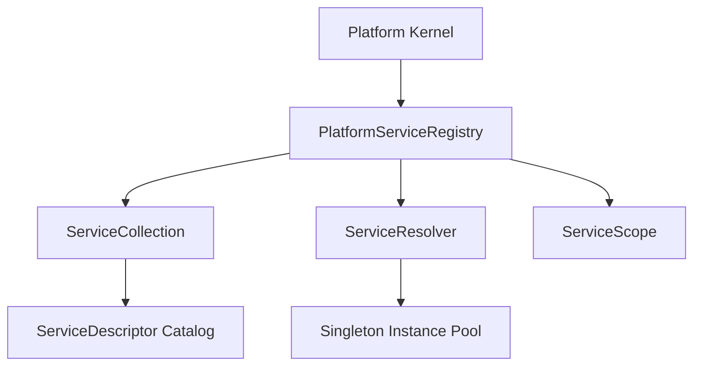

# OpenLearn Platform Service Registry Specification (服务注册表规范)

## 1. Executive Summary (概述)

在 Platform Kernel Increment PI-007 中，实现了 `PlatformServiceRegistry` (`packages/core/service-registry/`)。`PlatformServiceRegistry` 是平台基础设施的核心服务注册表，负责注册、解析、查询与检索服务描述符及实例。

**核心规约：Service Registry 仅负责服务元数据管理与查找（Lookup），绝对不作为自动依赖注入 (DI) 容器，绝对不包含复杂的自动依赖树构建或构造函数自动注入逻辑**。

---

## 2. Service Registry Architecture (Mermaid 架构图)

---

## 3. Service Lifetime Support (服务生命周期类型)

- **`Singleton`**: 平台全期唯一单例（仅产生一次实例并在整个 Kernel 生命周期复用）。
- **`Scoped`**: 会话或局部 Scope 作用域单例（依托 `ServiceScope` 隔离）。
- **`Transient`**: 瞬态服务（每次调用 `resolve()` 时产生新实例）。

---

## 4. API Capabilities (功能清单)

- `register<T>(descriptor, instance?)`: 注册服务描述符与可选静态实例
- `unregister(serviceId)`: 取消注册并清除缓存实例
- `replace<T>(serviceId, instance)`: 替换指定服务的静态实例
- `resolve<T>(serviceId, scope?)`: 解析并返回服务实例
- `tryResolve<T>(serviceId, scope?)`: 安全解析服务实例，失败时返回 `undefined`
- `resolveAll()`: 批量解析并返回当前所有有效服务实例列表
- `exists(serviceId)`: 检查服务是否已注册
- `list()`: 获取所有已注册的服务描述符清单
- `validate()`: 检查结构化校验（端口、重复注册、缺省实现等）
- `clear()`: 清空注册表
