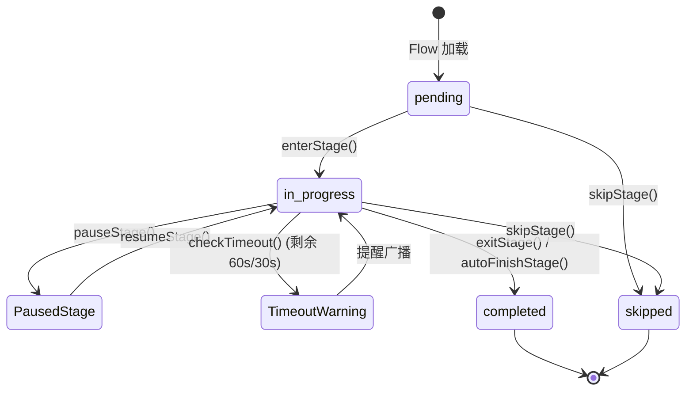

# OpenLearn Stage Lifecycle & Runtime Specification (教学阶段生命周期)

## 1. Overview (概述)

`StageRuntime` 负责管理单个教学阶段 (Stage) 的执行生命周期、自动化定时器告警以及过程性课堂数据评估 (Stage Analytics)。

白板系统不再独立管理 Page，而是绑定在 Stage 级别的 `Stage Canvas View` 上。

---

## 2. Stage Lifecycle & State Transitions (生命周期转换)

Stage 的生命周期包含 4 个核心状态：
- **`pending`**: 未开始
- **`in_progress`**: 正在进行中
- **`completed`**: 已完成
- **`skipped`**: 已跳过



---

## 3. Stage Analytics & Assessment (阶段评估数据)

每个 Stage 在执行过程中均实时追踪并计算 6 大维度评估数据：

| 数据指标 | 类型/范围 | 计算规则与含义 |
|---|---|---|
| **Completion Rate (完成率)** | `0 - 100%` | 已完成 Activity 数量 / Stage 内总 Activity 数量 |
| **Participant Count (参与人数)** | `number` | 在该 Stage 内产生过互动行为的独立学生数 |
| **Elapsed Time (耗时)** | `seconds` | 该 Stage 实际处于 `in_progress` 状态的累积时间 |
| **Interaction Count (互动次数)** | `number` | 学生答题、提问、提交、讨论及点赞的总次数 |
| **Quiz Scores (Quiz 成绩)** | `Array<Score>` | 该 Stage 内随堂测验的即时得分分布 |
| **Discussion Heat (讨论热度)** | `0 - 100` | 基于近 5 分钟学生发言频率加权计算的课堂活跃指数 |

---

## 4. Whiteboard Stage View & Cross-Stage Object Sharing (白板阶段视图与对象共享)

`WhiteboardStageAdapter` 实现了 Stage 与 Canvas 视图的直接关联：
1. **独立 Canvas (Independent Canvas)**: 每一个 Stage 拥有独立的 Canvas 视角与元素集。
2. **跨阶段共享 (Cross-Stage Sharing)**: 支持将重点公式、图表或教师笔记设定为 `isShared`，使其在指定的多个 Stage 间无缝共享与同步更新。

```typescript
// 跨阶段共享 API 示例
whiteboardAdapter.shareObjectAcrossStages(element, ['stg_learn_1', 'stg_summary_1']);
```
