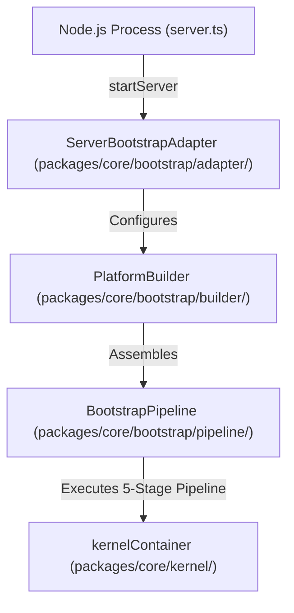

# OpenLearn Startup Architecture Specification (启动架构规范)

## 1. Executive Summary (概述)

本文档定义了 OpenLearn v2 平台的最终启动架构，描述了从 Node.js 进程启动到 `ServerBootstrapAdapter`，再到 `PlatformBuilder` 与 `BootstrapPipeline` 的完整链条。

---

## 2. Platform Startup Flow (Mermaid 启动流程图)

