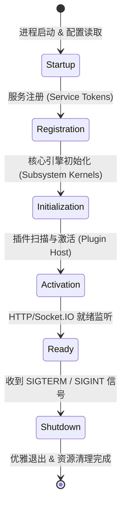
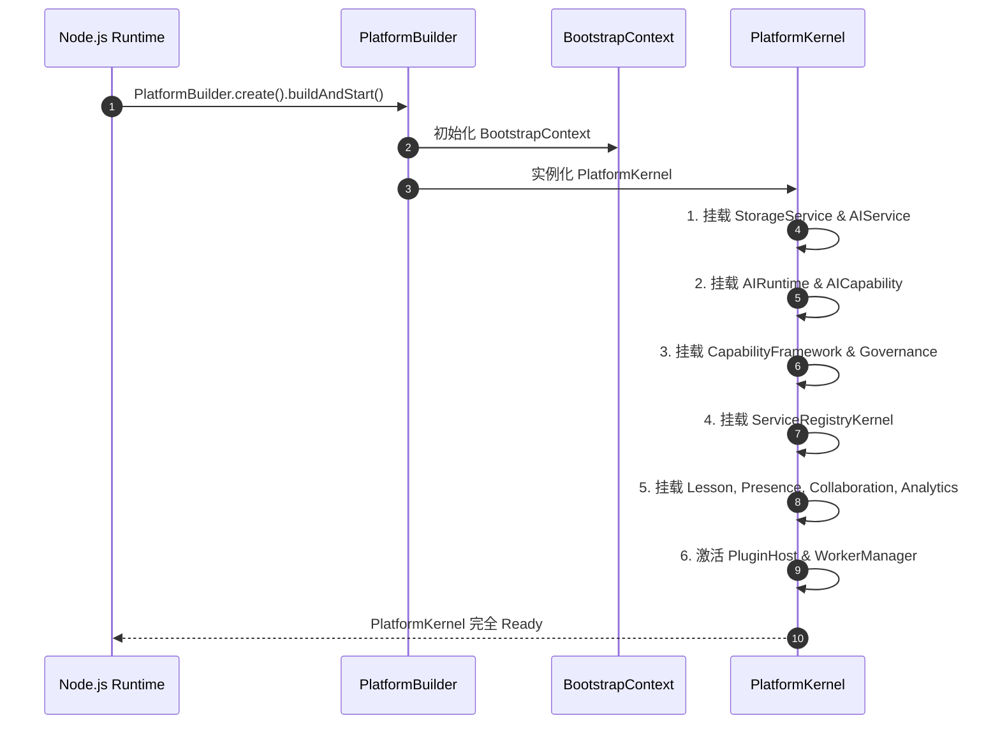

# OpenLearn Startup Lifecycle Specification (平台启动生命周期规范)

## 1. Executive Summary (概述)

本规范详尽定义了平台从进程启动（Startup）到关机回收（Shutdown）的完整生命周期状态机与时序控制图。

---

## 2. Platform Lifecycle State Machine (Mermaid 平台生命周期状态机图)

---

## 3. Detailed Startup Sequence (Mermaid 启动时序图)

