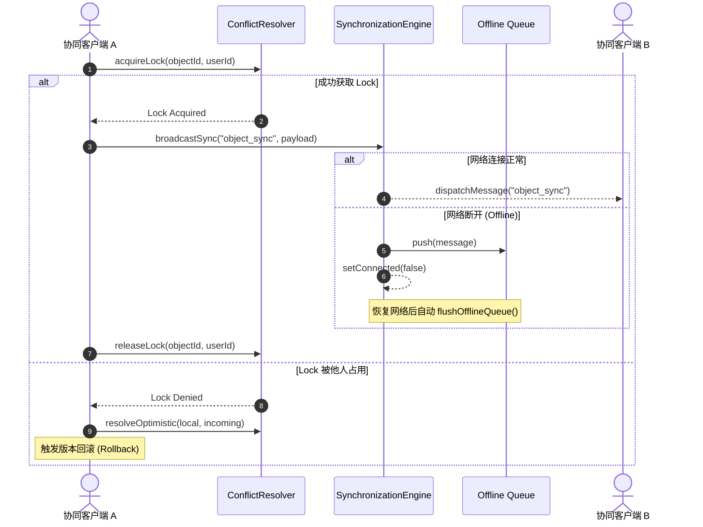

# OpenLearn Synchronization Engine & Conflict Resolution (同步引擎与冲突解决)

## 1. Overview (概述)

`SynchronizationEngine` 与 `ConflictResolver` 构成了协同引擎的数据传输与冲突仲裁通道。系统支持 6 层分级同步、对象级协同锁 (Object Lock)、乐观更新与版本推演，并预留了未来 CRDT 接口扩展。

---

## 2. Synchronization Flow (Mermaid 同步流程图)

---

## 3. Multi-Layered Synchronization (多层级同步)

1. **`object_sync`**: 白板元素、图片、公式、代码块变动同步。
2. **`selection_sync`**: 协同选择框与高亮显示。
3. **`viewport_sync`**: 教师视角聚焦与平移缩放同步。
4. **`pointer_sync`**: 实时鼠标轨迹与激光笔同步。
5. **`stage_sync`**: 教学阶段全员同步切换。
6. **`lesson_sync`**: 全局课堂状态与流程同步。

---

## 4. Conflict Resolution & Offline Recovery (冲突解决与离线恢复)

- **Object Locking (对象锁)**: 协同编辑特定元素时自动申请 TTL 对象锁，防止并发覆盖。
- **Optimistic Update & Versioning (乐观更新与版本推演)**: 客户端即时响应本地编辑，服务端按版本递增（Version Increment）推演，高版本胜出，低版本触发 Rollback。
- **Offline Queue (离线队列)**: 网络波动或断网期间发起的同步消息自动进入离线队列，网络重连 (`reconnect`) 后自动按序 Flush 恢复。
