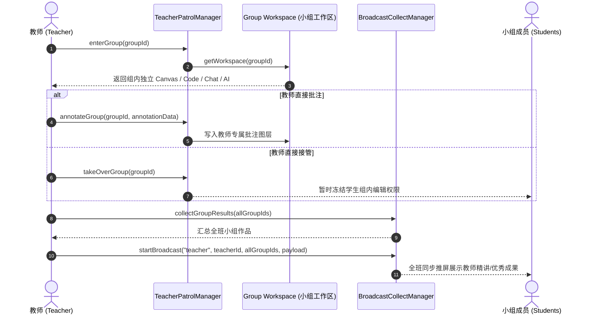

# OpenLearn Teacher Patrol & Control System (教师巡视与实时控制)

## 1. Overview (概述)

`TeacherPatrolManager` 与 `BroadcastCollectManager` 赋能教师对课堂分组协作的无死角观察与最高干预能力。教师可以随时巡视任意小组、批注学生作品、接管组内操作，或者将教师视角/特定优秀成果一键广播至全班。

---

## 2. Teacher Patrol Flow (Mermaid 巡视流程图)

---

## 3. Teacher Control Commands (教师操控指令)

- **`lockStudent(studentId)` / `unlockStudent(studentId)`**: 锁定或解锁单一学生的编辑权限。
- **`freezeWhiteboard()` / `recoverWhiteboard()`**: 一键冻结全班白板（切换至 `Teacher Review` 模式）或恢复协同。
- **`enterGroup(groupId)`**: 接入指定小组的音视频与沙箱工作区视角。
- **`takeOverGroup(groupId)`**: 接管小组编辑主导权。
- **`collectGroupResults(groupIds)`**: 自动收集并聚合所有小组的白板、代码、Quiz 及讨论记录。
- **`startBroadcast(...)`**: 将教师画面、特定小组成果或示范 Object 一键广播推屏给所有小组。
