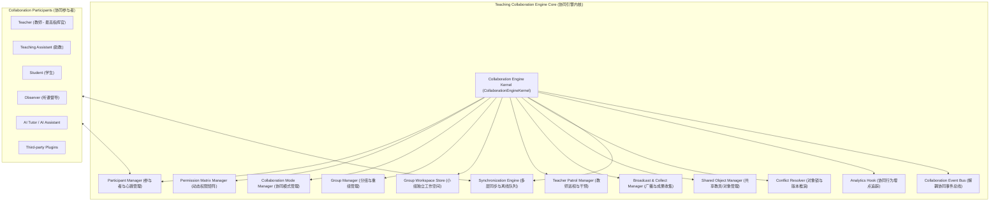

# OpenLearn Teaching Collaboration Engine Architecture & Design (教学协同引擎架构设计)

## 1. Overview (概述)

OpenLearn Teaching Collaboration Engine（教学协同引擎）是 OpenLearn 教学 OS 中统一的实时协同与流程管控中枢。

与普通多人协同工具不同，系统确立了**“以教师为中心、以课堂流程为核心 (Teacher Orchestrated Collaboration)”** 的控制范式：
- 教师始终拥有最高流程控制权与最高权限矩阵调配权。
- 学生的协作行为（如白板编辑、代码编写、测验提交、分组研讨）必须严格受当前教学模式与课堂流程约束。
- 未来所有参与者（**Teacher**, **Assistant**, **Student**, **Observer**, **AI**, **Plugin**）均统一通过 Collaboration Engine 实现受控协同。

---

## 2. Collaboration Architecture (Mermaid 架构图)

---

## 3. Collaboration Modes (协同模式切换)

系统保证在任意时刻**有且仅有一种协同模式处于 Active 状态**：

| 协同模式 | 核心行为 | 学生白板权限 |
|---|---|---|
| **`Teacher Presentation`** | 教师单向演示与讲授 | ReadOnly (仅允许观看) |
| **`Teacher + Student`** | 师生互动板书与协同问答 | ReadWrite (受控编辑) |
| **`Student Independent`** | 学生独立思考与练习 | ReadWrite (独立空间) |
| **`Small Group`** | 分组研讨与小组协作 | ReadWrite (组内共享) |
| **`Whole Class`** | 全班大串联协同创作 | ReadWrite (全班共享) |
| **`Teacher Review`** | 教师集中点评与作品展示 | ReadOnly (冻结编辑) |
| **`AI Assisted`** | AI 加入小组辅助思考 | ReadWrite (AI 助教联动) |
