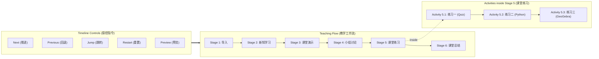

# OpenLearn Teaching Timeline Engine (教学时间线引擎)

## 1. Overview (概述)

`TeachingTimeline` 是 Lesson Flow Engine 中驱动课堂推进的时间基准与导航内核。课堂不再是静态的页面跳转，而是沿着时间线线型/非线性推进的动态流。

时间线引擎兼具**精确计时**与**全员实时同步**能力，确保师生端在不同设备上时刻保持毫秒级步调一致。

---

## 2. Timeline Core Mechanics (时间线核心机制)

教学时间线维护双重时间维度：
1. **Total Elapsed Time (课堂总用时)**: 从课堂开启起累积的总秒数。
2. **Stage Elapsed Time (阶段用时)**: 当前 Stage 进入后的持续秒数。

线型导航遵循 `Stage -> Activity` 双层逻辑结构：
- **`next()`**: 优先推进至当前 Stage 的下一个 Activity；若为最后一个 Activity，则切入下一个 Stage 的第一个 Activity。
- **`previous()`**: 优先回退至当前 Stage 的上一个 Activity；若为第一个 Activity，则回退至上一个 Stage 的末尾 Activity。
- **`jump(stageTarget, activityTarget?)`**: 非线型直接跳转至指定的 Stage 或 Activity。
- **`restart()`**: 将时间线与活动状态归零重置。
- **`preview(stageIndex)`**: 切换至预览模式，教师可提前查看后续 Stage 内容而不触发学生端的实时跳转广播。

---

## 3. Lesson Timeline Navigation (Mermaid 时间线流程图)



---

## 4. Real-time Synchronization (实时同步协议)

每当 Timeline 发生位置变更，引擎均自动向事件总线广播 `StudentSynced` 协议包：

```typescript
export interface StudentSyncedPayload {
  lessonId: string;
  studentId: string; // '*' 代表全员广播
  stageId: string;
  activityId?: string;
  timestamp: number;
}
```

学生端广播接收器根据该协议包驱动 React UI 视图平滑过渡，确保师生画面完全同屏同步。
