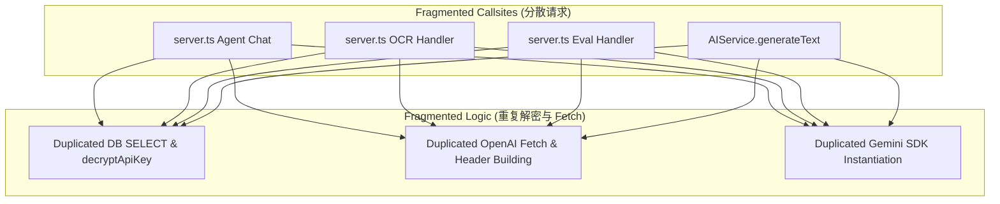
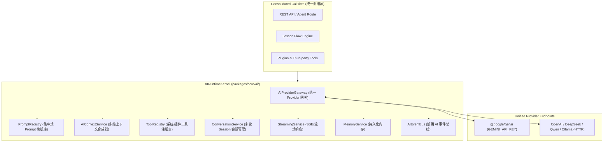

# OpenLearn Unified AI Architecture Specification (统一 AI 基础设施架构规范)

## 1. Overview (概述)

OpenLearn 统一 AI 基础设施（Unified AI Infrastructure）位于 `packages/core/ai/` 目录下。系统将 Provider 网关、Prompt 注册表、Context 服务、Tool 注册表、Conversation 会话服务、Streaming 服务、Memory 存储及 AI 事件总线统一集成于 `AIRuntimeKernel` 主控内核。

---

## 2. Current vs. Target Architecture Comparison (前后架构对比)

### 2.1 固有离散架构 (Current Legacy Architecture)

---

### 2.2 统一目标架构 (Target Unified Architecture)

---

## 3. Core Architecture Subsystems (核心子系统职责)

1. **`AIProviderGateway`**: 消除全局 4 处重复的 Provider 查询与 Fetch 逻辑，统一处理 OpenAI 兼容 HTTP 请求与 Gemini SDK 兜底。
2. **`PromptRegistry`**: 集中收拢所有 Agent 提示词、教学流程提示词、Quiz 生成提示词、OCR 提示词与评估提示词，支持模版插值。
3. **`AIContextService`**: 聚合 Teacher、Student、Lesson、Stage、Whiteboard 及 Analytics 上下文片段，合成标准化 AI 提示语。
4. **`ToolRegistry`**: 自动包装系统 Action 与插件工具，导出 OpenAI `function` 及 Gemini `tool` Schema。
5. **`ConversationService`**: 维护多轮对话历史记录、上下文窗口及 Tool 执行轨迹。
6. **`AIRuntimeKernel`**: Master 主控内核，连接所有子系统并暴露统一基础设施 API。
