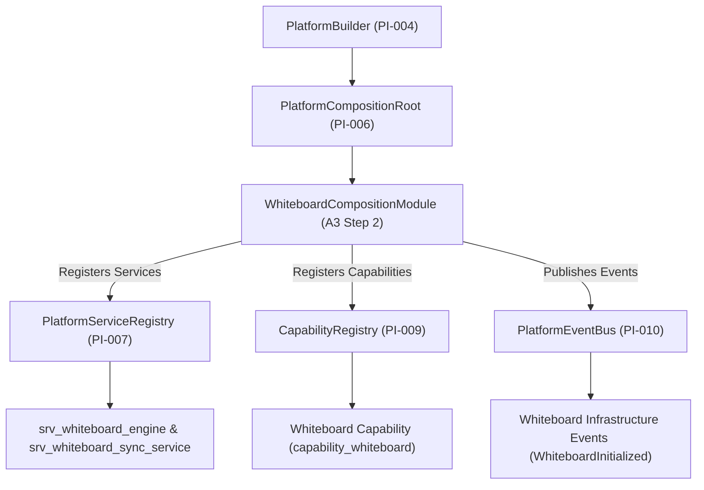

# OpenLearn Whiteboard Platform Integration Specification (白板平台集成规范)

## 1. Executive Summary (概述)

在 Platform Adoption Sprint A3 Step 2 中，成功实现了 **Whiteboard Runtime Integration**。本步骤通过引入 `WhiteboardCompositionModule` (`packages/core/bootstrap/composition/whiteboard-composition-module.ts`)，成功将现有的 Whiteboard Runtime、Konva 2D 画布渲染引擎与基础设施事件挂载至 Platform Kernel 的生命周期，**在 100% 保留 Konva 绘图、历史栈与 Socket.IO 协同广播机制前提下，完成了平台托管**。

---

## 2. Integration Architecture & Topology (Mermaid 平台集成架构图)

---

## 3. Registered Whiteboard Infrastructure Services & Capabilities (托管服务与能力清单)

- **Platform Services**: `srv_whiteboard_engine`, `srv_whiteboard_sync_service`
- **Capability Registry**: `capability_whiteboard`
- **Infrastructure Events**: `WhiteboardInitialized`, `RendererStarted`, `ToolRegistered`, `CanvasReady`
