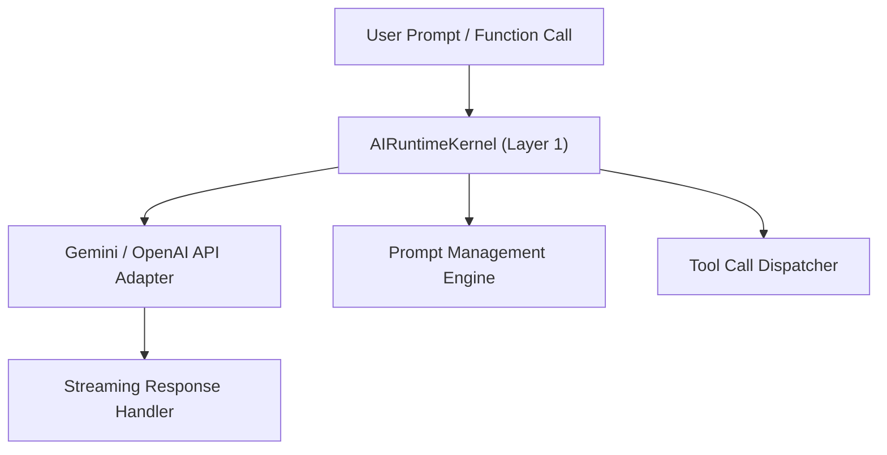

# AI Runtime Kernel 内核

`AIRuntimeKernel` 位于 `packages/core/ai/`，是 OpenLearn V2 的大语言模型（LLM）调度与 Prompt 管理内核。

---

## 核心架构与功能



### 1. 模型适配与流式响应
原生集成 `@google/genai` (Google GenAI SDK)，支持 Gemini 2.5/3.0 及 OpenAI 协议兼容模型的流式输出（Server-Sent Events / Socket.IO 流）。

### 2. Prompt 注册表管理
提供强类型的 Prompt 模板管理与上下文变量插值：

```typescript
const systemPrompt = aiRuntime.formatPrompt('ai-teacher-system', {
  teacherName: '张老师',
  subject: '数学',
});
```

---

## 依赖注入 Token

使用 `IAIServiceToken` 可在任何服务或插件中注入并调用 AI 能力：

```typescript
import { IAIServiceToken } from '@openlearn/plugin-sdk';

const aiService = ctx.resolve(IAIServiceToken);
const response = await aiService.generateCompletion({
  prompt: '解释勾股定理的原理',
});
```
