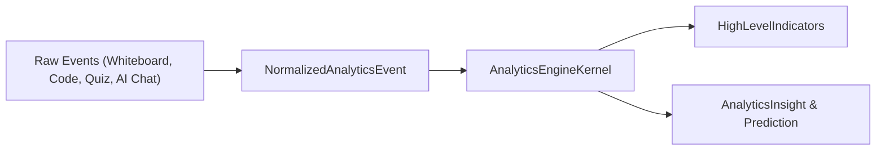

# Learning Analytics Engine 学习分析引擎

`AnalyticsEngineKernel` 位于 `packages/core/analytics-engine/`，负责多源教学数据的采集、规格归一化、高阶指标计算与学习洞察生成。

---

## 核心数据流



---

## 模型与指标 Schema (`analytics-engine/index.ts`)

平台定义了多维度的分析模型：

- **StudentAnalyticsModel**: 学生个人的参与度、正确率与学习曲线。
- **GroupAnalyticsModel**: 小组协作密度、对象锁定频次与讨论活跃度。
- **LessonAnalyticsModel**: 课程各阶段的时间消耗与互动比例。
- **AnalyticsInsight**: 学习预警与个性化教学建议。

```typescript
export interface HighLevelIndicators {
  engagementRate: number;   // 课堂参与率 (0~100%)
  collaborationIndex: number; // 协作指数
  masteryScore: number;       // 知识点掌握度得分
}
```
