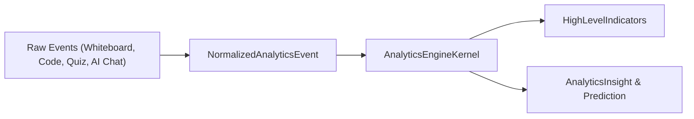

# Learning Analytics Engine 学习分析引擎

`AnalyticsEngineKernel` 位于 `packages/core/analytics-engine/`，负责多源教学数据的采集、规格归一化、高阶指标计算与学习洞察生成。全部模型与指标类型定义在 `packages/core/analytics-engine/types.ts`；该包的 `index.ts` 只是 `export *` 的 barrel，不重复定义。

---

## 核心数据流


```mermaid
graph LR
    A["Raw Events (Whiteboard, Code, Quiz, AI Chat)"] --> B["NormalizedAnalyticsEvent"]
    B --> C["AnalyticsEngineKernel"]
    C --> D["HighLevelIndicators"]
    C --> E["AnalyticsInsight & Prediction"]
```

---

## 模型与指标 Schema (`analytics-engine/types.ts`)

平台定义了多维度的分析模型：

- **StudentAnalyticsModel**: 学生个人的参与度、正确率与学习曲线。
- **GroupAnalyticsModel**: 小组协作密度、对象锁定频次与讨论活跃度。
- **LessonAnalyticsModel**: 课程各阶段的时间消耗与互动比例。
- **AnalyticsInsight**: 学习预警与个性化教学建议。

`HighLevelIndicators` 含 **8 个指标字段 + 1 个 `timestamp`**，全部为 `readonly`：

```typescript
export interface HighLevelIndicators {
  readonly participationIndex: number; // 课堂参与度指数 (0~100)
  readonly focusIndex: number; // 专注度指数 (0~100)
  readonly paceIndex: number; // 课堂节奏指数 (0~100)
  readonly collaborationIndex: number; // 协作指数 (0~100)
  readonly thinkingActivityIndex: number; // 思维活动指数 (0~100)
  readonly knowledgeMasteryIndex: number; // 知识掌握度指数 (0~100)
  readonly teacherPatrolIndex: number; // 教师巡查指数 (0~100)
  readonly aiAssistanceIndex: number; // AI 辅助指数 (0~100)
  readonly timestamp: number; // 采样时间戳
}
```

> 同文件另有 `StudentTrajectoryPoint`（学习轨迹点）、`WhiteboardAnalyticsModel`（白板热力图模型）、`PredictionResult`（预测结果）等类型。
> 完整定义见 `packages/core/analytics-engine/types.ts` 的 `HighLevelIndicators`。
