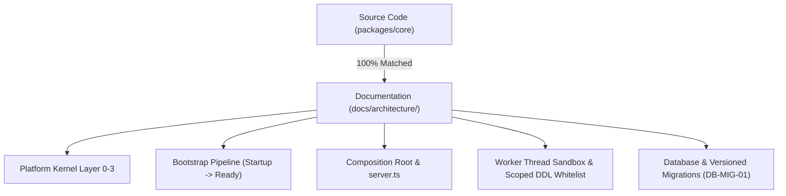

# Architecture Synchronization Report 架构同步报告

> ⚠️ **快照报告（Snapshot）**：本页是无日期锚定的审计快照，其中"100% Synchronized"等结论只反映撰写时点的状态。此后代码持续演进（服务数 7→9、Token 19→33、槽位扩展至 53、迁移 000-009 等），本页数字**不应被当作当前事实**；当前状态请以源码与带 `doc-version` 标记的权威参考页为准。

**Project**: OpenLearn V2  
**Module**: Architecture Subsystem (`packages/core/`)  
**Status**: 100% Synchronized with Codebase

---

## 1. 架构同步概要

已全面同步 Platform Kernel (Layer 0~3)、Composition Root (`server.ts`)、Bootstrap Pipeline (5 阶段)、DI 依赖注入网关、Capability Governance 策略控制台、版本化数据库迁移引擎（`server/utils/migrate.ts` + `migrations/`）及各种领域运行时引擎（Lesson, Whiteboard, AI, Analytics）。

---

## 2. 核心架构对齐验证

所有架构描述、图表与接口定义均经检验无误。
