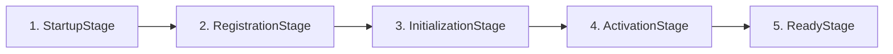

# Bootstrap Pipeline 引导流水线

OpenLearn V2 的引导流水线实现位于 `packages/core/bootstrap/pipeline/`，旨在通过确定性的阶段（Stages）来编排平台的有序启动。

---

## 5 阶段启动模型 (Standard Stages)

`BootstrapPipeline` 默认包含以下 5 个标准阶段：



### 阶段定义与职责

1. **`StartupStageImpl`**:
   - 检查基础运行环境、SQLite 数据库链接（`educational_os.db`）。
   - 初始化日志与诊断监听器。

2. **`RegistrationStageImpl`**:
   - 向 `ServiceRegistry` 注册全局接口 Tokens。
   - 向 `ExtensionRegistry` 注册核心扩展点（Extension Points）。

3. **`InitializationStageImpl`**:
   - 异步初始化领域引擎（`LessonRuntime`, `ClassroomRuntimeKernel`, `AIRuntimeKernel` 等）。
   - 载入 SQLite Schema 迁移。

4. **`ActivationStageImpl`**:
   - 激活 `PluginHost` 并加载内置插件包。
   - 初始化与启动 Worker 线程池（`WorkerManager`）。

5. **`ReadyStageImpl`**:
   - 执行最终健康检查。
   - 发送平台启动就绪事件 `platform.ready`。

---

## Pipeline 执行与诊断接口

### 接口与类型定义 (`pipeline-types.ts`)

```typescript
export interface IBootstrapPipeline {
  readonly stages: ReadonlyArray<IBootstrapStage>;
  addStage(stage: IBootstrapStage): this;
  addListener(listener: PipelineDiagnosticListener): () => void;
  run(context: IBootstrapContext): Promise<void>;
  execute(context: IBootstrapContext): Promise<PipelineResult>;
}

export interface PipelineResult {
  status: 'Completed' | 'Failed';
  failedStage?: string;
  error?: Error;
  durationMs: number;
}
```

### 诊断事件监听
开发与运维人员可通过 `addListener` 接入启动诊断日志：

```typescript
pipeline.addListener((event) => {
  console.log(`[Bootstrap Diagnostic] Stage: ${event.stageName}, Status: ${event.status}`);
});
```
