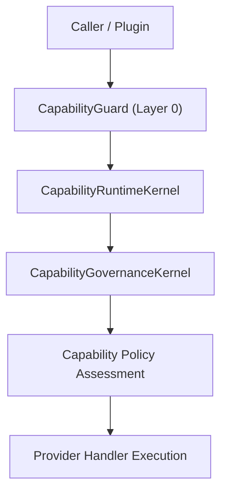

# Capability Gateway 能力网关与治理

能力网关子系统在 `packages/core/capability/`, `packages/core/capability-system/`, `packages/core/capability-governance/` 中实现，负责平台所有功能的零信任访问控制与能力注册体系。

---

## 核心组件架构



### 1. CapabilityGuard (权限防护)
`CapabilityGuard` 属于 Layer 0 核心安全设施，拦截所有能力调用。在执行前检验调用方的 Token、角色权限（Role）与上下文环境（CapabilityContext）。

### 2. CapabilityRuntimeKernel
能力运行时内核维护全量能力描述符（CapabilityDescriptor），管理提供者句柄（ICapabilityProviderHandler）注册与分发。

### 3. CapabilityGovernanceKernel
治理内核控制能力的生命周期阶段（Status）、审批等级（ApprovalTier）与可见性（VisibilityTier）：

- **ApprovalTier**: `Automatic` | `ManualApproval` | `AdminOnly`
- **VisibilityTier**: `Public` | `Internal` | `Restricted` | `Deprecated`
- **LifecycleStatus**: `Proposed` | `Active` | `Deprecated` | `Retired`

---

## 能力描述符 Schema (CapabilityDescriptor)

```typescript
export interface CapabilityDescriptor {
  id: string;
  name: string;
  category: CapabilityCategory; // 'AI' | 'Lesson' | 'Whiteboard' | 'Analytics' | 'Storage' | 'System'
  roles: CapabilityRole[]; // 'Admin' | 'Teacher' | 'Student' | 'Plugin'
  requiresApproval: boolean;
  handler: ICapabilityProviderHandler;
}
```

---

## 能力调用示例

```typescript
const result = await kernel.capabilityFrameworkRuntime.invoke({
  capabilityId: 'ai.completion.generate',
  context: {
    callerId: 'plugin-ext-quiz',
    role: 'Plugin',
    environment: 'production',
  },
  payload: {
    prompt: '请生成 3 道中考数学选择题',
  },
});
```
