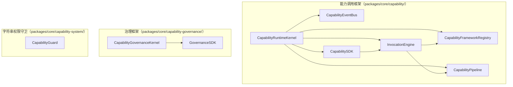

# Capability Gateway 能力网关与治理

能力相关子系统在**三个**目录中实现，彼此**独立、没有调用链关系**：

| 目录 | 职责 | 鉴权维度 |
| ---- | ---- | -------- |
| `packages/core/capability-system/` | `CapabilityGuard` —— 命令总线的**字符串权限**守卫 | `resource:action` 字符串 |
| `packages/core/capability/` | 通用能力 Provider 调用框架（`CapabilityRuntimeKernel`） | `CapabilityRole` 角色数组 |
| `packages/core/capability-governance/` | 能力治理元数据（`CapabilityGovernanceKernel`） | 无运行时鉴权，纯元数据登记 |

> ⚠️ 旧版本文档描述的 `CapabilityGuard → CapabilityRuntimeKernel → CapabilityGovernanceKernel` 串行链路**在代码中并不存在**。三者由 `Kernel` 构造函数各自独立实例化（分别是 `capabilityGuard` / `capabilityFrameworkRuntime` / `capabilityGovernance`），彼此无 import 关系。
> 另注：仓库中还有**第四套**相关机制 `RuntimePermissionManager`（`packages/core/classroom-runtime/permission-manager.ts`），见 [plugin-capability-matrix](../reference/plugin-capability-matrix.md)。

---

## 核心组件架构


```mermaid
graph TD
    subgraph A["能力调用框架（packages/core/capability/）"]
        A1["CapabilityRuntimeKernel"]
        A2["CapabilityFrameworkRegistry"]
        A3["CapabilityPipeline"]
        A4["InvocationEngine"]
        A5["CapabilityEventBus"]
        A6["CapabilitySDK"]
        A1 --> A2 & A3 & A4 & A5 & A6
        A6 --> A4
        A4 --> A2
        A4 --> A3
    end

    subgraph B["治理框架（packages/core/capability-governance/）"]
        B1["CapabilityGovernanceKernel"]
        B2["GovernanceSDK"]
        B1 --> B2
    end

    subgraph C["字符串权限守卫（packages/core/capability-system/）"]
        C1["CapabilityGuard"]
    end
```

### 1. CapabilityGuard（权限防护）

`packages/core/capability-system/index.ts` 中的 `CapabilityGuard` 是 Layer 0 安全设施。它被 `Kernel` 构造函数的 `commandBus.setInterceptor(...)` 调用，为每个已注册 action 的 `capabilityRequired` 字符串做校验。

其 API 只有 4 个方法：

- `constructor()` —— 预置 5 个默认 actor 的能力集：`user-demo`（`*:*:*`）、`user-frontend`、`anonymous`（空）、`agent-system-0`、`teacher-demo`、`student-demo`。
- `grant(actorId, cap)` —— 追加单条能力。
- `revokeAll(actorId)` —— 清空该 actor 的全部能力。
- `check(actorId, requiredCap)` —— 判定，优先级依次为：
  1. **管理员短路** —— `actorId` 命中 `role:administrator` / `admin` / `usr_admin` / `admin-demo`，或经私有静态方法 `extractRole` 解析出 `administrator` / `admin`；
  2. **角色兜底表** —— `extractRole` 按 `actorId` 最后一个 `:` 之后的片段解析角色，且**仅接受白名单** `administrator | admin | teacher | student | anonymous`（防止 userId 含 `:` 注入）；`teacher` / `student` 各有一份硬编码能力表；
  3. **显式授予表** —— `actorCapabilities` 中的 `*:*:*` / `*` 超管绕过；
  4. **精确匹配**；
  5. **部分通配** —— `lesson:*` 匹配 `lesson:write`。

> `extractRole` 对不含 `:` 的 `actorId`（如 `'anonymous'`）返回 `null`，直接走显式授予表。

### 2. CapabilityRuntimeKernel

`packages/core/capability/capability-runtime-kernel.ts` 的 `CapabilityRuntimeKernel` 是调用框架的组合根，只暴露 **5 个 `readonly` 子对象 + 1 个 `dispose()`**，**自身没有任何 `invoke` 方法**：

| 属性 | 类型 | 来源 |
| ---- | ---- | ---- |
| `registry` | `CapabilityFrameworkRegistry` | `packages/core/capability/registry/capability-framework-registry.ts` |
| `pipeline` | `CapabilityPipeline` | `packages/core/capability/pipeline/capability-pipeline.ts` |
| `engine` | `InvocationEngine` | `packages/core/capability/invocation/invocation-engine.ts` |
| `eventBus` | `CapabilityEventBus` | `packages/core/capability/event/capability-event-bus.ts` |
| `sdk` | `CapabilitySDK` | `packages/core/capability/sdk/capability-sdk.ts` |

构造函数可选接收 `AICapabilityKernel`，并通过私有方法 `registerStandardProviderAdapters` 注册提供者适配器：
- 有传入时注册 `AICapabilityProviderHandler`（`packages/core/capability/providers/ai-capability-provider.ts`）；
- 总是注册 `LessonCapabilityProviderHandler`（`packages/core/capability/providers/lesson-capability-provider.ts`）与 `AnalyticsCapabilityProviderHandler`（`packages/core/capability/providers/analytics-capability-provider.ts`）。

注意 `packages/core/capability/providers/plugin-capability-provider.ts` 虽被 `packages/core/capability/index.ts` 导出，但**未**被 `registerStandardProviderAdapters` 自动注册。

**默认注册的能力 id 只有 3 个**：`cap_lesson_flow`、`cap_analytics_insight`、`cap_ai_completion`。

### 3. CapabilityGovernanceKernel

`packages/core/capability-governance/governance-kernel.ts` 的 `CapabilityGovernanceKernel` 是一个**极薄的包装**，只有 1 个 `readonly` 属性 `sdk: GovernanceSDK` 和 1 个 `dispose()`。它把命名空间管理、依赖图、校验、策略、健康监测、搜索、manifest 导出等能力全部收拢在 `packages/core/capability-governance/sdk/governance-sdk.ts` 的 `GovernanceSDK` 中。

`GovernanceSDK` 的公开方法：`registerCapability(spec)`、`validateCapability(spec)`、`queryCapability(query)`、`listCapability(category?)`、`clear()`，以及 `readonly healthMonitor: HealthMonitor`。

> `CapabilityGovernanceKernel` 在 `packages/core/kernel/index.ts` 中除实例化并经 `ICapabilityGovernanceServiceToken` 暴露外，**无其他生产消费者**（审计项 M-9）。
>
> **⚠️ 未接入真实调用路径**：本子系统（529 行）自 SDK 3.8.0 起已标 `@experimental`
> 并**移出 `@openlearn/plugin-sdk` 导出面**（审计项 F-2 / D-2 决策）。插件不要依赖
> `ICapabilityGovernanceServiceToken`。若将来接入真实消费者并稳定，去掉
> `packages/core/capability-governance/index.ts` 顶部的 `@experimental` 注释、
> 把 `export type { … }` 加回 `packages/plugin-sdk/index.ts` 即可。

---

## 能力描述符 Schema

### 1. 调用框架描述符（`packages/core/capability/types/index.ts`）

```typescript
export interface CapabilityDescriptor {
  readonly id: string;
  readonly name: string;
  readonly category: CapabilityCategory;
  readonly provider: string;
  readonly permission: ReadonlyArray<CapabilityRole>;
  readonly inputSchema: Record<string, unknown>;
  readonly outputSchema: Record<string, unknown>;
  readonly metadata: Record<string, unknown>;
  readonly tags: ReadonlyArray<string>;
  readonly version: string;
}
```

> 旧文档写的 `roles` / `requiresApproval` / `handler` 三个字段**均不存在**：实际字段是 `permission`（数组）、`provider`（字符串）与独立的 `ICapabilityProviderHandler`。

同文件中的真实类型定义：

```typescript
export type CapabilityRole = 'Teacher' | 'Student' | 'Plugin' | 'AI' | 'Observer' | 'System';

export type CapabilityCategory =
  | 'lesson' | 'whiteboard' | 'notebook' | 'plugin' | 'analytics' | 'ai' | string;

export type ResultType =
  | 'teaching_object' | 'whiteboard_object' | 'markdown' | 'quiz' | 'code'
  | 'image' | 'analytics_insight' | 'plugin_data' | 'generic';

export interface ICapabilityProviderHandler {
  readonly descriptor: CapabilityDescriptor;
  execute(request: InvocationRequest): Promise<unknown>;
}

export interface CapabilityContext {
  readonly lessonId?: string;
  readonly whiteboardId?: string;
  readonly studentId?: string;
  readonly teacherId?: string;
  readonly analyticsSessionId?: string;
  readonly conversationId?: string;
  readonly pluginId?: string;
  readonly actorRole: CapabilityRole;   // 必填
}

export interface InvocationRequest {
  readonly id: string;
  readonly capabilityId: string;
  readonly payload: Record<string, unknown>;
  readonly context: CapabilityContext;
  readonly timeoutMs?: number;
}

export interface CapabilityResult<T = unknown> {
  readonly invocationId: string;
  readonly capabilityId: string;
  readonly resultType: ResultType;
  readonly data: T;
  readonly executionTimeMs: number;
  readonly success: boolean;
  readonly error?: string;
}
```

> **`CapabilityRole` 没有 `Admin`。** 6 个成员为 `Teacher | Student | Plugin | AI | Observer | System`。管理员绕过只存在于 `CapabilityGuard` 与 `PermissionChecker`（`actorRole === 'System'` 直通），与 `CapabilityRole` 枚举无关。
>
> **`CapabilityCategory` 不是 `'AI' | 'Lesson' | 'Whiteboard' | 'Analytics' | 'Storage' | 'System'`。** 它是**小写**前缀，且末尾带 `| string` 开放尾部——任意字符串都合法，类型系统不做穷尽校验。

### 2. 能力事件（`CapabilityEventMap`）

`CapabilityEventType = keyof CapabilityEventMap`，共 **6** 个事件：

| 事件 | payload |
| ---- | ------- |
| `CapabilityRequested` | `{ request: InvocationRequest }` |
| `CapabilityStarted` | `{ invocationId, capabilityId }` |
| `CapabilityFinished` | `{ result: CapabilityResult }` |
| `CapabilityCancelled` | `{ invocationId, reason }` |
| `CapabilityFailed` | `{ invocationId, error }` |
| `CapabilityPublished` | `{ result: CapabilityResult }` |

### 3. 治理类型（`packages/core/capability-governance/types/index.ts`）

```typescript
export type CapabilityLifecycleStatus =
  | 'Draft' | 'Experimental' | 'Preview' | 'Stable' | 'Deprecated' | 'Archived';

export type ApprovalTier = 'Official' | 'Community' | 'Experimental' | 'Internal';

export type VisibilityTier = 'Public' | 'Private' | 'Protected';

export type GovernanceCategory =
  | 'Teaching' | 'Assessment' | 'Whiteboard' | 'Notebook' | 'AI'
  | 'Analytics' | 'Storage' | 'Media' | 'Runtime' | 'Plugin' | 'Utility';
```

> **三个治理枚举的全部成员已更正**（旧文档写的 `Automatic | ManualApproval | AdminOnly`、`Public | Internal | Restricted | Deprecated`、`Proposed | Active | Deprecated | Retired` **均不存在**）。
> 注意生命周期类型名是 **`CapabilityLifecycleStatus`**，不是 `LifecycleStatus`。

`GovernanceSpecification` 共 **19** 个 `readonly` 字段：`id`、`namespace`、`displayName`、`description`、`version`、`provider`、`category`、`permission: ReadonlyArray<string>`、`inputSchema`、`outputSchema`、`metadata`、`dependencies: ReadonlyArray<CapabilityDependencySpec>`、`owner`、`license`、`visibility`、`deprecated: boolean`、`tags`、`approvalTier`、`status`。

> `GovernanceSpecification.permission` 是**裸 `string[]`**，与调用框架的 `CapabilityRole[]` 不是同一类型。

---

## 能力调用示例（真实 API）

> ❌ 旧文档示例中的 `kernel.capabilityFrameworkRuntime.invoke({...})` **方法不存在**。
> 真实入口是 `CapabilitySDK.invokeCapability(capabilityId, payload, context)`（三个位置参数，不接受单个对象）。

```typescript
import { kernelContainer } from './packages/core/kernel/index.js';
import type { CapabilityResult } from './packages/core/capability/types/index.js';

const result = await kernelContainer.capabilityFrameworkRuntime.sdk.invokeCapability<string>(
  'cap_lesson_flow',                                  // CapabilityDescriptor.id
  { anything: 'you like' },                           // payload: Record<string, unknown>
  {
    actorRole: 'Teacher',                             // CapabilityContext.actorRole 必填
    lessonId: 'les_demo',
  },
) as CapabilityResult<string>;

if (result.success) {
  console.log(result.data, result.executionTimeMs);
} else {
  console.error(result.error);
}
```

`CapabilitySDK.invokeCapability` 内部自行为请求生成 `id`（`inv_${crypto.randomUUID()}`），并转发到 `InvocationEngine.invoke(request)`。

`InvocationEngine`（`packages/core/capability/invocation/invocation-engine.ts`）的完整公开 API：

- `invoke(request: InvocationRequest): Promise<CapabilityResult>` —— 先查 `cancelledInvocations`，命中则发 `CapabilityCancelled` 并抛错；否则 `registry.resolve(capabilityId)` 取 handler 后交给 `pipeline.executePipeline(request, handler)`。
- `cancel(invocationId, reason?)` —— 标记取消。
- `retry(request, maxRetries = 3)` —— 指数无关的简单重试循环。
- `batch(requests)` —— `Promise.all` 并发调用 `invoke`。

`CapabilitySDK` 另外两个查询/订阅方法：`watchCapability(eventType | '*', subscriber)`（返回取消订阅函数）、`queryCapability(categoryOrTag?)`。

### 执行管线（`CapabilityPipeline.executePipeline`）

固定 7 步，事件发布点如下：

1. **`CapabilityRequested`** —— 发布请求事件；
2. **Payload 校验** —— `!request.payload` 直接抛 `Pipeline Validation Failed: Payload missing for <capabilityId>`；
3. **权限检查** —— `PermissionChecker.validatePermission(desc, request.context.actorRole)`；失败则发布 `CapabilityFailed` 并抛 `Access Denied: Role '<role>' is not authorized for capability '<id>'`；
4. **上下文注入** —— 把整个 `request.context` 以 **`payload.__injectedContext`** 键合并进 `enrichedRequest.payload`（handler 可从 `request.payload.__injectedContext` 取回上下文）；
5. **`CapabilityStarted`** —— 发布开始事件；
6. **结果转换** —— `resultType` 取自 `descriptor.metadata.resultType`，缺省 `'generic'`；`data` 为 `handler.execute()` 的原始返回值；`executionTimeMs = Date.now() - startTime`；结果对象经 `Object.freeze`；
7. **收尾** —— 成功时依次发布 `CapabilityFinished` 与 `CapabilityPublished` 后返回；`handler.execute` 抛错则发布 `CapabilityFailed` 并原样 rethrow（**不会**返回 `success: false` 的结果对象，`CapabilityResult.error` 字段仅供调用方自行构造时使用）。

`PermissionChecker`（`packages/core/capability/pipeline/permission-checker.ts`）只有一个静态方法 `validatePermission(descriptor, actorRole)`：`permission` 为空数组时放行；`actorRole === 'System'` 时放行；否则做 `descriptor.permission.includes(actorRole)` 精确匹配——**不做层级继承**（`Teacher` 不会自动获得 `Plugin` 权限）。

---

## 统计口径

- 调用框架类型：`CapabilityRole` 6 成员、`CapabilityCategory` 7 个字面量 + 1 个 `string` 开放尾部、`ResultType` 9 成员、`CapabilityEventType` 6 成员、`CapabilityDescriptor` 10 字段、`GovernanceSpecification` 19 字段。
- 治理类型：`CapabilityLifecycleStatus` 6 成员、`ApprovalTier` 4 成员、`VisibilityTier` 3 成员、`GovernanceCategory` 11 成员。
- `CapabilityRuntimeKernel` 公开成员：5 个 `readonly` 属性 + `dispose()`；`CapabilityGovernanceKernel`：1 个 `readonly` 属性 + `dispose()`。
- `CapabilityGuard` 公开方法：3 个（`grant` / `revokeAll` / `check`）；构造函数预置默认 actor：6 个。
- 默认注册的能力 descriptor：3 个。

> 统计截至 commit `a11b99b`。
