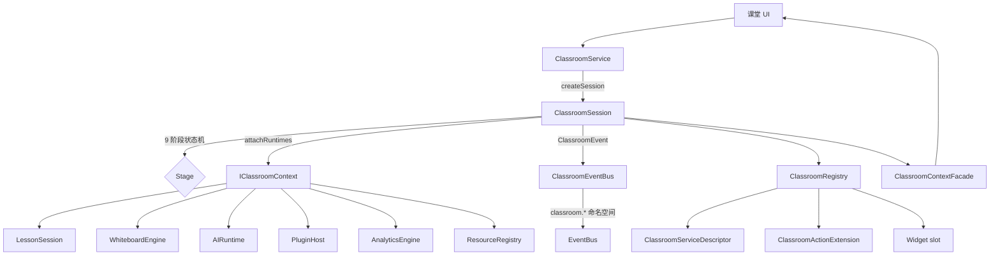
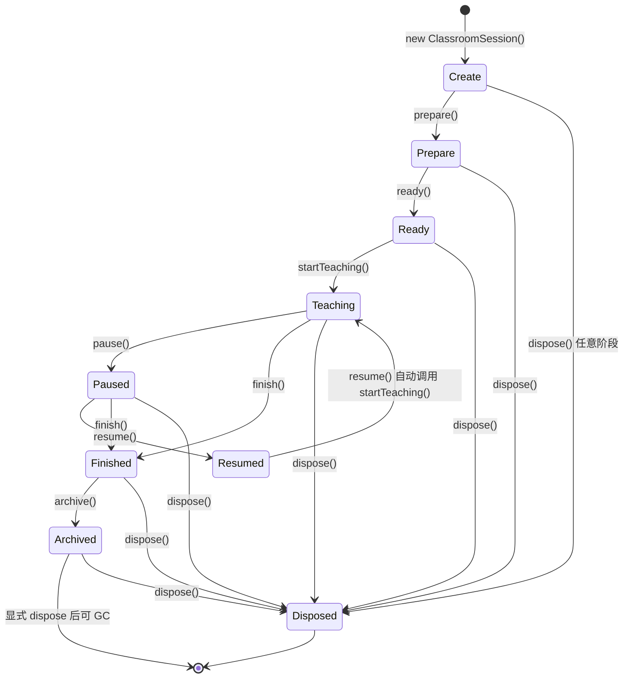

# Classroom Runtime 架构说明

OpenLearn V2 的 **Classroom Runtime**（Sprint P4-01 ~ P4-03）跨前后端各一份实现：

- 前端：`src/features/classroom-runtime/`（343 行 / 7 文件）
- 后端：`packages/core/classroom-runtime/`

它是 OpenLearn "课堂" 概念的运行时抽象——**9 阶段生命周期状态机 + 6 个底层 runtime 协调器**。

---

## 整体定位

Classroom Runtime 是 Layer 2 中的**顶层领域引擎**，把"一节课从创建到销毁"的全过程抽象为一个有限状态机，并协调 6 个底层 runtime（lesson / whiteboard / ai / plugin / analytics / resource）。



---

## 9 阶段状态机

`ClassroomSession`（125 行，前端版本）维护课堂生命周期：



每个合法转换都通过 `assertValidTransition(allowedFrom, target)` 校验，非法转换抛 `ClassroomSession Error: Invalid state transition`。

转换时自动触发 `ClassroomEvent`（9 种 type 一一对应 9 个 stage）：
`ClassroomCreated` / `ClassroomPrepared` / `ClassroomReady` / `ClassroomTeaching` / `ClassroomPaused` / `ClassroomResumed` / `ClassroomFinished` / `ClassroomArchived` / `ClassroomDisposed`。

**特殊转换**：
- `resume()` 内部会调用 `startTeaching()`——因为 resume = 回到 teaching。
- `dispose()` 可从任意阶段进入（不校验 `allowedFrom`），是应急逃生口。

---

## 协调 6 个 Runtime：`IClassroomContext`

`attachRuntimes()` 注入 6 个底层 runtime 引用：

```typescript
public attachRuntimes(runtimes: {
  lessonSession?: unknown;
  whiteboardEngine?: unknown;
  aiRuntime?: unknown;
  pluginHost?: unknown;
  analyticsEngine?: unknown;
  resourceRegistry?: unknown;
}): void;
```

注意：6 个字段全部是 `unknown`，这是**显式延迟绑定**——前端代码不直接 import 这些 runtime 的具体类型，而是通过 [`ClassroomContextFacade`](#classroomcontextfacade统一门面) 在运行时按需访问。

### ClassroomContextFacade（统一门面）

`ClassroomContextFacade`（54 行）把 session 和 context 封装成**单一 facade**，对外暴露只读 getter：

| Getter | 返回 |
|---|---|
| `classroomId` | string |
| `stage` | ClassroomStage |
| `lesson` | unknown（lessonSession） |
| `whiteboard` | unknown（whiteboardEngine） |
| `ai` | unknown（aiRuntime） |
| `plugin` | unknown（pluginHost） |
| `analytics` | unknown（analyticsEngine） |
| `resource` | unknown（resourceRegistry） |
| `getSession()` | ClassroomSession（用于高级操作） |

**设计意图**：课堂 UI 代码只依赖 `ClassroomContextFacade`，不直接接触 6 个底层 runtime 的类型定义——后者按需懒解析。这样 plugin 或能力扩展可以**替换底层实现**而不需要改 frontend。

---

## 三类扩展点：ClassroomRegistry

`ClassroomRegistry`（55 行）提供 3 类扩展 slot：

| 存储 | Key | Value | 用途 |
|---|---|---|---|
| `services` | serviceId | `ClassroomServiceDescriptor` | 业务服务（execute 语义） |
| `actions` | actionId | `ClassroomActionExtension` | 课堂动作扩展（handler 语义） |
| `widgets` | widgetId | `{ id, name, slot }` | 课堂 UI 控件挂载 |

### ClassroomServiceDescriptor vs ClassroomActionExtension

| 维度 | ServiceDescriptor | ActionExtension |
|---|---|---|
| 语义 | 可重用的"业务能力" | 单次执行的"动作" |
| 生命周期 | 注册后可被多次 execute | 注册后被业务按需触发 |
| 典型用例 | "成绩统计服务" | "开启投票动作" |

### ClassroomService（门面层）

`ClassroomService`（52 行）持有 `Map<classroomId, ClassroomSession>`：

```typescript
public createSession(classroomId: string): ClassroomSession;
public getSession(classroomId: string): ClassroomSession | undefined;
public listSessions(): ReadonlyArray<ClassroomSession>;
public disposeSession(classroomId: string): boolean;  // 调用 session.dispose() 后从 Map 移除
public clear(): void;                                   // disposeAll + registry.clear()
```

注意：重复 `createSession` 同 `classroomId` 会抛 `ClassroomService Error: Classroom session already exists`。

---

## 事件总线：ClassroomEventBus（Sprint P4-03）

`ClassroomEventBus`（59 行）把课堂事件**命名空间化**到全局 `EventBus`（PI-010）：

```typescript
export type ClassroomEventType =
  | 'classroom.created' | 'classroom.prepared' | 'classroom.ready'
  | 'classroom.teaching' | 'classroom.paused' | 'classroom.resumed'
  | 'classroom.finished' | 'classroom.archived' | 'classroom.disposed';
```

事件命名遵循 `classroom.<stage>` 风格，便于跨模块按 namespace 订阅：

```typescript
const bus = container.resolve(CLASSROOM_EVENT_BUS_TOKEN);
const unsub = bus.subscribe('classroom.teaching', (event) => {
  console.log(`classroom ${event.classroomId} started teaching at ${event.timestamp}`);
});

// 或订阅所有课堂事件
bus.subscribe('*', (event) => { ... });
```

`subscribe()` 返回 `() => void` 类型的 unsubscribe 函数（PI-010 风格）。

**与 `ClassroomSession.emitEvent` 的关系**：
- `ClassroomSession.emitEvent` → 直接回调注册的 `ClassroomEventListener`（in-process，session 范围）
- `ClassroomEventBus.publish` → 走全局 EventBus（跨模块，跨进程可扩展）

两者**并存**：session listener 用于 session 内部观察者，event bus 用于跨模块协作。

---

## 跨前后端实现

| 维度 | 前端 (`src/features/classroom-runtime/`) | 后端 (`packages/core/classroom-runtime/`) |
|---|---|---|
| 用途 | UI 状态编排、6 个 client runtime 协调 | 服务端权威状态机、持久化、与 DB 同步 |
| 9 阶段状态机 | ✅ | ✅ |
| `IClassroomContext` | ✅ 持有 client runtime 引用 | ✅ 持有 service-side runtime 引用 |
| EventBus | 复用全局 EventBus（前端 ESM 版） | 复用全局 EventBus（后端 Node 版） |
| 业务边界 | 不持久化，刷新即失 | 持久化课堂状态到 DB |

**同步机制**（不在本子系统范围内）：前端 `ClassroomService` 通过 WebSocket / RPC 调用后端 `ClassroomRuntimeKernel` 的对应方法，后端事件通过推送（push）反向同步到前端 event bus。前后端 9 阶段状态机**可能暂时不一致**（网络延迟），前端以**乐观更新**为主，最终一致性由后端修正。

---

## 在 Layer-2 中的位置

参考 [`platform-kernel.md`](./platform-kernel.md) Layer 2_6 节点（`ClassroomRuntimeKernel`）：

| Kernel 属性 | 前后端实现 |
|---|---|
| `classroomRuntime` | `ClassroomService` (前端) / `ClassroomRuntimeKernel` (后端) |
| 6 个被协调的 runtime | lesson / whiteboard / ai / plugin / analytics / resource |

Classroom Runtime 是 Layer 2 中**唯一的"协调型" runtime**——其他 runtime（lesson-runtime、whiteboard-runtime 等）都是**单一职责型**，只有它负责跨 runtime 编排。

---

## 约束与不变量

1. **9 阶段是封闭的状态机**：除 `dispose()` 应急口外，所有转换都强制走 `assertValidTransition` 校验。
2. **session id 全局唯一**：在 `ClassroomService` 内重复 `createSession` 抛错。
3. **context 字段全 `unknown`**：禁止在 `IClassroomContext` 层面做类型断言，所有访问必须通过 facade 或运行时校验。
4. **`attachRuntimes` 是可重入的**：同一 runtime 字段会被新引用覆盖，但已 dispatch 的事件不会重发。
5. **事件命名空间严格闭合**：所有 classroom 事件必须 `classroom.<stage>` 9 种之一，不可自定义扩展（避免跨模块消费方 schema 漂移）。
6. **plugin 不能直接改 stage**：插件只能通过 `ClassroomActionExtension` 注册动作，动作执行由 Classroom 业务代码负责调用 `session.prepare()` 等。
7. **`dispose()` 清空 listeners**：防止已 dispose 的 session 内存泄漏。

---

## 相关源码

### 前端（src/features/classroom-runtime/）

- `classroom-types.ts`（46 行）— 类型契约（ClassroomStage / ClassroomEvent / IClassroomContext / ServiceDescriptor / ActionExtension）
- `classroom-registry.ts`（55 行）— services / actions / widgets 三类 slot
- `classroom-session.ts`（125 行）— 9 阶段状态机
- `classroom-service.ts`（52 行）— session Map 门面
- `classroom-context-facade.ts`（54 行）— 统一 context facade
- `classroom-event-bus.ts`（59 行）— `classroom.*` 命名空间事件总线
- `index.ts`（10 行）— 桶导出

合计 343 行 / 7 文件。

### 后端（packages/core/classroom-runtime/）

- 后端 `ClassroomRuntimeKernel` 与 6 个被协调 runtime 由 [`platform-kernel.md`](./platform-kernel.md) Layer 2_6 节点描述；具体内部模块划分待 backend 审计报告补充。
