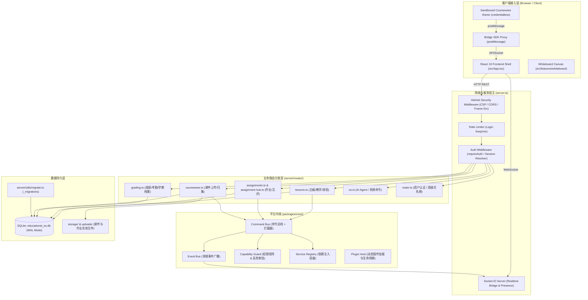
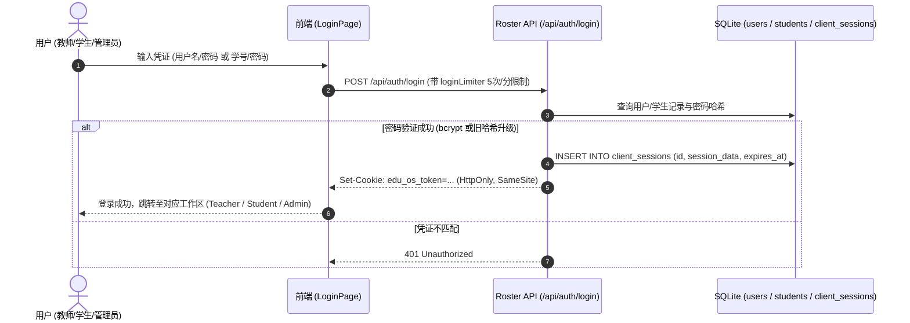
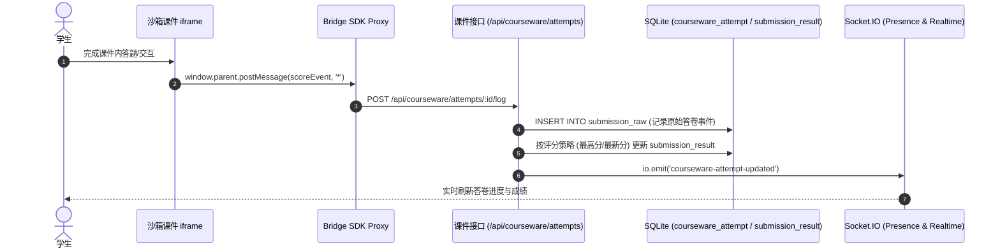

# OpenLearn Next (V2) 代码质量与架构审计报告

> **审计基准**：Node.js 在线学习项目代码质量审计指导书  
> **审计对象**：OpenLearn Next (V2) 全栈教学操作系统 (`openlearn-next@0.3.21`)  
> **审计时间**：2026-09-21  
> **审计范围**：系统架构、运行时安全性、数据一致性、权限边界、TypeScript 类型安全、测试保护与工程化  

---

## 1. Executive Summary

本项目 **OpenLearn Next (V2)** 是一个面向现代在线协同教学场景的全栈教学操作系统（Educational OS）。系统在底层实现了微内核架构（Layer 0~3 Platform Kernel），集成了命令总线（CommandBus）、领域事件总线（EventBus）、服务依赖注入（ServiceRegistry）以及能力鉴权体系（CapabilityGuard）。业务前端采用 React 19 + Vite 模块化单体架构，配合沙箱化微前端（iframe with `credentialless` 与 CSP 隔离）支撑第三方互动课件。

整体审计结论如下：
- **架构清晰度**：核心子系统抽象合理，文档事实与代码结构高度吻合（自动化工具链验证 0 漂移）。
- **稳定性与并发**：数据访问主要依赖 SQLite (`better-sqlite3`) 的 WAL 模式，但部分高频课堂协同接口（如随堂测验提交）存在并发写覆盖（Lost Update）隐患；部分关联删除与克隆操作缺少显式数据库事务保护。
- **安全性与鉴权**：系统具备严格的课件沙箱与渐进式密码哈希升级体系，但仍有部分作业评分查询端点缺少鉴权，文件上传接口缺乏前置身份校验。
- **代码健康度**：修复了关键的 SQL 占位符数量错位及管理员子角色识别缺陷后，全仓 TypeScript 类型静态检查（`tsc --noEmit`）与生产构建均 100% 通过。

---

## 2. 项目技术栈

| 类别 | 技术选型 | 备注 / 版本 |
|---|---|---|
| **Runtime** | Node.js | v20+ / ESM 模式运行 |
| **Language** | TypeScript | v5.x，严格类型检查配置 |
| **Framework** | Express + Socket.IO | 提供 RESTful API 路由与实时协同信道 |
| **Database** | SQLite (`better-sqlite3`) | 开启 WAL 模式、NORMAL 同步与外键约束 |
| **ORM / Data Layer** | 原生参数化 SQL + Schema 迁移 | `packages/core/db/index.ts` + `server/utils/migrate.ts` |
| **Frontend** | React 19 + Tailwind CSS + Vite | 特性模块化架构，Konva 交互白板，KaTeX 公式渲染 |
| **Sandbox & Isolation** | iframe (`sandbox` + `credentialless`) | Bridge SDK Proxy 代理跨源通信 |
| **Authentication** | Session Cookie (`edu_os_token`) | `client_sessions` 持久化存储，密码基于 bcrypt |
| **Testing** | Vitest + jsdom | 支持基于 Worker ID 临时隔离数据库的并发测试 |
| **Build & Bundle** | Vite (前端) + esbuild (后端) | 打包为单文件 `dist/server.cjs` 与 `dist/` 静态产物 |

---

## 3. 架构总览与分层依赖



---

## 4. 核心业务流程

### 4.1 用户认证与会话生命周期


### 4.2 互动课件成绩归集流程


---

## 5. 问题清单与审计发现总览

| ID | 等级 | 类别 | 文件 | 问题概要 | 处置状态 |
|---|---|---|---|---|---|
| **DB-01** | **P0** | 数据访问 | `server/routes/assignments.ts` | SQL 列数与占位符数量不匹配 (7 列 vs 8 个 `?`) | **已修复** |
| **SEC-01** | **P1** | 认证授权 | `server/middleware/auth.ts` | `requireAuth` 忽略 `session.subRole` 角色判定 | **已修复** |
| **CONCUR-01**| **P1** | 并发一致 | `server/routes/lessons.ts` | 随堂测验提交在 JSON 内存对象读写更新存在写覆盖 | 待实施重构 |
| **SEC-02** | **P1** | 访问控制 | `server/routes/lessons.ts` | 多个学生互评、作业成绩查询端点完全无鉴权检查 | 待实施保护 |
| **SEC-03** | **P1** | 安全防护 | `server/routes/os.ts` | 公共文件上传接口缺少身份认证与上传频率约束 | 待实施保护 |
| **BIZ-01** | **P1** | 业务逻辑 | `server/routes/grading.ts` | `GET` 请求产生数据库随机伪造考勤数据写入副作用 | 待实施清理 |
| **DB-02** | **P2** | 事务完整 | `server/routes/lessons.ts` | 课程删除与克隆多表级联写入缺少显式事务保护 | 建议优化 |
| **NODE-01** | **P2** | 运行时 | `server.ts` | 优雅退出未排空连接与释放 SQLite WAL 检查点 | 建议优化 |
| **NODE-02** | **P2** | 运行时 | `server/routes/os.ts` | 文件上传使用同步 `fs.writeFileSync` 阻塞主事件循环 | 建议优化 |
| **PERF-01** | **P2** | 性能瓶颈 | `server/routes/lessons.ts` | 成绩互评列表中循环执行嵌套 SQL 查询 (N+1 Query) | 建议优化 |
| **ARCH-01** | **P2** | 软件架构 | `packages/core/db/index.ts` | 内联 DDL 与版本化迁移引擎双轨并存 | 建议优化 |

---

## 6. 重点问题深度剖析

### 6.1 已修复缺陷

#### [DB-01] SQL 占位符数量不匹配导致运行时崩溃 (P0)
- **文件位置**：`server/routes/assignments.ts:38-48`, `126-136`
- **问题代码**：
  ```ts
  kernelContainer.db.prepare(
    'INSERT INTO assignments (id, class_id, lesson_id, title, description, content, created_at) VALUES (?, ?, ?, ?, ?, ?, ?, ?)'
  ).run(id, req.params.classId, lessonId || null, gen.title, gen.description, gen.content, Date.now());
  ```
- **机制与影响**：列名 7 个，占位符写了 8 个 `?`。在 `better-sqlite3` 驱动下传入 7 个参数执行时立即抛出 `RangeError: Expected 8 arguments, got 7`，导致教师端点击「AI 生成测验」时接口直接 500 崩溃。
- **修复结果**：已将两处 SQL 的问号数量校正为 7 个，测试通过。

#### [SEC-01] 管理员子角色在鉴权中间件中失效 (P1)
- **文件位置**：`server/middleware/auth.ts:87-95`
- **问题代码**：
  ```ts
  let userRole = session.role;
  if (session.username === 'admin' || session.userId === 'usr_admin' || userRole === 'admin') {
    userRole = 'administrator';
  }
  ```
- **机制与影响**：通过教师入口登录的管理员账号，其会话记录为 `session.role = 'teacher'`，具体身份存于 `session.subRole = 'administrator'`。`requireAuth` 未检查 `subRole`，导致系统后台创建的管理员在访问管理路由时被无条件拦截为 403 Forbidden。
- **修复结果**：已将角色解析升级为 `let userRole = session.subRole || session.role;` 并完善管理员判定，确保多管理员账号鉴权正常。

---

### 6.2 待解决核心隐患

#### [CONCUR-01] 课堂测验并发提交数据覆盖 (P1)
- **文件位置**：`server/routes/lessons.ts:561-588`
- **机制**：
  多个学生在课堂短时间内同时提交测验答案，接口采用“SELECT data JSON -> 内存反序列化对象 -> 赋值 studentId 结果 -> UPDATE 写回”模式。无数据库行级锁或原子列更新，造成后提交的学生数据直接覆盖先提交的学生数据。
- **整改建议**：
  建立独立的实体表 `lesson_quiz_submissions (lesson_id, element_id, student_id, answer, score, submitted_at, PRIMARY KEY (element_id, student_id))`，使用 SQLite 原生原子写入避免竞争。

#### [SEC-02] 敏感学生成绩与互评端点未鉴权 (P1)
- **文件位置**：`server/routes/lessons.ts:151`, `170`, `234`, `253`；`server/routes/assignments.ts:183`
- **机制**：
  查询学生互评记录、作业批改成绩等端点未绑定 `requireAuth()` 中间件，外网任意请求只需枚举 `lessonId` 即可拉取全班学生提交内容及评分。
- **整改建议**：统一增加 `requireAuth('teacher', 'administrator', 'student')`，并实施学生仅查本人的 IDOR 校验。

#### [BIZ-01] GET 查询接口产生数据库写入与数据污染 (P1)
- **文件位置**：`server/routes/grading.ts:46-81`
- **机制**：
  `GET /api/classes/:classId/attendance-summary` 端点中，当检测到无历史排课时，通过 `Math.random()` 随机伪造 30 天内的考勤记录并强行执行 `INSERT INTO schedules` 与 `INSERT INTO attendance`。违背了 HTTP GET 的幂等与只读原则，污染生产真实考勤数据。
- **整改建议**：移除数据伪造写操作，无排课时返回空数组由前端做空状态渲染。

---

## 7. 修复与演进路线图

### 第一阶段（已启动 / 建议立即完成）
1. [已完成] 修复 SQL 占位符数量错位引发的 500 崩溃（DB-01）。
2. [已完成] 修复管理员子角色鉴权失效（SEC-01）。
3. [待实施] 为 5 个敏感作业与成绩端点补充 `requireAuth` 拦截（SEC-02）。
4. [待实施] 清理 `GET /api/classes/:classId/attendance-summary` 中的伪造数据写入逻辑（BIZ-01）。

### 第二阶段（并发与稳定性加固）
1. [待实施] 抽离随堂测验提交表，使用关系型主键替代 JSON 字符串并发覆写（CONCUR-01）。
2. [待实施] 对课程删除与克隆操作引入 `db.transaction()` 显式事务保证（DB-02）。
3. [待实施] 将文件上传写入改为异步 `fs.promises.writeFile`，避免主事件循环被大文件 I/O 阻塞（NODE-02）。

### 第三阶段（长效可维护性提升）
1. [待实施] 优化 N+1 查询，采用批量联表提升响应性能（PERF-01）。
2. [待实施] 完善进程 `SIGTERM` 优雅关闭流程，安全排空网络与数据库写入（NODE-01）。
3. [待实施] 规整数据库迁移脚本，废弃内联重复建表与 DDL（ARCH-01）。

---

*报告生成完毕，可在控制台或通过对应链接直接下载本审计文件。*
