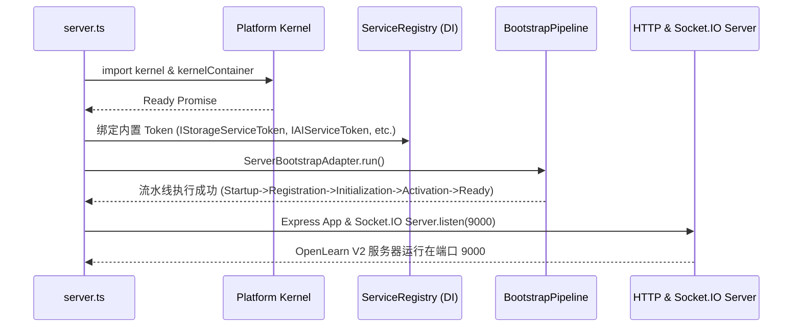

# Composition Root & Server 服务组装

Composition Root（服务组装根）是 OpenLearn V2 应用程序的入口点，定义在项目根目录的 `server.ts` 以及 `packages/core/bootstrap/composition/index.ts` 中。

---

## 组装根职责

Composition Root 负责：
1. **环境与配置装载**: 加载 `.env` 文件、确定运行模式（Development vs Production）。
2. **初始化 Platform Kernel**: 引用 `kernelContainer` (`kernel.serviceRegistry`) 并建立类型安全的 DI 映射。
3. **注册系统与插件级扩展**: 注册 `ActivityRegistry` 等第三方/官方活动生态系统。
4. **启动引导流水线**: 调用 `ServerBootstrapAdapter` 驱动 5 阶段启动流水线。
5. **绑定网络传输层**: 组装 Express HTTP API 路由与 Socket.IO 实时通信服务。

---

## 启动时序流 (Startup Flow)

---

## Express API 与 Socket.IO 协同

Composition Root 将 Kernel 依赖直接解算并注入到路由与 WebSocket 句柄中：

- **认证中间件**: `getCookieToken`, `getValidSession`, `checkIsTeacherOrAdmin` 提供 JWT Cookie 校验。
- **扩展 API**: 安全与防 Prompt 注入组件（`detectPromptInjection`, `encryptApiKey`, `decryptApiKey`）。
- **活动生态**: 通过 `IActivityRegistryToken` 注册并分发官方与自定义活动。
