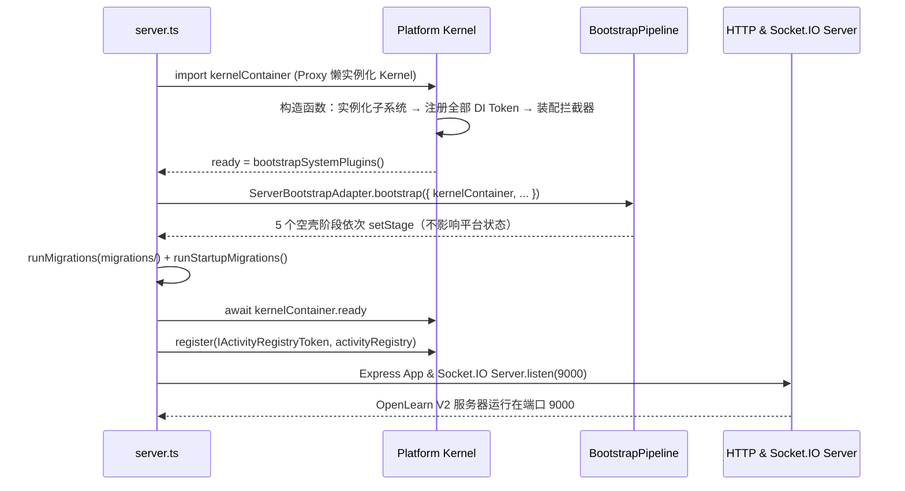

# Composition Root & Server 服务组装

Composition Root（服务组装根）是 OpenLearn V2 应用程序的入口点，定义在项目根目录的 `server.ts` 以及 `packages/core/bootstrap/composition/` 中。

> **架构演变（v0.2.0）**：`server.ts` 已从 ~1000 行瘦身（当前 672 行），现在只承担"组装根"职责——装载环境、初始化 `kernelContainer`、调用 `ServerBootstrapAdapter`、组装 Express + Socket.IO，并把所有领域行为委托给 `server/` 下的独立模块。各模块均携带"逐字搬移 + 特征测试"保证行为不变：
>
> - `server/realtime-bridge.ts` — `setupRealtimeBridge({ eventBus, io, db })`：EventBus → Socket.IO 实时转发。
> - `server/ai-agent.ts` — AI 对话编排（`runOpenAIAgentChat`、工具调用与系统提示词生成）。
> - `server/shared-state.ts` — 共享单例 `MF_REMOTE_CACHE` / `lessonActiveSegments`。
> - `server/presence.ts` — `setupPresence({ io, eventBus })`：Socket.IO 连接生命周期与在线状态广播。
> - `server/utils/migrate.ts` — `runMigrations(db, migrations)`：Phase 20 版本化数据库迁移运行器，服务启动阶段自动从 `migrations/` 目录加载 `.sql` 脚本，记录并比对 `_migrations` 元表状态，具备幂等性与 duplicate column 容错保护。
> - `server/bootstrap-db.ts` — `runStartupMigrations(db)`：启动时 DB 兼容性保障、旧插件升级与过期会话清理。
>
> 路由模块（`server/routes/*.ts`）通过 `ServerContext`（`ctx`）消费这些能力，不再直接从 `server.ts` 导入符号。

---

## 组装根职责

Composition Root 负责：

1. **环境与配置装载**: 加载 `.env` 文件、确定运行模式（Development vs Production）。
2. **初始化 Platform Kernel**: 引用模块级单例 `kernelContainer`（`packages/core/kernel/index.ts`，一个 `Kernel` 实例的懒加载 `Proxy`）并建立类型安全的 DI 映射。
3. **注册系统与插件级扩展**: 注册 `IActivityRegistryToken` 等第三方/官方活动生态系统。
4. **驱动引导流水线**: 调用 `ServerBootstrapAdapter.bootstrap(...)`（见下方「流水线不负责真正的装配」）。
5. **绑定网络传输层**: 组装 Express HTTP API 路由与 Socket.IO 实时通信服务。

---

## 真正的装配顺序：`Kernel` 构造函数

**大部分 Token 绑定并不在 `server.ts` 里**，而在 `packages/core/kernel/index.ts` 的 `Kernel` 构造函数中按分层顺序完成：

| 层     | 顺序与内容                                                                                                                                                              |
| ------ | --------------------------------------------------------------------------------------------------------------------------------------------------------------------- |
| Layer 0 | `eventBus`、`capabilityGuard`、`serviceRegistry`、`storageService`、`aiService`、`esmLoader`（均无依赖）                                                                  |
| Layer 1 | 领域内核：`aiRuntime` → `aiCapability` → `capabilityFrameworkRuntime` → `capabilityGovernance` → `platformServiceRegistryKernel` → `analyticsEngine` → `collaborationEngine` → `presenceEngine` → `classroomRuntime` → `lessonRuntime` |
| 依赖 L0/L1 | `commandBus`（依赖 `eventBus`）、`actionRegistry`、`processManager`、`pluginHost`（依赖 `serviceRegistry` + `esmLoader` + `db`，并 `mkdirSync` 出 `plugins/` 目录） |
| Layer 3 | `workerManager`（依赖 `serviceRegistry` + `capabilityGuard` + `db`），随后 `pluginHost.setWorkerManager(workerManager)` 反向接线 |
| 插件 facade | `pluginRuntimeComposition`、`pluginLifecycleManager`、`pluginDistributionManager`、`unifiedExtensionRegistry`、`pluginCapabilityGateway`；并调用 `PlatformCompositionRoot.create().registerModule(new PluginCompositionModule()).compose(...)`（失败仅 `console.warn`，不阻断启动） |
| **Token 注册** | 一次性 `serviceRegistry.register(...)` 注册全部 DI Token：7 个基础服务 + 5 个插件 facade + `IDatabaseToken` + `ICapabilityRegistryToken` + 学期成绩/积分三件套 + 8 个引擎门面 + `IAuthSessionBridgeToken` + `ICoursewareRuntimeScriptRegistryToken` |
| 拦截器 | `commandBus.setInterceptor(...)`：JSON Schema 入参校验 → 能力检查（admin 角色豁免）→ 高危操作人工审批（`pending_commands` 表 + `approval.requested` 事件） |
| 收尾 | `bootstrapSharedModules()` 异步注册 `ctx.require` 白名单；`this.ready = this.bootstrapSystemPlugins()`（7 个内置插件，critical 失败 `process.exit(1)`）；开发模式下挂 `HotReloadController` |

`server.ts` 只在其上**追加** 3 个 Token：`IActivityRegistryToken`（`startServer()` 内）、`IClassroomLifecycleServiceToken` 与 `IInteractionRuntimeServiceToken`（二者绑定同一个 `classroomRuntimeService` 实例）。

---

## 启动时序流 (Startup Flow)

```mermaid
sequenceDiagram
    participant Main as server.ts
    participant Kernel as Platform Kernel
    participant Pipeline as BootstrapPipeline
    participant Server as HTTP & Socket.IO Server

    Main->>Kernel: import kernelContainer (Proxy 懒实例化 Kernel)
    Kernel->>Kernel: 构造函数：实例化子系统 → 注册全部 DI Token → 装配拦截器
    Kernel-->>Main: ready = bootstrapSystemPlugins()
    Main->>Pipeline: ServerBootstrapAdapter.bootstrap({ kernelContainer, ... })
    Pipeline-->>Main: 5 个空壳阶段依次 setStage（不影响平台状态）
    Main->>Main: runMigrations(migrations/) + runStartupMigrations()
    Main->>Kernel: await kernelContainer.ready
    Main->>Kernel: register(IActivityRegistryToken, activityRegistry)
    Main->>Server: Express App & Socket.IO Server.listen(9000)
    Server-->>Main: OpenLearn V2 服务器运行在端口 9000
```

### 流水线不负责真正的装配

`ServerBootstrapAdapter.bootstrap(...)` 虽然返回 `{ builderResult, pipelineResult }` 且 `pipelineResult.status` 非 `'Failed'`，但那 5 个标准阶段的 `execute()` 只做 `context.setStage(...)`；更关键的是 `server-bootstrap-adapter.ts` 里手写的 `IBootstrapContext` 字面量中 `setStage: () => {}` 是**空实现**。详见 [bootstrap-pipeline.md](bootstrap-pipeline.md)。

---

## Express API 与 Socket.IO 协同

Composition Root 将 Kernel 依赖直接解算并注入到路由与 WebSocket 句柄中：

- **认证中间件**（`server/middleware/auth.ts`）: `getCookieToken`、`getValidSession`、`checkIsTeacherOrAdmin` 提供**不透明会话令牌校验** —— 登录后签发随机会话 ID 存入 `edu_os_token` HttpOnly Cookie，服务端在 `client_sessions` 表查表校验。**不是 JWT**（全仓无 JWT 依赖，cookie 不含签名或载荷，无法离线验证）。
- **扩展 API**: 安全与防 Prompt 注入组件（`detectPromptInjection` 位于 `server/utils/crypto.ts`；`encryptApiKey` / `decryptApiKey` 位于 `server/utils/crypto.ts` 与 `packages/core/di/api-key-crypto.ts`）。
- **活动生态**: `startServer()` 中实例化 `ActivityRegistry`（`packages/activity-ecosystem/registry.ts`）、调用 `registerOfficialActivities` 把官方活动注册为 Provider 并把 AI Action 贡献进 `kernelContainer.actionRegistry`，最后 `serviceRegistry.register(IActivityRegistryToken, activityRegistry)` —— 插件随后即可用 `ctx.resolve(IActivityRegistryToken)` 取到。

> ⚠️ `IActivityRegistryToken` 定义在 `packages/activity-ecosystem/index.ts`（标识串 `@openlearn/activity-ecosystem:IActivityRegistry`），**不在 `packages/core/di/interfaces.ts`**，但由 `packages/plugin-sdk/openlearn.d.ts` 导出，插件侧可直接 import。

