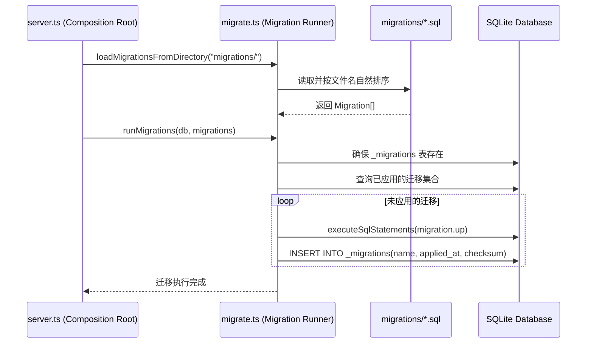

# 数据库与版本化迁移架构 (Database & Migrations)

OpenLearn V2 采用 SQLite 作为嵌入式持久化存储，结合 WAL 模式提供高吞吐并发读写能力，并通过版本化迁移体系保障 Schema 演进的可靠性与幂等性。

---

## 1. 数据库持久化基础 (Storage Foundation)

- **引擎与模式**: 采用 `better-sqlite3`，全生命周期开启 `WAL (Write-Ahead Logging)` 读写分离模式与外键约束：
  ```sql
  PRAGMA journal_mode = WAL;
  PRAGMA synchronous = NORMAL;
  PRAGMA foreign_keys = ON;
  ```
- **多环境路径解析**:
  - **生产与标准开发**: 默认存放于 `packages/core/db/educational_os.db`，支持通过环境变量 `OPENLEARN_DB_PATH` 自定义重定向。
  - **Vitest 测试并发隔离**: 当检测到 `process.env.VITEST` 激活时，按 Worker 进程 Pool ID / PID 在临时目录分配独立数据库（`/tmp/openlearn_test_dbs/openlearn_test_${poolId}.db`），彻底消除并发测试时的文件写锁争用，支持 170+ 测试套件高速并行回归。

---

## 2. 版本化迁移引擎 (Phase 20 - DB-MIG-01)

为替代遗留的散落 `try/catch ALTER TABLE` 模式，平台在 `server/utils/migrate.ts` 中构建了轻量可靠的版本化数据库迁移运行器。

### 迁移约定与文件规范

迁移脚本位于根目录 `migrations/`，遵循统一规范：
1. **命名格式**: `NNN_description.sql`（`NNN` 为三位序号升序执行）；
2. **段落切分**: 使用 `-- UP` 声明正向迁移操作，使用 `-- DOWN` 声明回滚逆操作；
3. **元表追踪**: 引擎自动维护 `_migrations` 状态表：
   ```sql
   CREATE TABLE IF NOT EXISTS _migrations (
     name TEXT PRIMARY KEY,
     applied_at INTEGER NOT NULL,
     checksum TEXT NOT NULL
   );
   ```

### 关键容错与幂等机制

- **增量比对**: 启动时查询 `_migrations` 已有记录，仅应用增量脚本。
- **校验和保障**: 记录迁移脚本正向内容的 Checksum，防止已执行脚本被恶意篡改。
- **历史库平滑升级 (Duplicate Column Tolerate)**: 执行 DDL 时，若遇到旧版本已手工添加的列报错（`duplicate column name`），迁移器自动记录安全提示并继续执行，保障存量老库无痛过渡至版本化管理。

---

## 3. 当前标准迁移序列

| 序号 | 迁移文件 | 职责说明 |
|---|---|---|
| `000` | `000_initial_schema.sql` | 核心基础数据表（30+ 表）与性能索引全量建表 |
| `001` | `001_add_execution_mode.sql` | `plugins` 表新增 `execution_mode`（支持 worker/inline） |
| `002` | `002_add_client_session_expiry.sql` | `client_sessions` 表新增 `expires_at` 会话超时字段 |
| `003` | `003_classroom_runtime.sql` | 课堂工具与 AI 对话记忆表（`student_rollcalls`, `site_settings`, `agent_conversations`） |

---

## 4. 架构时序


