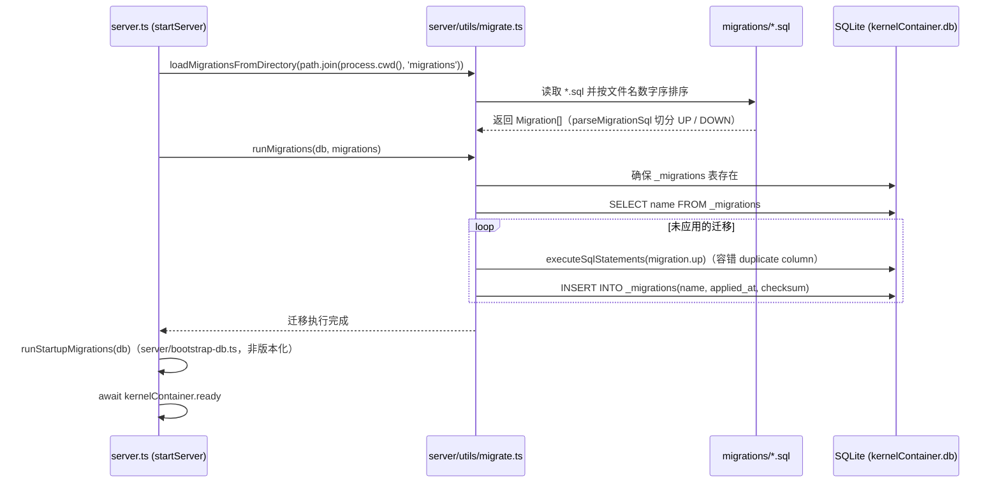

# 数据库与版本化迁移架构 (Database & Migrations)

# 数据库与版本化迁移架构 (Database & Migrations)

OpenLearn V2 采用 SQLite 作为嵌入式持久化存储，结合 WAL 模式提供高吞吐并发读写能力，并通过版本化迁移体系保障 Schema 演进的可靠性与幂等性。

---

## 1. 数据库持久化基础 (Storage Foundation)

- **引擎与模式**: 采用 `better-sqlite3`，全生命周期开启 `WAL (Write-Ahead Logging)` 读写分离模式与外键约束：
  ```sql
  PRAGMA journal_mode = WAL;
  PRAGMA synchronous = NORMAL;
  PRAGMA foreign_keys = ON;
  ```
- **多环境路径解析**:
  - **生产与标准开发**: 默认存放于 `packages/core/db/educational_os.db`，支持通过环境变量 `OPENLEARN_DB_PATH` 自定义重定向。
  - **Vitest 测试并发隔离**: 当检测到 `process.env.VITEST` 激活时，按 Worker 进程 Pool ID / PID 在临时目录分配独立数据库（`/tmp/openlearn_test_dbs/openlearn_test_${poolId}.db`），彻底消除并发测试时的文件写锁争用，支持 170+ 测试套件高速并行回归。

---

## 2. 版本化迁移引擎 (Phase 20 - DB-MIG-01)

为替代遗留的散落 `try/catch ALTER TABLE` 模式，平台在 `server/utils/migrate.ts` 中构建了轻量可靠的版本化数据库迁移运行器。

### 迁移约定与文件规范

迁移脚本位于根目录 `migrations/`，遵循统一规范：

1. **命名格式**: `NNN_description.sql`（`NNN` 为三位序号升序执行）；
2. **段落切分**: 使用 `-- UP` 声明正向迁移操作，使用 `-- DOWN` 声明回滚逆操作。`parseMigrationSql` 对二者均为可选：未匹配到 `-- UP` 时**整份文件内容**即视为 UP，未匹配到 `-- DOWN` 时 `down` 为空串。
   - 因此「缺少 DOWN 段」不会阻塞**正向**应用，但 `rollbackMigration` 会在该迁移上直接 `throw new Error('Migration ... does not provide a DOWN rollback script.')`。**若希望某个迁移可回滚，`-- DOWN` 段是硬性要求。**
   - `migrations/` 下 **16 个迁移全部**带 `-- UP` / `-- DOWN` 段（2026-10-04 补齐了 `009_classroom_peer_review.sql` 与 `011_classroom_feed.sql` 的 DOWN，二者此前整篇被当作 UP 执行且不可回滚）。有 DOWN 段后 `rollbackMigration()` 对全部迁移均可用。
3. **元表追踪**: 引擎自动维护 `_migrations` 状态表：
   ```sql
   CREATE TABLE IF NOT EXISTS _migrations (
     name TEXT PRIMARY KEY,
     applied_at INTEGER NOT NULL,
     checksum TEXT NOT NULL
   );
   ```

### 关键容错与幂等机制

- **增量比对**: 启动时查询 `_migrations` 已有记录，仅应用增量脚本（按 `name` 精确匹配）。
- ✅ **校验和已实际校验**（2026-10-04 修复）：`runMigrations` 现在读出 `_migrations.checksum` 并与磁盘上 UP 段的 `simpleChecksum` 比对，检出漂移时返回 `ChecksumDrift[]` 并打印醒目告警。设 `MIGRATION_CHECKSUM_STRICT=true` 可改为直接抛错阻断启动（默认不阻断 —— 已执行的部分无法靠抛错回退，拒绝启动并不能修复它）。迁移文件已从磁盘移除的情况会跳过，不误报。
- ✅ **逐条事务**（2026-10-04 修复）：此前 UP 脚本逐条 `db.exec` 且**不在事务内**，中途失败会留下半应用状态，且 `_migrations` 行未写入 → 重启后重跑已执行过的语句。现将「执行 + 登记 checksum」放进同一个 `db.transaction`，失败即整体回滚。
- **无事务包裹**: 单条迁移的 UP 段由 `executeSqlStatements` 逐句 `db.exec`，语句间不显式开事务；中途失败会留下「部分已执行」的中间态，而 `_migrations` 记录不会写入，重启后会重跑该迁移（依赖上面的 `duplicate column name` 容错才能不炸）。
- **历史库平滑升级 (Duplicate Column Tolerate)**: 执行 DDL 时，若遇到旧版本已手工添加的列报错（`duplicate column name`），`executeSqlStatements` 打印 `console.warn` 并 `continue`，迁移器自动记录安全提示并继续执行，保障存量老库无痛过渡至版本化管理。

---

## 3. 当前标准迁移序列

`migrations/` 下现有 **`000`–`014` 共 15 个 `.sql` 脚本**（按文件名数字序升序执行）：

| 序号  | 迁移文件                            | 职责说明                                                                                                                  |
| ----- | ----------------------------------- | ------------------------------------------------------------------------------------------------------------------------- |
| `000` | `000_initial_schema.sql`            | 核心基础数据表（30+ 表）与性能索引全量建表                                                                                |
| `001` | `001_add_execution_mode.sql`        | `plugins` 表新增 `execution_mode`（支持 worker/inline）                                                                   |
| `002` | `002_add_client_session_expiry.sql` | `client_sessions` 表新增 `expires_at` 会话超时字段                                                                        |
| `003` | `003_classroom_runtime.sql`         | 课堂工具与 AI 对话记忆表（`student_rollcalls`, `site_settings`, `agent_conversations`）                                    |
| `004` | `004_courseware_score_config.sql`   | 互动课件成绩归集策略表 `courseware_score_config`（宿主侧按策略从样本历史算最终分）                                         |
| `005` | `005_assignment_hub.sql`            | 作业中心：新增 `plugin_assignments` / `plugin_submission_versions` / `plugin_assignment_files` / 互评任务表，并重建 `plugin_submissions` 以支持「按作业」唯一 |
| `006` | `006_classroom_event_bus.sql`       | `events` 审计表补课堂维度：新增 `lesson_id` 列与 `timestamp` / `correlationId` / `(lesson_id, timestamp)` 索引            |
| `007` | `007_interactive_classroom.sql`     | 互动课堂与课节生命周期：`lesson_quiz_submissions` / `classroom_sessions` / `classroom_quick_polls` / `classroom_poll_votes` / `classroom_buzzers` / `classroom_exit_tickets` / `classroom_pacing_signals` |
| `008` | `008_teaching_modes.sql`            | 教学模式表 `teaching_modes` 与 `classroom_sessions.teaching_mode_id`（课堂启动门户的模式选择器数据源）                    |
| `009` | `009_classroom_peer_review.sql`     | 课中全班大屏互评：`classroom_peer_review_tasks` / `classroom_peer_reviews` / `classroom_peer_badges` / `classroom_peer_nominations` / `classroom_danmaku` / `classroom_peer_rubric_dimensions` |
| `010` | `010_class_groups.sql`              | 小组表 `class_groups`                                                                                                       |
| `011` | `011_classroom_feed.sql`            | 课堂动态流表 `classroom_feed`（教师离开课堂再回来后可按 lesson 回放）                                                     |
| `012` | `012_auto_record_score.sql`         | `courseware_score_config` 补自动录入规则列 `auto_record_enabled` / `auto_record_min_completion`                            |
| `013` | `013_score_source_strategy.sql`     | `assignment_submissions` 补 `source` 列（manual/auto 分流）+ `courseware_score_config` 补 `auto_record_strategy`（latest/highest） |
| `014` | `014_performance_indexes.sql`       | 五个高频查询索引（`vfs_nodes.parent_id`、`plugin_submissions.lesson_id`、`student_point_logs.student_id`、`student_rollcalls.class_id` / `student_id`） |

> `012` / `013` 的 DOWN 段采用「建 `*__rollback` 临时表 → 重命名覆盖」的方式回滚 `ADD COLUMN`，因为旧版 SQLite 内核不支持 `ALTER TABLE ... DROP COLUMN`，且迁移执行器只对 `duplicate column` 做容错。

---

## 4. 架构时序

启动时 `startServer()`（`server.ts`）在 `ServerBootstrapAdapter.bootstrap(...)` 之后、`await kernelContainer.ready` 之前执行版本化迁移。整段被 `try/catch` 包裹，失败只 `console.error('[Migration] Failed to run database migrations:', err)`，**不阻断服务启动**。

紧随其后的 `runStartupMigrations(kernelContainer.db)`（`server/bootstrap-db.ts`）是另一套**独立的**启动期修补逻辑（旧版内置插件升级、遗留 `try/catch ALTER TABLE` 式建表），与 `_migrations` 版本化体系无关，两者是先后串行、互不感知的。


```mermaid
sequenceDiagram
    participant Boot as server.ts (startServer)
    participant Migrate as server/utils/migrate.ts
    participant FS as migrations/*.sql
    participant DB as SQLite (kernelContainer.db)

    Boot->>Migrate: loadMigrationsFromDirectory(path.join(process.cwd(), 'migrations'))
    Migrate->>FS: 读取 *.sql 并按文件名数字序排序
    FS-->>Migrate: 返回 Migration[]（parseMigrationSql 切分 UP / DOWN）
    Boot->>Migrate: runMigrations(db, migrations)
    Migrate->>DB: 确保 _migrations 表存在
    Migrate->>DB: SELECT name FROM _migrations
    loop 未应用的迁移
        Migrate->>DB: executeSqlStatements(migration.up)（容错 duplicate column）
        Migrate->>DB: INSERT INTO _migrations(name, applied_at, checksum)
    end
    Migrate-->>Boot: 迁移执行完成
    Boot->>Boot: runStartupMigrations(db)（server/bootstrap-db.ts，非版本化）
    Boot->>Boot: await kernelContainer.ready
```
