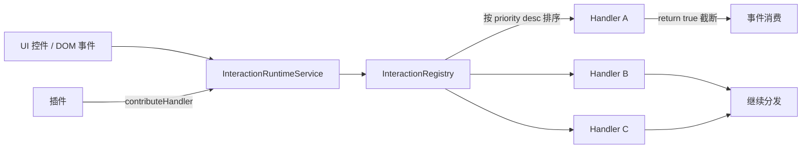

# Interaction Runtime 架构说明

OpenLearn V2 的 **Interaction Runtime**（Sprint P2-09）位于 `src/features/interaction-runtime/`，是前端统一的人机交互事件编排中心，覆盖 9 个交互域（Keyboard / Mouse / Touch / Gesture / Drag / Clipboard / Focus / ContextMenu / Selection）。

---

## 整体定位

Interaction Runtime 在前端架构中扮演**单一交互事件总线**的角色：

```
UI 控件 ─┐
          ├─► InteractionRuntimeService ─► InteractionRegistry ─► InteractionHandler[]
UI 事件  ─┘                                                            ▲
                                                                       │
插件 (Plugin) ──── contributeHandler() ───────────────────────────────┘
```

所有 UI 交互事件（键盘、鼠标、触摸、剪贴板等）都通过 `InteractionRuntimeService` 统一派发，由 `InteractionRegistry` 按优先级分发给已注册的 `InteractionHandler`。插件可以通过 `contributeHandler()` 注入自定义交互逻辑。

---

## 核心数据结构

### InteractionEvent（不可变事件）

```typescript
export interface InteractionEvent<T = Record<string, unknown>> {
  readonly id: string;             // 自动生成 evt_<domain>_<ts>_<rand>
  readonly domain: InteractionDomain;
  readonly targetId?: string;
  readonly payload: T;
  readonly timestamp: number;
}
```

### InteractionDomain（9 个交互域）

```typescript
export type InteractionDomain =
  | 'Keyboard' | 'Mouse' | 'Touch' | 'Gesture' | 'Drag'
  | 'Clipboard' | 'Focus' | 'ContextMenu' | 'Selection';
```

### InteractionHandler（优先级处理器）

```typescript
export interface InteractionHandler {
  readonly id: string;
  readonly domain: InteractionDomain;
  readonly priority?: number;      // 数值越大优先级越高
  readonly handle: (event: InteractionEvent) => boolean | void;
  // 返回 true 表示事件已被消费（截断）
}
```

---

## 组件关系



### InteractionRegistry（注册中心）

`Map<string, InteractionHandler>` 存储：

| 方法 | 行为 |
|---|---|
| `register(handler)` | 校验 id 非空，按 id 覆盖 |
| `unregister(handlerId)` | 返回 boolean |
| `getHandlers(domain)` | 按 `priority` 降序返回冻结数组 |
| `dispatch(event)` | 顺序调用，返回首个 `handle() === true` 的结果 |
| `clear()` | 清空所有 handler |

### InteractionRuntimeService（门面层）

提供 9 个领域派发 helper + 插件贡献 API：

| 方法 | 领域 |
|---|---|
| `dispatchKeyboard(key, shortcut?, targetId?)` | Keyboard |
| `dispatchMouse(type, x, y, targetId?)` | Mouse |
| `dispatchTouch(type, touches, targetId?)` | Touch |
| `dispatchGesture(type, scale?, rotation?, targetId?)` | Gesture |
| `dispatchDrag(phase, deltaX, deltaY, targetId?)` | Drag |
| `dispatchClipboard(action, content?, targetId?)` | Clipboard |
| `setFocus(targetId) / getFocusedTargetId()` | Focus（持有状态） |
| `openContextMenu(x, y, menuItems?, targetId?)` | ContextMenu |
| `setSelection(ids, targetId?) / getSelection()` | Selection（持有状态） |

`emitEvent()` 内部自动生成 `id` 和 `timestamp`，构造 `InteractionEvent` 后调用 `registry.dispatch()`。

`Focus` 和 `Selection` 是**有状态领域**（service 内持有 `currentFocusTargetId` / `currentSelectionIds`），其余 7 个是**无状态纯派发**。

---

## 插件贡献协议

```typescript
// 插件中
const svc = container.resolve(INTERACTION_RUNTIME_TOKEN);
svc.contributeHandler({
  id: 'my-plugin.shortcut-ctrl-s',
  domain: 'Keyboard',
  priority: 100,
  handle: (evt) => {
    if (evt.payload.key === 's' && evt.payload.shortcut === 'ctrl') {
      save();
      return true; // 截断，不让其他 handler 处理
    }
  },
});

// 卸载插件时
svc.removeHandler('my-plugin.shortcut-ctrl-s');
```

**优先级语义**：
- 数值大者**先**执行；
- 任一 handler 返回 `true` 即截断（"事件被消费"）；
- 未截断的 handler 仍会按序执行完。

---

## 在 Layer-2 中的位置

参考 [`platform-kernel.md`](./platform-kernel.md) Layer 2_6 节点（`ClassroomRuntimeKernel`）。Interaction Runtime 是**前端独有的协作领域引擎**，与 Layer 2 中其他 runtime（`LessonRuntime` / `ClassroomRuntime` / `PresenceEngine` 等）平行存在；它**不参与课堂生命周期**，只负责低层交互事件归一化。

| 维度 | Interaction Runtime | Classroom Runtime |
|---|---|---|
| 作用层 | UI 交互层（DOM 事件归一化） | 业务编排层（课堂生命周期） |
| 状态 | Focus / Selection 状态可保留 | 9 阶段状态机 |
| 跨域 | 仅前端 | 跨前后端（前后端各一份实现） |

---

## 约束与不变量

1. **不可变事件**：`InteractionEvent` 所有字段都是 `readonly`，handler 不能修改传入的事件。
2. **handler id 必须唯一**：重复 `register()` 同 id 会覆盖。
3. **`dispatch` 返回值语义**：`true` = 已截断；`false` = 无人处理或全部放行；调用方据此决定是否执行默认行为。
4. **线程模型**：当前为单线程（前端 JS 主线程），`getHandlers` 返回冻结数组，避免 handler 运行时被修改。
5. **插件清理责任**：`removeHandler` 由插件自己负责调用；Interaction Runtime 不做反向追踪。

---

## 相关源码

- `src/features/interaction-runtime/interaction-types.ts`（21 行）— 类型契约
- `src/features/interaction-runtime/interaction-registry.ts`（42 行）— 注册中心
- `src/features/interaction-runtime/interaction-runtime-service.ts`（121 行）— 门面层
- `src/features/interaction-runtime/index.ts`（7 行）— 桶导出

合计 191 行 / 4 文件。
