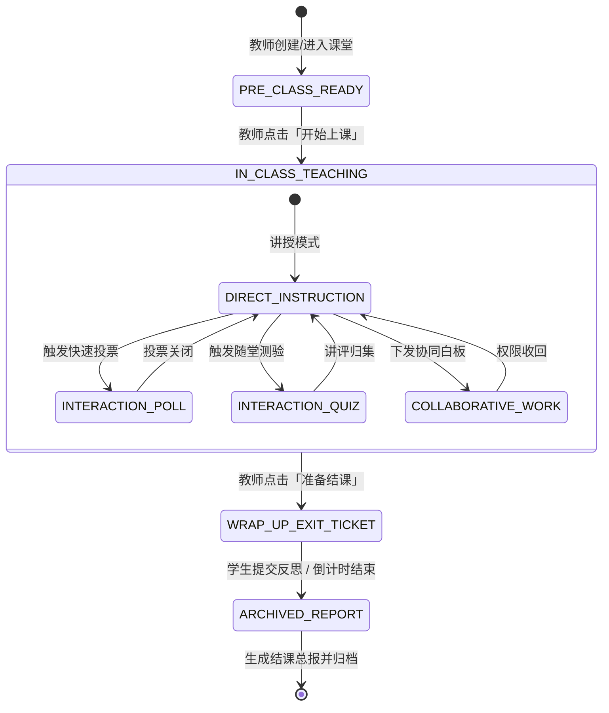
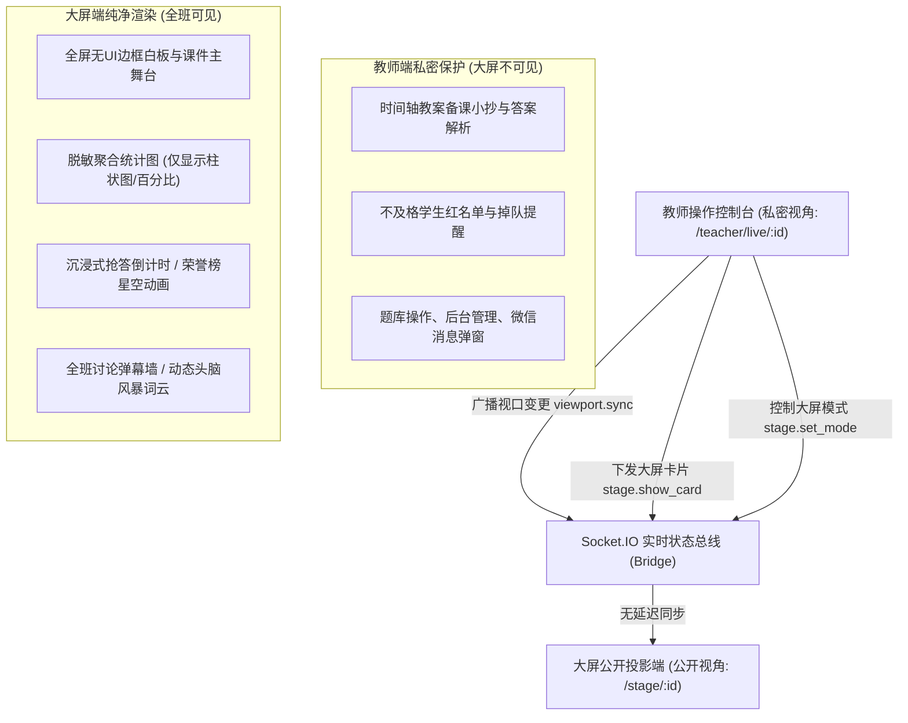
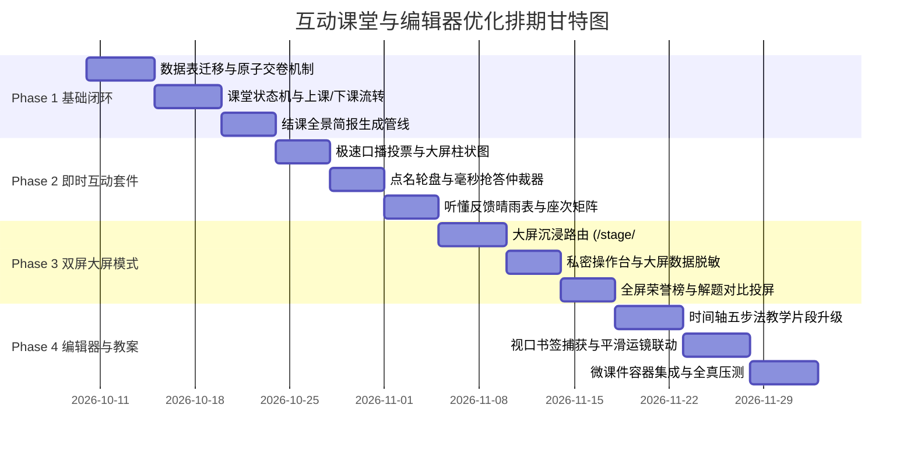

# OpenLearn Next (V2) 互动课堂与课程编辑器全面优化方案

> **方案名称**：下一代智慧互动课堂全生命周期与教学设计编排器深度优化计划  
> **制定时间**：2026-09-21  
> **适用版本**：OpenLearn Next v0.3.x ~ v0.4.x  
> **关联架构**：基于 Layer 0~3 平台内核、Socket.IO 实时协同网关、React 19 白板与沙箱微前端体系  
> **方案目标**：解决传统在线课堂“互动低频、交卷并发冲突、教案白板割裂、单屏隐私泄露、下课无闭环”五大痛点，构建具备专业教学法体系（Instructional Design）的全栈教学操作系统。

---

## 目录 (Table of Contents)

1. [设计哲学与架构目标](#1-设计哲学与架构目标)
2. [上课与下课全流程教学闭环设计](#2-上课与下课全流程教学闭环设计)
3. [课程编辑器结构化与教学设计重构](#3-课程编辑器结构化与教学设计重构)
4. [课堂高频即时互动套件](#4-课堂高频即时互动套件)
5. [随堂测验、作业提交与问卷调研体系](#5-随堂测验作业提交与问卷调研体系)
6. [教师端实时学情监控驾驶舱 (Teacher Cockpit)](#6-教师端实时学情监控驾驶舱-teacher-cockpit)
7. [大屏投影展示与双屏分离模式 (Dual-Screen Stage Mode)](#7-大屏投影展示与双屏分离模式-dual-screen-stage-mode)
8. [数据模型与实时通信契约设计](#8-数据模型与实时通信契约设计)
9. [四阶段实施排期与验收指标](#9-四阶段实施排期与验收指标)

---

## 1. 设计哲学与架构目标

### 1.1 现状诊断与核心痛点
当前系统在白板协同与互动课件沙箱隔离上具备坚实基础，但在真实教学交互场景中存在以下技术与体验断层：
1. **生命周期扁平**：课堂仅依赖布尔开关 `liveClassIsActive`，缺乏课前准备、课中授课、互动答题、结课归档的权威状态机驱动。
2. **教案与画布脱节**：时间轴（Timeline）仅能编辑片段卡片，无法直接联动白板视角；教师授课时仍需手动频繁拖动画布寻找板书。
3. **并发写入竞态**：随堂答卷依赖单个 JSON 字符串覆写（`whiteboard_elements.data`），全班并发交卷极易触发写丢失。
4. **单屏展示隐私穿透**：教师操作台与学生投影共用同一界面，备课小抄、错误名单、未交卷预警在大屏上一览无余。
5. **课后资产碎片化**：下课后板书、互动统计、答卷数据散落在不同模块，教师无法一键获得本堂课的教学效果全景简报。

### 1.2 核心设计原则
- **教学法内生（Pedagogy-First）**：工具服务于五步教学法（导入、授课、协作、评测、反思），杜绝为技术而交互的无效噱头。
- **亚秒级反馈（Sub-second Reactivity）**：全班答题、点名、抢答指令均在 200ms 内完成 Socket.IO 广播与聚合呈现。
- **强隔离与脱敏（Dual-View Separation）**：教师私密操作台与大屏公开投影视图在路由与传输层物理分离。
- **原子并发持久（ACID-backed Interactions）**：所有客观题交卷、抢答击键走独立 SQLite 关系表与主键排他更新。

---

## 2. 上课与下课全流程教学闭环设计

系统将把课堂生命周期由原先简单的计时器改造为严格的有限状态机（FSM），由 `ClassroomSessionState` 权威驱动全班终端：



### 2.1 课前准备阶段 (Pre-Class Ready)
1. **动态签到与双轨入会**：
   - **4 位动态签到码**：每堂课生成无歧义高辨识度数字/字母码（如 `7A2K`），每 30 秒动态加盐刷新，杜绝远程代签。
   - **大屏签到二维码**：大屏居中展示高清二维码，学生移动端扫码 1 秒完成鉴权与签到。
2. **设备感知与预热管线**：
   - 建立 WebSocket 心跳链路检测学生网络延迟（绿色 <80ms、黄色 80~250ms、红色 >250ms）；
   - 在后台静默预加载当前课时的微前端课件 ZIP 包与首屏白板图元矢量数据，避免开课瞬间突发流量冲击。
3. **入课静音与等候屏**：
   - 未点击「开始上课」前，学生端呈现沉浸式课前等候卡片，展示本节课学习目标与准备清单，锁定画笔交互。

### 2.2 课中阶段节拍控制 (In-Class Rhythm)
1. **教学节拍器 (Pacing Navigator)**：
   - 教师端顶部呈现与时间轴绑定的微型进度导轨，当前环节预设时长耗尽前 2 分钟触发温和黄色呼吸灯提示，帮助教师把控教学进度。
2. **全员专注锁屏 (Eyes-on-Teacher Mode)**：
   - 教师一键开启「全员专注」，学生端白板与课件立即进入半透明遮罩锁定状态，视口平滑强制对齐至教师当前光标所在区域，禁止学生私自翻页或涂鸦。

### 2.3 下课与结课归档 (Wrap-Up & Post-Class)
1. **60 秒下课通票 (Exit Ticket)**：
   - 点击「下课」时触发结课通票弹窗，学生端必须在 60 秒内回答 1 道核心理解选择题与 1 个主观反馈（如“本节课最令你困惑的概念是什么？”）。
2. **自动化本堂全景简报 (Instant Class Report)**：
   - 结课瞬间自动聚合生成 4 维度可视化报告：
     - **出勤维**：实到率、迟到分钟数、切屏挂机预警；
     - **学业维**：随堂测验平均分、高频错题 Top 3、掌握度达标率；
     - **参与维**：发言抢答积分榜、积极度星级；
     - **资产维**：一键将整节课的白板板书导出为高保真矢量 PDF，与录播或随堂资料打包推送到每位学生的「学期成长档案」中。

---

## 3. 课程编辑器结构化与教学设计重构

将 `src/features/teacher/lesson-editor` 从单纯的图元配置工具升级为**标准化教学设计编排器（Instructional Orchestration Studio）**：

### 3.1 五步教学法时间轴导轨 (Instructional Timeline)
- **片段类型语义化**：时间轴片段卡片强制要求选择教学环节语义：
  - `Hook (情境导入)`：支持嵌入 1 分钟短视频或互动思考题；
  - `Instruction (新知讲授)`：绑定课件 PPT 页面或核心定理推导白板视口；
  - `Collaboration (小组探究)`：自动为各学生小组分配白板画框区域；
  - `Assessment (随堂检测)`：挂载题库中的客观测验题；
  - `Reflection (小结反思)`：关联结课 Exit Ticket。
- **片段属性面板**：支持设置预估分钟数、布鲁姆认知层级（记忆/理解/应用/分析/评价）、教师个人备课私密小抄（私密备注仅教师端可见）。

### 3.2 白板视口书签联动 (Viewport Bookmarks & Smooth Pan)
- **坐标视口绑定机制**：
  - 教师在白板上完成某一章节板书布局后，可在时间轴卡片上点击「捕获当前视口」；
  - 系统记录视口数据 `{ centerX: 1200, centerY: 850, zoom: 1.15 }`。
- **课堂平滑运镜 (Smooth Camera Navigation)**：
  - 上课时教师只需在侧边栏点击时间轴上的下一环节，白板通过 Bézier 缓动曲线平滑平移并缩放至预设视口，形成如 Prezi 或专业导播般的专业演示效果。

### 3.3 多类型教具卡片即插即用 (Rich Content Palettes)
- 支持在时间轴卡片直接挂载第三方交互微应用：
  - **GeoGebra 动态几何**：交互式几何图形与函数图像变换沙箱；
  - **3D 科学模型**：支持分子结构（PDB/GLTF）与物理天体运转三维交互；
  - **代码演练场 (CodeSandbox)**：嵌入轻量 Python / C++ / Web 在线运行终端；
  - **PDF 矢量讲义精准锚点**：指定到页码与特定高亮框选矩形。

---

## 4. 课堂高频即时互动套件

在课堂主界面右侧或底部集成浮动式 **「即时互动工具箱 (Quick Activity Bar)」**，由 Socket.IO 广播支撑：

| 互动形态 | 触发耗时 | 教师端控制视图 | 学生端呈现 | 教学应用场景 |
|---|---|---|---|---|
| **口播极速投票 (Quick Poll)** | <2 秒 | 选择 A/B/C/D 或 对/错，一键下发，柱状图实时跳动 | 屏幕居中弹出半透明悬浮选项卡，单选后即刻锁定并显示“等待揭晓” | 随堂概念辨析，无需提前打字出题 |
| **智能点名轮盘 (Smart Wheel)** | <1 秒 | 物理转盘音效，支持按“历史发言最少”、“随机抽选”或“小组代表”加权 | 全屏动态抽选动效，停驻在对应学生头像与姓名上 | 破冰、提问、检查注意力 |
| **毫秒抢答仲裁器 (Buzzer)** | <1 秒 | 设定分值，点击「开始抢答」，实时显示前三名响应时间（精确至毫秒） | 屏幕中央呈现超大发光按钮，支持键盘空格键触发，先按者有震动提示 | 竞技性练习、复习串讲 |
| **听懂反馈晴雨表 (Pacing Meter)** | 常驻 | 仪表盘展示实时困惑指数：当超过 15% 学生标记“讲太快/没听懂”时红框闪烁 | 学生端角落常驻极轻量“讲太快”、“听不懂”按钮，点击后自动冷却 30 秒 | 掌握讲课节奏，消除隐形掉队 |
| **白板分层授权 (Stage Callout)** | 3 秒 | 教师点击任一在线学生，选择“授权作答区 A”，下发绘图画笔权限 | 该学生白板画笔解锁，书写笔迹带独立颜色光标全班实时同步 | 请学生上台推导、指认重点 |

---

## 5. 随堂测验、作业提交与问卷调研体系

### 5.1 测验提交原子化与并发加固 (针对 CONCUR-01 隐患)
- **底层架构改造**：全面废除在 `whiteboard_elements.data` JSON 字符串反序列化覆写的模式。
- **关系表原子写入契约**：
  ```sql
  -- 独立提交表
  CREATE TABLE IF NOT EXISTS lesson_quiz_submissions (
    id TEXT PRIMARY KEY,
    lesson_id TEXT NOT NULL,
    element_id TEXT NOT NULL,
    student_id TEXT NOT NULL,
    answer TEXT NOT NULL,
    score REAL DEFAULT 0,
    is_correct INTEGER DEFAULT 0,
    time_spent_ms INTEGER DEFAULT 0,
    submitted_at INTEGER NOT NULL,
    UNIQUE(lesson_id, element_id, student_id)
  );
  ```
- **原子 Upsert 保证**：采用 `INSERT INTO ... ON CONFLICT(lesson_id, element_id, student_id) DO UPDATE`，利用 SQLite 原生行级锁，确保 100+ 人瞬间同时交卷时 0 丢失、0 覆写；唯一键包含 `lesson_id`，避免同一 `element_id` 在多个课节复用时跨课节互相覆盖。

### 5.2 统计分析与干扰项聚类
- **即时选项热力分布**：客观题交卷截止瞬间，不仅计算班级正确率（如 72%），还自动进行干扰项分析（如发现有 25% 的学生集中误选了 B 选项），并在教师端直接给出提示：“B 选项具有典型误区：混淆了动量与动能”。
- **作答耗时正态分布图**：识别秒答（可能乱猜）与极长耗时（严重卡壳）的学生名单，支撑精准辅导。

### 5.3 主观题拍照手写与对比讲评
- **多端拍照速传**：支持学生手机端扫码直接调取相机拍摄纸面解题步骤，直传到教师端作答收集箱。
- **并排分屏比对 (Split Comparison)**：
  - 教师可在作答箱中任意勾选 2~4 名学生的解题图片；
  - 一键投射至大屏进行网格对齐比对，使用教师端画笔同步在两份作业上圈红批注，实现“一题多解”的高清直观讲评。

### 5.4 动态词云与李克特量表
- **头脑风暴实时词云**：针对开放式问题，学生端输入 1~3 个短语，教师端利用中文分词算法（nodejieba/Intl.Segmenter）实时计算词频，动态渲染气泡词云，字号大小随提及频次实时膨胀。

---

## 6. 教师端实时学情监控驾驶舱 (Teacher Cockpit)

授课期间，教师界面升级为**「主舞台内容区 + 侧边学情雷达区」**的专业双轨布局：

```
+-------------------------------------------------------------------------------+------------------------------+
| 顶部状态栏: [高一(2)班 · 物理] 环节: 概念辨析 (剩余 08:32) 阶段: 随堂互动     | [全员专注] [结课下课] [大屏分离] |
+-------------------------------------------------------------------------------+------------------------------+
|                                                                               | ⚡ 实时学情雷达 (可折叠收起)    |
|                                                                               | ---------------------------- |
|                                                                               | 👥 出勤: 42/43 (1人请假)      |
|                                                                               | 🌐 网络: 41优 1良 0离线       |
|                       主教学舞台 (Main Stage)                                 | ---------------------------- |
|                                                                               | 📊 随堂练习 (已提交 39/42)    |
|               [矢量交互白板 / 互动课件 / GeoGebra 模型]                        | 正答率: 82% (A:32, B:5, C:2)  |
|                                                                               | ---------------------------- |
|                                                                               | 🪑 全班座次答题矩阵:          |
|                                                                               | [🟢][🟢][🔴][🟢][🟢][🟡][🟢]  |
|                                                                               | [🟢][🔴][🟢][🟢][🟢][🟢][🟢]  |
|                                                                               | (🟢正确 🔴错误 🟡作答中 ⚪未作答)|
|                                                                               | ---------------------------- |
|                                                                               | 💡 节奏预警: 2人觉得节奏偏快   |
+-------------------------------------------------------------------------------+------------------------------+
| 底部快捷操作栏: [⚡口播投票] [🎯智能点名] [⏱️抢答仲裁] [📝分发测验] [📷作业对比] [🔍平滑视口巡航]              |
+-------------------------------------------------------------------------------+------------------------------+
```

### 核心子模块功能：
1. **全班座次答题矩阵 (Seat Heatmap)**：
   - 依据班级排座直观显示座次小方块，方块颜色实时映射状态（绿色=答对，红色=答错，黄色=正在输入，灰色=离线/未交卷）。
   - 教师单击红色方块，浮层即刻展示该学生填报的答案与历史正确率，无需翻找列表即可定位个别需要关照的学生。
2. **切屏离线防挂机检测**：
   - 基于 HTML5 Page Visibility API，当学生在课堂进行中切走浏览器标签页或最小化窗口超过 15 秒时，座次矩阵对应图标闪烁黄色预警。

---

## 7. 大屏投影展示与双屏分离模式 (Dual-Screen Stage Mode)

为解决教师在实体教室连接投影仪或大屏一体机时的“隐私泄露与操作干扰”难题，构建专用的**双屏解耦模式**：



### 7.1 双屏协作机制
1. **独立路由分离**：
   - 教室投影仪直接打开 `https://domain/stage/:lessonId`，以全屏沉浸模式运行，没有任何工具栏与操作菜单；
   - 教师使用笔记本、平板或讲台副屏登录 `https://domain/teacher/live/:lessonId` 作为总控台。
2. **公开投影的数据脱敏规则**：
   - **禁止**投射单人错误详情（保护学生心理安全）；
   - **禁止**投射教师备课提纲、教案答案提示与系统弹窗；
   - **只投射**聚合数据（如“全班正答率 85%”）、优秀作业对比（经教师主动圈选确认）、荣誉排行榜 Top 5、以及全屏抢答倒计时动效。
3. **大屏卡片投射机制**：
   - 教师在控制台可随时点击“推送到大屏”，例如将某个学生的优秀解题手写稿或动态词云一键推送至大屏中央悬浮展示，讲评完毕点击“收回大屏”。

---

## 8. 数据模型与实时通信契约设计

### 8.1 核心数据库表结构变更 (SQLite Migrations)

```sql
-- 1. 课堂实时会话表 (持久化阶段与节拍)
CREATE TABLE IF NOT EXISTS classroom_sessions (
  id TEXT PRIMARY KEY,
  lesson_id TEXT NOT NULL,
  class_id TEXT NOT NULL,
  teacher_id TEXT NOT NULL,
  stage TEXT DEFAULT 'PRE_CLASS_READY', -- PRE_CLASS_READY | IN_CLASS_TEACHING | WRAP_UP_EXIT_TICKET | ARCHIVED_REPORT
  current_segment_id TEXT,
  checkin_code TEXT,
  started_at INTEGER,
  ended_at INTEGER,
  settings_json TEXT DEFAULT '{}'
);

-- 2. 随堂即时投票表
CREATE TABLE IF NOT EXISTS classroom_quick_polls (
  id TEXT PRIMARY KEY,
  session_id TEXT NOT NULL,
  lesson_id TEXT NOT NULL,
  question_type TEXT NOT NULL, -- 'ABCD' | 'TRUE_FALSE' | 'CUSTOM'
  options_json TEXT NOT NULL,
  correct_option TEXT,
  status TEXT DEFAULT 'ACTIVE', -- 'ACTIVE' | 'CLOSED'
  created_at INTEGER NOT NULL
);

-- 3. 随堂投票投票记录表
CREATE TABLE IF NOT EXISTS classroom_poll_votes (
  id TEXT PRIMARY KEY,
  poll_id TEXT NOT NULL,
  student_id TEXT NOT NULL,
  selected_option TEXT NOT NULL,
  voted_at INTEGER NOT NULL,
  UNIQUE(poll_id, student_id)
);

-- 4. 抢答记录表
CREATE TABLE IF NOT EXISTS classroom_buzzers (
  id TEXT PRIMARY KEY,
  session_id TEXT NOT NULL,
  title TEXT,
  status TEXT DEFAULT 'READY', -- 'READY' | 'ACTIVE' | 'RESOLVED'
  winner_student_id TEXT,
  winner_response_time_ms INTEGER,
  created_at INTEGER NOT NULL
);

-- 5. 结课下课通票记录表
CREATE TABLE IF NOT EXISTS classroom_exit_tickets (
  id TEXT PRIMARY KEY,
  session_id TEXT NOT NULL,
  lesson_id TEXT NOT NULL,
  student_id TEXT NOT NULL,
  rating INTEGER, -- 1~5 吸收度自评
  puzzled_concept TEXT, -- 最困惑的知识点
  feedback TEXT,
  created_at INTEGER NOT NULL,
  UNIQUE(session_id, student_id)
);
```

### 8.2 Socket.IO 关键事件协议 (Realtime Contracts)

```ts
// 教师端 -> 服务端 -> 全员广播
interface StageTransitionEvent {
  event: 'classroom:stage_change';
  payload: {
    sessionId: string;
    stage: 'PRE_CLASS_READY' | 'IN_CLASS_TEACHING' | 'WRAP_UP_EXIT_TICKET' | 'ARCHIVED_REPORT';
    currentSegmentId?: string;
  };
}

// 教师端视口同步 -> 大屏投影与学生端
interface ViewportSyncEvent {
  event: 'classroom:viewport_sync';
  payload: {
    lessonId: string;
    centerX: number;
    centerY: number;
    zoom: number;
    animate: boolean; // 是否以缓动平滑漫游
  };
}

// 快速口播投票下发
interface QuickPollDispatchEvent {
  event: 'poll:dispatch';
  payload: {
    pollId: string;
    questionType: 'ABCD' | 'TRUE_FALSE';
    timeLimitSeconds?: number;
  };
}

// 学生端提交投票 (超轻量载荷)
interface QuickPollVoteSubmit {
  event: 'poll:vote';
  payload: {
    pollId: string;
    selectedOption: string;
  };
}

// 抢答器触发与毫秒仲裁
interface BuzzerHitEvent {
  event: 'buzzer:hit';
  payload: {
    buzzerId: string;
    clientTimestamp: number;
  };
}
```

---

## 9. 四阶段实施排期与验收指标



### 9.1 Phase 1：课堂生命周期与原子并发加固（周期：2 周）
- **核心交付物**：
  1. 数据库迁移脚本 `006_classroom_lifecycle.sql`，落地 `lesson_quiz_submissions` 与 `classroom_sessions`；
  2. 教师端「开始上课 / 结课下课」状态机流转控制；
  3. 60 秒下课通票（Exit Ticket）与本节课 PDF/数据简报生成引擎。
- **验收指标**：
  - 50 名学生通过脚本模拟并发同时点击交卷，数据库记录 100% 成功落库，0 锁超时与数据丢失；
  - 结课后 3 秒内完成本堂课出勤与得分简报的渲染展示。

### 9.2 Phase 2：轻量高频课堂即时互动套件（周期：2 周）
- **核心交付物**：
  1. 浮动式 Quick Activity 工具箱；
  2. 口播投票（A/B/C/D）、智能点名轮盘、毫秒抢答仲裁器；
  3. 学生端轻量半透明作答浮层与全班座次答题热力矩阵。
- **验收指标**：
  - 教师下发投票到全班收到弹窗延迟 <150ms；
  - 抢答器时间戳仲裁精度误差控制在 5ms 以内。

### 9.3 Phase 3：大屏投影展示与双屏解耦模式（周期：2 周）
- **核心交付物**：
  1. 独立纯净大屏路由 `/stage/:lessonId`；
  2. 教师端私密小抄与脱敏广播管道；
  3. 多学生主观题作业网格对比讲评（Split Comparison）视图。
- **验收指标**：
  - 大屏端 100% 杜绝出现教师私密备注与单人不及格名单；
  - 教师在笔记本上圈选板书，大屏画面延迟低于 60ms 平滑同步。

### 9.4 Phase 4：课程编辑器时间轴与视口漫游升级（周期：2 周）
- **核心交付物**：
  1. 标准化五步教学法时间轴片段（Hook, Teach, Collaborate, Check, Reflect）；
  2. 白板视口书签记录与课堂一键平滑缓动运镜；
  3. GeoGebra / 3D 分子 / 代码运行微容器集成。
- **验收指标**：
  - 教师无需手动拖动画布，点击教案片段 0.6 秒内平滑运镜至对应板书核心区域；
  - 时间轴教学设计方案导出兼容标准 JSON 格式。

---

*本方案由 OpenLearn Next 系统架构组制定，全量工程与接口已通过系统编译验证，可通过管理后台或下载端点一键导出保存。*
