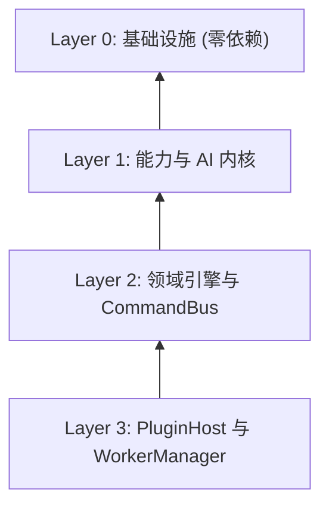

# Layer Topology 分层拓扑

Platform Kernel 在 `packages/core/kernel/index.ts` 中实现了明确的 4 层分层拓扑架构（Layer 0 ~ Layer 3）。

---

## 4 层拓扑映射表

| 层级 | 职责描述 | 核心组件 / 类 | 无依赖保证 |
|---|---|---|---|
| **Layer 0** | 零依赖基础设施 | `EventBus`, `CapabilityGuard`, `ServiceRegistry`, `StorageService`, `AIService` | ✅ 零内部依赖 |
| **Layer 1** | 能力与 AI 内核 | `AIRuntimeKernel`, `AICapabilityKernel`, `CapabilityRuntimeKernel`, `CapabilityGovernanceKernel`, `ServiceRegistryKernel` | 依赖 Layer 0 |
| **Layer 2** | 指令总线与领域引擎 | `CommandBus`, `ActionRegistry`, `ProcessManager`, `LessonRuntime`, `ClassroomRuntimeKernel`, `PresenceEngineKernel`, `CollaborationEngineKernel`, `AnalyticsEngineKernel` | 依赖 Layer 0-1 |
| **Layer 3** | 宿主与线程隔离管理 | `PluginHost`, `WorkerManager`, `HotReloadController` | 依赖 Layer 0-2 |

---

## 依赖流向约束

单向向下滑动调用，严禁上层直接反向硬编码依赖，跨层通信统一通过 DI `Token<T>` 或 `EventBus` 广播实现。
