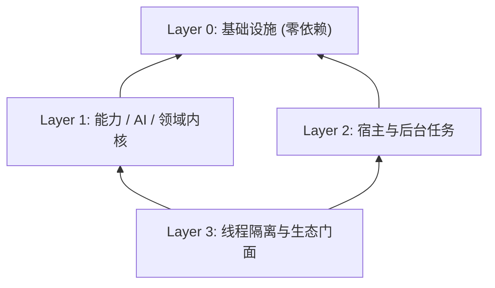

# Layer Topology 分层拓扑

Platform Kernel 在 `packages/core/kernel/index.ts` 中实现了明确的 4 层分层拓扑架构（Layer 0 ~ Layer 3）。下表的分层归属直接对应 `Kernel` 构造函数中各组件 `new` 语句旁的 `// Layer N` 注释。

---

## 4 层拓扑映射表

| 层级        | 职责描述             | Kernel 公开属性名（`kernelContainer.<name>`）                                                                                                                                                            | 无依赖保证     |
| ----------- | -------------------- | ----------------------------------------------------------------------------------------------------------------------------------------------------------------------------------------- | -------------- |
| **Layer 0** | 零依赖基础设施       | `eventBus`, `capabilityGuard`, `serviceRegistry`, `storageService`, `aiService`, `esmLoader`, `db`                                                                                         | ✅ 零内部依赖  |
| **Layer 1** | 能力 / AI / 领域内核 | `aiRuntime`, `aiCapability`, `capabilityFrameworkRuntime`, `capabilityGovernance`, `platformServiceRegistryKernel`, `analyticsEngine`, `collaborationEngine`, `presenceEngine`, `classroomRuntime`, `lessonRuntime`, `commandBus`, `actionRegistry` | 依赖 Layer 0   |
| **Layer 2** | 宿主与后台任务       | `processManager`, `pluginHost`                                                                                                                                                                 | 依赖 Kernel / db |
| **Layer 3** | 线程隔离与生态门面   | `workerManager`, `pluginRuntimeComposition`, `pluginLifecycleManager`, `pluginDistributionManager`, `unifiedExtensionRegistry`, `capabilityRegistry`, `pluginCapabilityGateway`                       | 依赖 Layer 0-2 |

> 合计 **29 个** `public readonly` 属性（`db` 与 `ready` 计入其中）。

---

## 属性名 ≠ 类名（取属性时的常见坑）

文档、类名与属性名在若干处不一致，按**类名**去 `kernelContainer` 上取属性会拿到 `undefined`：

| 类名                       | 实际属性名                   | 所在包                                             |
| -------------------------- | ---------------------------- | -------------------------------------------------- |
| `ServiceRegistryKernel`    | `platformServiceRegistryKernel` | `packages/core/service-registry/`               |
| `CapabilityRuntimeKernel`  | `capabilityFrameworkRuntime` | `packages/core/capability/`                      |
| `CapabilityGovernanceKernel` | `capabilityGovernance`     | `packages/core/capability-governance/`           |

同理，`AIRuntimeKernel` / `AICapabilityKernel` / `CapabilityGovernanceKernel` / `AnalyticsEngineKernel` / `CollaborationEngineKernel` / `PresenceEngineKernel` / `ClassroomRuntimeKernel` / `LessonRuntime` 的属性名与类名一致。

---

## 不属于公开属性的组件

- **`HotReloadController`**：类定义在 `packages/core/plugin-host/hot-reload.ts`，**不是** `Kernel` 的公开属性。它是开发态的局部变量——`Kernel` 构造函数中在 watch 模式下 `new HotReloadController(this.pluginHost, watchDir)`，再经 `this.pluginHost.setHotReloadController(hotReload)` 注入宿主。取用方式是 `kernelContainer.pluginHost` 上的能力，而非 `kernelContainer.hotReloadController`。

---

## 启动就绪信号

- **`ready`**：`public readonly ready: Promise<void>`，在构造函数末尾由 `this.bootstrapSystemPlugins()` 赋值（失败仅 `console.error`，不 reject）。启动方应 `await kernelContainer.ready` 后再假定系统插件已装载完毕。

---

## 依赖流向约束

```mermaid
graph BT
    L0["Layer 0: 基础设施 (零依赖)"]
    L1["Layer 1: 能力 / AI / 领域内核"] --> L0
    L2["Layer 2: 宿主与后台任务"] --> L0
    L3["Layer 3: 线程隔离与生态门面"] --> L2
    L3 --> L1
```

单向向下滑动调用，严禁上层直接反向硬编码依赖，跨层通信统一通过 DI `Token<T>` 或 `EventBus` 广播实现。
