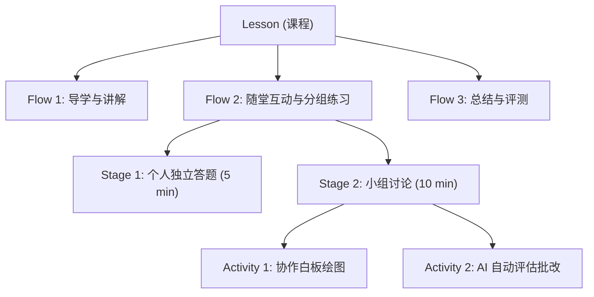
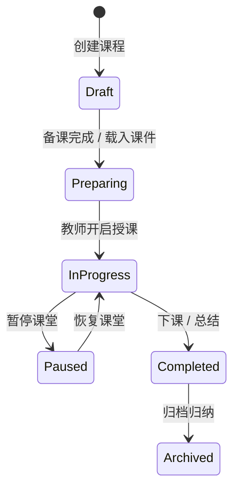

# Lesson Runtime 课程引擎

Lesson Runtime（`packages/core/lesson-engine/`）是 OpenLearn V2 教学流程编排的核心引擎，管理从备课、授课到课后分析的全生命周期状态流转。

---

## 领域模型与层级关系

课程（Lesson）遵循四层分层结构：

```
Lesson (课程)
 └── Flow (教学流)
      └── Stage (教学阶段 / 环节)
           └── Activity (教学活动)
```



---

## 核心类型定义 (`lesson-engine/index.ts`)

```typescript
export interface Lesson {
  id: string;
  title: string;
  subject: string;
  grade: string;
  flows: Flow[];
  createdAt: number;
  updatedAt: number;
}

export interface Flow {
  id: string;
  name: string;
  stages: Stage[];
}

export interface Stage {
  id: string;
  title: string;
  durationMinutes: number;
  activities: Activity[];
}

export interface Activity {
  id: string;
  type: string;
  title: string;
  config: ActivityConfig;
}
```

---

## 课程生命周期状态机


