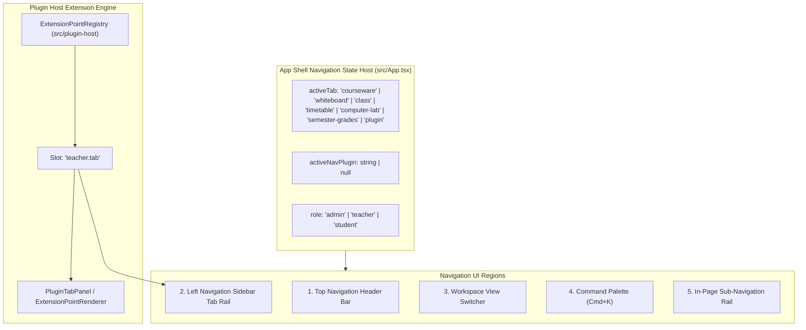
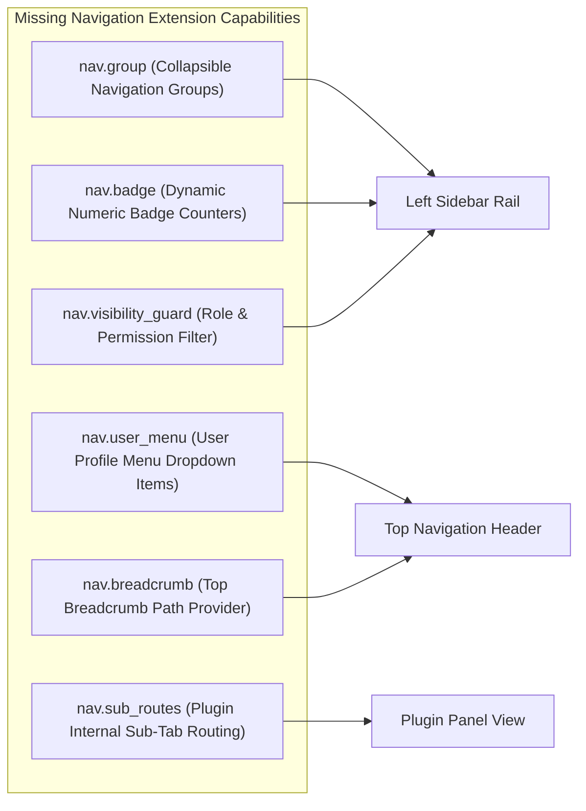
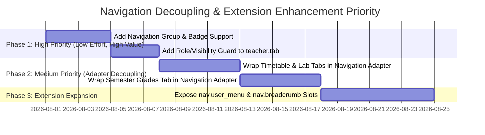

# Navigation Audit Report

**Title**: OpenLearn V2 PF-02 Navigation System Audit  
**Author**: Chief Platform Architect  
**Date**: July 24, 2026  
**Status**: Completed (Architecture Frozen; Repository Analysis Only)

---

## 1. Executive Summary

This report delivers a thorough architectural audit of the **OpenLearn V2 Navigation System (PF-02)** across `src/App.tsx`, `src/plugin-host/`, `src/features/`, and `src/components/`.

The current navigation implementation provides a functional single-page workspace shell driven by React state (`activeTab`, `activeNavPlugin`, `role`). While it successfully supports plugin-contributed tabs via the `teacher.tab` extension slot, the navigation system relies on direct hardcoded component imports and string-based tab switching inside `src/App.tsx`.

This report documents the current navigation architecture, maps the platform navigation tree, evaluates existing vs. missing extension capabilities, audits business coupling, and details a minimal adapter-based migration roadmap without modifying any production source code.

---

## 2. Current Navigation Architecture

The OpenLearn V2 navigation system operates as a **state-driven Application Shell Navigation Engine** hosted in `src/App.tsx`.



### Key Navigation Component Layers

1. **State Manager**: `src/App.tsx` manages `activeTab` string state, `activeNavPlugin` ID state, and `role` permission state.
2. **Left Navigation Rail**: Renders vertical icon tabs. Contains hardcoded icons for built-in tabs and dynamically maps items registered under `teacher.tab` in `usePluginHostStore`.
3. **View Router**: Renders appropriate panel based on `activeTab`. If `activeTab === 'plugin'`, delegates rendering to `PluginTabPanel` (`src/App.tsx` L15-49).
4. **Command Palette**: `src/features/command-palette/` provides keyboard-driven (`Cmd+K`) quick search and navigation.

---

## 3. Platform Navigation Tree

The overall navigation hierarchy across all platform roles is structured as follows:

```
OpenLearn V2 Navigation Tree
├── 🌐 Top Header Bar (Global Controls)
│   ├── Platform Logo & Brand Title
│   ├── Role Switcher Dropdown [Admin | Teacher | Student]
│   ├── Language Toggle [zh | en]
│   ├── Notification Bell Drawer
│   └── User Profile & Avatar Menu
│
├── 📑 Left Navigation Sidebar Rail
│   ├── 📁 Courseware Hub (`activeTab = 'courseware'`)
│   ├── 🎨 Whiteboard Canvas (`activeTab = 'whiteboard'`)
│   ├── 👥 Live Classroom Monitor (`activeTab = 'class'`)
│   ├── 📅 Timetable Manager (`activeTab = 'timetable'`)
│   ├── 💻 Computer Lab Manager (`activeTab = 'computer-lab'`)
│   ├── 📊 Semester Grades (`activeTab = 'semester-grades'`)
│   └── 🧩 Plugin Contributions (`activeTab = 'plugin'`, `activeNavPlugin = id`)
│       ├── Registered Plugin Tab 1 (Slot: teacher.tab)
│       └── Registered Plugin Tab N (Slot: teacher.tab)
│
├── 🖥️ Workspace Interior Navigation
│   ├── Lesson Editor Sub-Rail (Palette ↔ Timeline Rail)
│   └── Courseware File Tree Navigation
│
└── ⌨️ Command Palette Modal (Cmd+K Global Shortcuts)
```

---

## 4. Existing Navigation Extension Points

Plugin navigation extensions are managed by `ExtensionPointRegistry` (`src/plugin-host/extension-points.ts`) and `usePluginHostStore` (`src/plugin-host/plugin-host-store.ts`).

### Supported Navigation Slot: `teacher.tab`

```typescript
// Plugin registration invocation (Worker Thread API)
ctx.ui.registerExtensionPoint('teacher.tab', {
  id: 'my-custom-analytics',
  label: '分析看板',
  icon: 'BarChart2',
  component: MyAnalyticsPanelComponent,
  position: 10,
  pluginId: 'ext-analytics',
});
```

### Rendering Pipeline in `src/App.tsx`

```tsx
// src/App.tsx (L15-49) — PluginTabPanel Component
function PluginTabPanel({ activeNavPlugin }: { activeNavPlugin: string | null }) {
  const extensionPoints = usePluginHostStore(state => state.extensionPoints);
  const tabs = extensionPoints.get('teacher.tab' as any) || [];
  const activeTab = tabs.find(t => t.pluginId === (activeNavPlugin || tabs[0]?.pluginId));

  return (
    <div className="flex-1 flex flex-col min-h-0">
      <div className="flex-1 overflow-auto">
        {activeTab?.component ? (
          <activeTab.component renderType="panel" />
        ) : (
          <DOMExtensionWrapper ext={activeTab} slot="teacher.tab" slotProps={{ renderType: 'panel' }} />
        )}
      </div>
    </div>
  );
}
```

---

## 5. Missing Navigation Extension Points

Although `teacher.tab` enables adding sidebar tabs, several key navigation features cannot currently be extended by plugins declaratively.

### Navigation Capabilities Gap Matrix



| Missing Extension Feature | Target Navigation Area | Impact / Missing Functionality | Proposed API Signature |
|---|---|---|---|
| **Navigation Groups (`nav.group`)** | Left Sidebar Rail | Cannot group tabs into sections (e.g. "Teaching", "Admin", "Plugins"). | `group?: 'teaching' \| 'admin' \| 'extensions'` |
| **Dynamic Badges (`nav.badge`)** | Left Sidebar Rail Tabs | Cannot show unread notifications or pending grading count on tab icons. | `badge?: () => number \| string` |
| **Visibility Guard (`nav.visibility_guard`)** | All Navigation Tabs | Cannot restrict tab visibility declaratively by role or permission. | `rolesAllowed?: ('admin' \| 'teacher' \| 'student')[]` |
| **User Menu Items (`nav.user_menu`)** | Top Header User Dropdown | Plugins cannot contribute items to the top-right user menu. | `slot: 'nav.user_menu', { id, label, onClick }` |
| **Breadcrumb Provider (`nav.breadcrumb`)** | Top Header / Workspace | No unified breadcrumb bar for deep navigation paths (e.g. Course > Lesson > Activity). | `slot: 'nav.breadcrumb', { getPath() }` |
| **Sub-route Routing (`nav.sub_routes`)** | Plugin Panel Interior | Plugin internal sub-tabs cannot hook into URL or platform tab router. | `routes?: { path: string, component }[]` |

---

## 6. Business Coupling Audit in Navigation

Navigation in `src/App.tsx` is tightly coupled to specific built-in business features.

### Hardcoded Dependencies Identification

1. **Hardcoded Tab Identifiers**: `src/App.tsx` relies on hardcoded string literals: `'courseware'`, `'whiteboard'`, `'class'`, `'timetable'`, `'computer-lab'`, `'semester-grades'`.
2. **Direct Component Imports**:
   - `import { TimetableManager } from './components/TimetableManager';`
   - `import { ComputerLabManager } from './components/ComputerLabManager';`
   - `import { SemesterGradeManager } from './components/SemesterGradeManager';`
   - `import { CoursewareHubPanel } from './features/teacher/CoursewareHubPanel';`
3. **Hardcoded Render Conditionals**:
   ```tsx
   // Hardcoded branch in App.tsx
   {activeTab === 'timetable' && <TimetableManager />}
   {activeTab === 'computer-lab' && <ComputerLabManager />}
   {activeTab === 'semester-grades' && <SemesterGradeManager />}
   ```

### Decoupling Strategy

Instead of hardcoding tab strings and importing components directly into `src/App.tsx`, navigation items should be declared through a unified `NavigationProvider` or `ExtensionRegistry` during platform activation.

---

## 7. Pluginization Opportunities & Priority Matrix

All current navigation entries have been audited and categorized into a Core vs. Plugin Matrix:

### Navigation Core vs. Plugin Matrix

| Navigation Item | Current Status | Proposed Classification | Rationale |
|---|---|---|---|
| **App Shell Header & User Menu** | Hardcoded | 🏛️ **Core Platform** | System infrastructure and global identity. |
| **Courseware Tab** | Hardcoded | 🔌 **Official Plugin** (`ext_courseware_hub`) | File asset management; should be registered via Navigation Provider. |
| **Whiteboard Tab** | Hardcoded | 🏛️ **Core Platform** | Fundamental teaching canvas navigation. |
| **Live Classroom Monitor Tab** | Hardcoded | 🏛️ **Core Platform** | Core real-time classroom orchestration. |
| **Timetable Manager Tab** | Hardcoded | 🔌 **Official Plugin** (`prov_timetable`) | School schedule manager; should be a `teacher.tab` plugin. |
| **Computer Lab Manager Tab** | Hardcoded | 🔌 **Official Plugin** (`prov_lab_manager`) | Lab station manager; should be a `teacher.tab` plugin. |
| **Semester Grade Manager Tab** | Hardcoded | 🔌 **Official Plugin** (`prov_grade_manager`) | Grading analytics; should be a `teacher.tab` plugin. |

### Navigation Decoupling Priority Matrix



---

## 8. Recommended Minimal Changes & Non-Breaking Adapters

To achieve complete navigation extensibility while preserving frozen production code, the following **minimal `NavigationProvider` adapter interface** is recommended:

```typescript
// Proposed Navigation Item Specification (Non-breaking extension)
export interface INavigationItem {
  id: string;
  group?: 'core' | 'teaching' | 'management' | 'analytics' | 'extension';
  label: string;
  icon: string;
  position?: number;
  badge?: number | string;
  rolesAllowed?: ('admin' | 'teacher' | 'student')[];
  component: React.ComponentType<any>;
}
```

### Summary of Benefits

1. **Zero-Breaking Change**: Built-in tabs can be registered using this adapter at system startup without changing existing state logic.
2. **Unified Rendering**: `src/App.tsx` can iterate over `NavigationProvider.getItems()` instead of maintaining 40+ hardcoded conditional `activeTab === 'xxx'` branches.
3. **Complete Plugin Control**: Plugins gain full capabilities to contribute grouped, badged, and permission-guarded navigation items.
