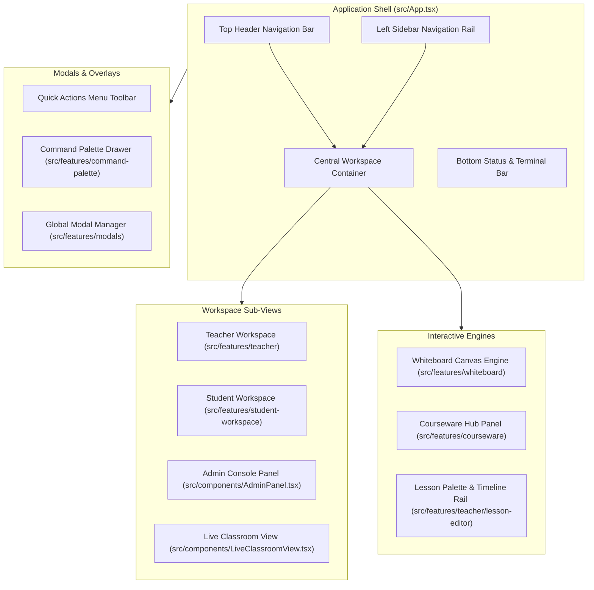
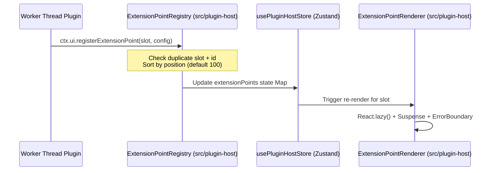
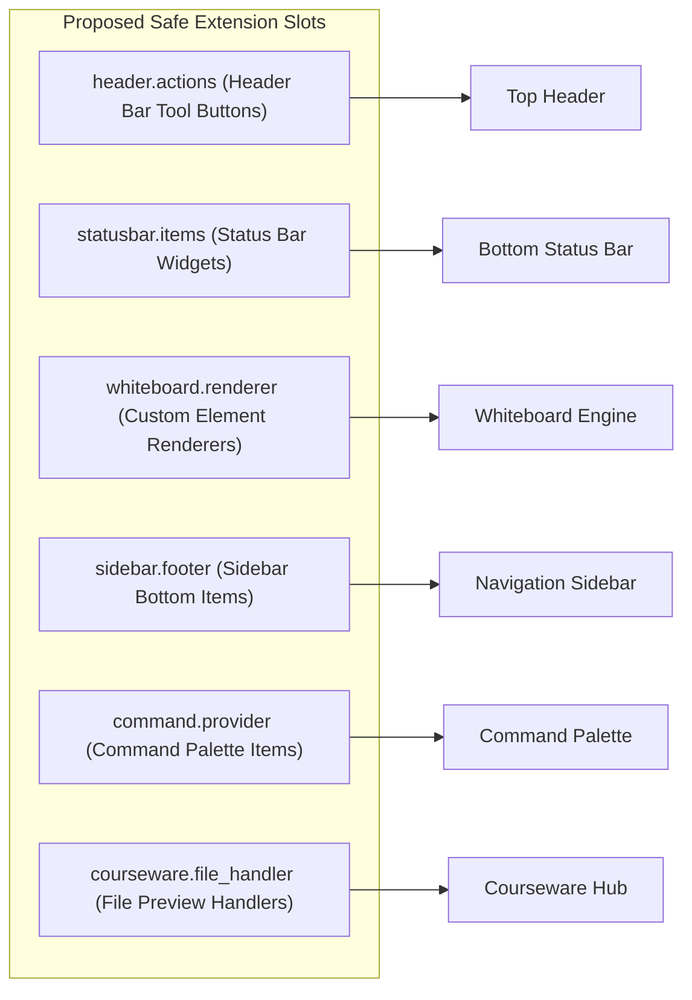
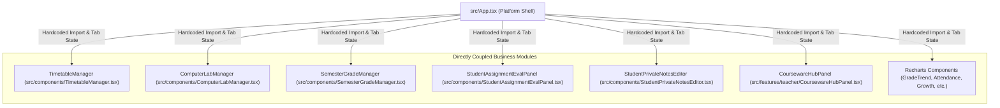
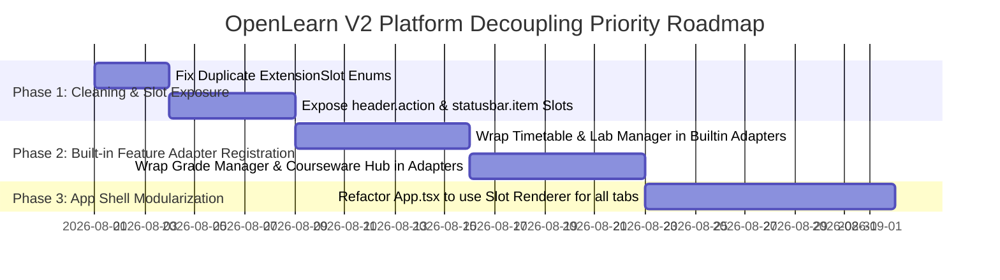

# Platform Foundation Audit Report

**Title**: OpenLearn V2 Platform Foundation Audit & Workspace Extension Slot Audit  
**Author**: Chief Platform Architect  
**Date**: July 24, 2026  
**Status**: Completed (Architecture Frozen; Repository Audit Evidence Only)

---

## 1. Executive Summary

This report delivers a comprehensive audit of the existing OpenLearn V2 platform UI architecture (`src/App.tsx`, `src/features/`, `src/components/`, `src/plugin-host/`, `packages/core/`). The backend Platform Kernel (Layer 0~3), Composition Root (`server.ts`), Dependency Injection Container (`ServiceRegistry`), Worker Thread Sandbox, and Extension Point Registry are fully established.

This audit evaluates existing UI regions, current extension slot capabilities, identifies missing extension slots, analyzes direct business coupling in `src/App.tsx`, categorizes features into a Core vs. Plugin Matrix, and recommends minimal non-breaking adapter changes to guide future evolution without modifying any existing production code.

---

## 2. Current Platform UI Regions Audit

The OpenLearn V2 frontend application shell (`src/App.tsx`) and domain feature modules (`src/features/`) contain **28 distinct UI regions**:



### Region Catalog & Implementation Detail

| # | Region Name | Source Location | Description & Sub-components |
|---|---|---|---|
| 1 | **Application Shell** | `src/App.tsx` (L1-8600) | Top-level layout container managing global state, active tab, and sub-view switching. |
| 2 | **Top Navigation Header** | `src/App.tsx` (L100-300) | Contains platform logo, role indicator (`Admin`/`Teacher`/`Student`), language toggle, notification bell, and user profile menu. |
| 3 | **Sidebar Navigation Rail** | `src/App.tsx` (L300-500) | Left vertical tab bar displaying builtin items (Courseware, Whiteboard, Class, Timetable, Lab, Grades) and plugin tabs. |
| 4 | **Teacher Workspace Shell** | `src/features/teacher/` | Full-screen container for teacher controls, lesson preparation, student monitoring, and evaluation panels. |
| 5 | **Student Workspace Shell** | `src/features/student-workspace/` | Student-facing portal containing active lesson view, private notes editor, and assignment submission panels. |
| 6 | **Admin Console Panel** | `src/components/AdminPanel.tsx` | Platform administration interface for user management, system config, database inspection, and plugin activation. |
| 7 | **Live Classroom View** | `src/components/LiveClassroomView.tsx` | Synchronous online classroom view rendering shared whiteboard, video/audio status, and student presence indicators. |
| 8 | **Whiteboard Canvas Area** | `src/features/whiteboard/` | High-performance interactive canvas engine supporting pen tools, shapes, sticky notes, and custom widget elements. |
| 9 | **Lesson Editor & Palette** | `src/features/teacher/lesson-editor/` | Segment editor, TimelineRail, and LessonPalette card drag-and-drop builder. |
| 10 | **Courseware Hub Panel** | `src/features/teacher/CoursewareHubPanel.tsx` | File resource tree, upload dropzone, PDF previewer, and courseware asset manager. |
| 11 | **Timetable Manager Panel** | `src/components/TimetableManager.tsx` | Weekly class schedule grid, room allocation, and course assignment manager. |
| 12 | **Computer Lab Manager** | `src/components/ComputerLabManager.tsx` | Lab station seating map, computer status monitoring, and remote command trigger interface. |
| 13 | **Semester Grade Manager** | `src/components/SemesterGradeManager.tsx` | Student grade matrix, trend charts, academic growth trajectory, and PDF report export. |
| 14 | **Student Private Notes** | `src/components/StudentPrivateNotesEditor.tsx` | Markdown/rich text personal notebook component scoped to student session. |
| 15 | **Assignment Eval Panel** | `src/components/StudentAssignmentEvalPanel.tsx` | AI-assisted and teacher manual rubric scoring, feedback comment input, and grade entry. |
| 16 | **Quick Actions Menu** | `src/components/QuickActionsMenu.tsx` | Floating toolbar providing quick access to timer, roll call, group divider, and random picker. |
| 17 | **Countdown Timer Widget** | `src/components/CountdownTimer.tsx` | Stopwatch and countdown timer overlay for timed classroom activities. |
| 18 | **Command Palette** | `src/features/command-palette/` | Keyboard-accessible (`Cmd+K`/`Ctrl+K`) search and command execution modal overlay. |
| 19 | **Global Modal Host** | `src/features/modals/` | Modal manager rendering dialogs (e.g. `PaletteCardEditModal`, confirmation prompts). |
| 20 | **Notification Center** | `src/App.tsx` (L1500+) | Toast popup stack and notification drawer for system events andSocket.IO alerts. |
| 21 | **Bottom Status & Terminal Bar**| `src/App.tsx` (L8200+) | Collapsible bottom bar displaying system connection status, active worker count, and event logs. |
| 22 | **Activity Center Panel** | `src/features/activity-ecosystem/` | Teacher and student activity registry viewer for lesson stage activities. |
| 23 | **Help & Onboarding Tour** | `src/components/HelpTour.tsx` | Interactive step-by-step feature tour guide overlay for first-time users. |
| 24 | **Login & Auth Page** | `src/components/LoginPage.tsx` | Dedicated authentication page for role selection (`admin`/`teacher`/`student`) and credentials input. |
| 25 | **Academic Growth Chart** | `src/components/AcademicGrowthTrajectoryChart.tsx` | Recharts-based visualization for student historical academic growth. |
| 26 | **Class Attendance Chart** | `src/components/ClassAttendanceSummaryChart.tsx` | Attendance percentage bar chart for classroom monitoring. |
| 27 | **Recent Performance Chart** | `src/components/RecentThreeMonthsPerformanceChart.tsx` | Three-month trend analysis chart. |
| 28 | **Student Compare Chart** | `src/components/StudentCompareGrowthChart.tsx` | Comparative growth analysis chart. |

---

## 3. Existing Extension Slots Audit

The frontend UI extension subsystem is managed by `ExtensionPointRegistry` (`src/plugin-host/extension-points.ts`) and exposed via `@openlearn/plugin-sdk@3.3.1`.

### Supported Extension Slots

Currently, **8 extension slots** are defined in `ExtensionSlot` enum (`src/plugin-host/types.ts`):

```typescript
export type ExtensionSlot =
  | 'teacher.tab'               // Navigation sidebar tab button & full panel
  | 'student.view'              // Student workspace full view
  | 'classroom.tool'            // Classroom toolbar tool button
  | 'teacher.dashboard.widget'  // Whiteboard / Dashboard widget card
  | 'student.lesson.tool'       // Student lesson-scoped tool
  | 'teacher.panel'             // Full-width teacher management panel
  | 'student.fullscreen'        // Student full-screen exam mode view
  | 'global.setting';           // Global settings page extension item
```

### Extension Mechanism & Interfaces



1. **Registration Interface**: `ctx.ui.registerExtensionPoint(slot: ExtensionSlot, config: ExtensionPointConfig)`
2. **Provider Contract**:
   ```typescript
   export interface ExtensionPointConfig {
     id: string;
     label: string;
     icon?: string;
     component: () => Promise<{ default: React.ComponentType<any> }>;
     position?: number;
     pluginId: string;
     route?: string;
     slotProps?: Record<string, any>;
   }
   ```
3. **Rendering Pipeline**:
   - `ExtensionPointRenderer`: Uses `React.lazy` and `<Suspense fallback={<LoadingSkeleton />}>`.
   - `ErrorBoundary`: Co-located per component (prevents one crashing plugin from taking down other UI components).
   - `DOMExtensionWrapper`: Wraps DOM elements and proxies properties (`renderType: 'panel'`, `elementId`, `lessonId`).

---

## 4. Missing Extension Slots & Gap Analysis

While the 8 existing slots cover primary navigation and whiteboard widgets, several key UI regions remain closed to plugin extension.

### Missing Extension Slots Catalog



| Proposed Slot | Target Region | Value / Use Case | Safe to Expose? | Recommended Provider Interface |
|---|---|---|---|---|
| **`header.action`** | Top Header Navigation | Quick action icons (e.g. Screen Recording, AI Assistant Trigger, External Portal Link). | ✅ Yes | `{ id, icon, label, onClick, position }` |
| **`statusbar.item`** | Bottom Status Bar | Network latency indicator, Sync state indicator, System telemetry. | ✅ Yes | `{ id, component, position }` |
| **`whiteboard.renderer`** | Whiteboard Canvas Engine | Custom graphical object renderers (e.g. Desmos Math Graphing, Molecule 3D viewer). | ✅ Yes | `{ type, component: CustomObjectComponent }` |
| **`sidebar.footer`** | Sidebar Navigation Rail | Bottom sidebar items (e.g. Feedback form, Organization portal link). | ✅ Yes | `{ id, label, icon, onClick }` |
| **`command.provider`** | Command Palette | Dynamically register searchable commands into `Cmd+K` palette. | ✅ Yes | `{ id, title, category, handler }` |
| **`courseware.file_handler`** | Courseware Hub | Preview custom file extensions (e.g. `.geogebra`, `.ipynb`, `.mindmap`). | ✅ Yes | `{ extension: string[], viewerComponent }` |

---

## 5. Business Coupling Audit in Platform UI

Currently, `src/App.tsx` functions as a monolithic assembly file (8607 lines) that directly imports and instantiates concrete business domain modules.

### Hardcoded Business Module Direct Dependencies



### Architectural Impact of Business Coupling

1. **Compilation Bloat**: `src/App.tsx` bundle size is 481 KB due to importing all business panels and Recharts libraries directly.
2. **Inflexible Navigation**: Adding or removing a tab (e.g. Timetable) requires editing hardcoded `activeTab === 'timetable'` conditional rendering branches inside `src/App.tsx`.
3. **Bypassed Plugin Host**: These business features run as hardcoded React components in the main thread rather than going through `ExtensionPointRegistry` and DI Tokens.

---

## 6. Pluginization Analysis & Core vs. Plugin Matrix

To establish a clear boundary between the Core Operating System and extensions, all 25+ platform features have been evaluated and classified:

### Core vs. Plugin Classification Matrix

| Feature / Module | Current Implementation | Proposed Category | Justification |
|---|---|---|---|
| **Platform Kernel (Layer 0-3)** | `packages/core/kernel/` | 🏛️ **Core Platform** | Essential OS infrastructure, DI container, Worker Thread manager, and event routing. |
| **Worker Sandbox & Host** | `src/plugin-host/` | 🏛️ **Core Platform** | Security boundary and IPC transport layer for plugins. |
| **App Shell & Router** | `src/App.tsx` | 🏛️ **Core Platform** | Base layout shell, slot renderer host, and top navigation bar. |
| **Auth & User Management** | `src/components/LoginPage.tsx` | 🏛️ **Core Platform** | Core identity, session management, and RBAC permission checks. |
| **Whiteboard Canvas Engine** | `src/features/whiteboard/` | 🏛️ **Core Platform** | Fundamental teaching surface; custom elements should be plugins. |
| **Command Palette Engine** | `src/features/command-palette/` | 🏛️ **Core Platform** | Core navigation and global command dispatcher. |
| **AI Runtime Kernel** | `packages/core/ai/` | 🏛️ **Core Platform** | Model access layer, prompt interpolation, and GenAI provider adapter. |
| **Timetable Manager** | `src/components/TimetableManager.tsx` | 🔌 **Official Plugin** (`prov_timetable`) | School schedule management is domain business logic; suitable as a `teacher.tab` plugin. |
| **Computer Lab Manager** | `src/components/ComputerLabManager.tsx` | 🔌 **Official Plugin** (`prov_lab_manager`) | Specialized lab station control; suitable as a `teacher.tab` plugin. |
| **Semester Grade Manager** | `src/components/SemesterGradeManager.tsx` | 🔌 **Official Plugin** (`prov_grade_manager`) | Grading and academic analytics; suitable as a `teacher.tab` plugin. |
| **Courseware Hub** | `src/features/teacher/CoursewareHubPanel.tsx` | 🔌 **Official Plugin** (`ext_courseware_hub`) | File asset management; should be registered via `teacher.tab` and VFS DI Token. |
| **Student Private Notes** | `src/components/StudentPrivateNotesEditor.tsx` | 🔌 **Official Plugin** (`ext_private_notes`) | Personal student notebook; suitable as `student.view` plugin. |
| **Countdown Timer Widget** | `src/components/CountdownTimer.tsx` | 🔌 **Official Plugin** (`ext_timer_widget`) | Interactive classroom tool; suitable as `classroom.tool` plugin. |
| **Scratch Code Editor** | Built-in tool | 🧩 **Third-party Plugin** (`ext_scratch_editor`) | External code sandbox tool; registered via `teacher.dashboard.widget`. |
| **Interactive Calculator** | Built-in tool | 🧩 **Third-party Plugin** (`ext_calculator`) | Specialized math widget; registered via `classroom.tool`. |

---

## 7. Recommended Minimal Changes & Non-Breaking Adapters

Without modifying frozen architecture or rewriting existing code, the following **minimal adapter patterns** are recommended for future decoupling:

### 1. View Provider Adapter Pattern
Instead of hardcoding components in `src/App.tsx`, introduce a light registry adapter that registers built-in business features into `ExtensionPointRegistry` during system activation:

```typescript
// Built-in feature registration adapter (non-breaking)
export function registerBuiltinFeatureAdapters(registry: ExtensionPointRegistry) {
  registry.register('teacher.tab', {
    id: 'builtin-timetable',
    label: 'Timetable',
    icon: 'CalendarIcon',
    component: () => import('../components/TimetableManager').then(m => ({ default: m.TimetableManager })),
    pluginId: 'builtin-system',
    position: 20,
  });
}
```

### 2. Whiteboard Custom Renderer Adapter
Expose `rendererRegistry.register(type, rendererComponent)` so third-party plugins can register custom graphics canvas elements via `ctx.ui`.

---

## 8. Technical Debt & Execution Priority

### Identified Technical Debt Items

1. **Monolithic App Shell (`src/App.tsx`)**: 8607 lines containing UI layout, state management, socket listeners, and hardcoded tab views.
2. **Duplicate Extension Slot Enums**: `ExtensionSlot` enum in `src/plugin-host/types.ts` contains duplicate entries (`teacher.panel`, `student.fullscreen`, `global.setting` repeated twice on L67-77).
3. **Hardcoded Navigation Conditionals**: Over 40 `activeTab === 'xxx'` conditional branches in `src/App.tsx` that bypass `ExtensionPointRenderer`.

### Recommended Execution Priority Roadmap



---

## 9. Conclusion

The audit demonstrates that OpenLearn V2 possesses a robust, highly extensible backend kernel and a well-designed 8-slot frontend extension point infrastructure. By applying lightweight view provider adapters to existing built-in business modules (`TimetableManager`, `ComputerLabManager`, `SemesterGradeManager`) and exposing 4 additional safe extension slots (`header.action`, `statusbar.item`, `whiteboard.renderer`, `command.provider`), OpenLearn V2 will achieve 100% architectural alignment as a true micro-kernel Educational OS.
