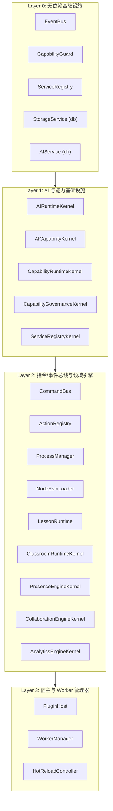

# Platform Kernel 架构全景

OpenLearn V2 的平台内核（Platform Kernel）位于 `packages/core/kernel/index.ts`，是整个 Educational OS 的核心抽象与资源调配枢纽。

---

## 内核初始化分层 (Layer 0 ~ Layer 3)

Platform Kernel 在构造函数中按严格依赖顺序进行 4 层递进初始化：



---

## 核心组件定义

### 1. `Kernel` 类属性与接口
`Kernel` 类导出了底层核心服务的引用：

```typescript
export class Kernel {
  public readonly eventBus: EventBus;
  public readonly commandBus: CommandBus;
  public readonly actionRegistry: ActionRegistry;
  public readonly capabilityGuard: CapabilityGuard;
  public readonly processManager: ProcessManager;
  public readonly esmLoader: NodeEsmLoader;
  public readonly db: Database;
  public readonly serviceRegistry: ServiceRegistry;
  public readonly storageService: StorageService;
  public readonly aiService: AIService;
  public readonly pluginHost: PluginHost;
  public readonly workerManager: WorkerManager;
  public readonly lessonRuntime: LessonRuntime;
  public readonly classroomRuntime: ClassroomRuntimeKernel;
  public readonly presenceEngine: PresenceEngineKernel;
  public readonly collaborationEngine: CollaborationEngineKernel;
  public readonly analyticsEngine: AnalyticsEngineKernel;
  public readonly aiRuntime: AIRuntimeKernel;
  public readonly aiCapability: AICapabilityKernel;
  public readonly capabilityFrameworkRuntime: CapabilityRuntimeKernel;
  public readonly capabilityGovernance: CapabilityGovernanceKernel;
  public readonly platformServiceRegistryKernel: ServiceRegistryKernel;
  public readonly ready: Promise<void>;
}
```

### 2. 单例暴露与 Container 导出
为确保全局共享唯一的 Kernel 实体与组合根容器，`packages/core/kernel/index.ts` 暴露了单例与注册导引：

```typescript
export const kernel = new Kernel();
export const kernelContainer = kernel.serviceRegistry;
```

---

## 内核生命周期与 Ready 机制

`kernel.ready` 是一个全局 `Promise<void>`，用于追踪系统加载状态：
1. **构建就绪阶段**: 完成 Layer 0 ~ Layer 3 实例构建与依赖注入 Token 绑定。
2. **插件激活阶段**: 自动加载内置插件（`BuiltinPlugin`, `VfsPlugin`, `ProcessPlugin`, `ManagementPlugin`, `AiPlannerPlugin`, `AiSubmitInjectorPlugin`, `AssignmentEvalPlugin`）。
3. **完成阶段**: 触发 `kernel.ready` 解析，通知 Composition Root (`server.ts`) 启动 HTTP 与 WebSockets 服务。
