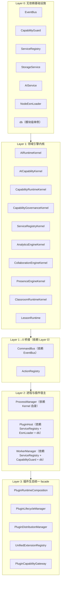

# Platform Kernel 架构全景

> 📌 **本文为唯一真源**：`docs/core/platform-kernel.md` 旧版（2026-07-24）已废弃删除，内容以本文为准。

OpenLearn V2 的平台内核（Platform Kernel）位于 `packages/core/kernel/index.ts`，是整个 Educational OS 的核心抽象与资源调配枢纽。该文件同时定义了 `Kernel` 类与全局单例 `kernelContainer`。

---

## 内核初始化分层 (Layer 0 ~ Layer 3)

`Kernel` 构造函数按严格依赖顺序进行 4 层递进初始化。**注意：分层是代码注释中的设计意图，实际构造顺序即下表顺序。**


```mermaid
graph TD
    subgraph Layer0["Layer 0: 无依赖基础设施"]
        L0_1["EventBus"]
        L0_2["CapabilityGuard"]
        L0_3["ServiceRegistry"]
        L0_4["StorageService"]
        L0_5["AIService"]
        L0_6["NodeEsmLoader"]
        L0_7["db（模块级单例）"]
    end

    subgraph Layer1["Layer 1: 领域引擎内核"]
        L1_1["AIRuntimeKernel"]
        L1_2["AICapabilityKernel"]
        L1_3["CapabilityRuntimeKernel"]
        L1_4["CapabilityGovernanceKernel"]
        L1_5["ServiceRegistryKernel"]
        L1_6["AnalyticsEngineKernel"]
        L1_7["CollaborationEngineKernel"]
        L1_8["PresenceEngineKernel"]
        L1_9["ClassroomRuntimeKernel"]
        L1_10["LessonRuntime"]
    end

    subgraph Layer1B["Layer 1→0 桥接（依赖 Layer 0）"]
        L1B_1["CommandBus（依赖 EventBus）"]
        L1B_2["ActionRegistry"]
    end

    subgraph Layer2["Layer 2: 进程与插件宿主"]
        L2_1["ProcessManager（依赖 Kernel 自身）"]
        L2_2["PluginHost（依赖 ServiceRegistry + EsmLoader + db）"]
        L2_3["WorkerManager（依赖 ServiceRegistry + CapabilityGuard + db）"]
    end

    subgraph Layer3["Layer 3: 插件生态统一 facade"]
        L3_1["PluginRuntimeComposition"]
        L3_2["PluginLifecycleManager"]
        L3_3["PluginDistributionManager"]
        L3_4["UnifiedExtensionRegistry"]
        L3_5["PluginCapabilityGateway"]
    end

    Layer0 --> Layer1
    Layer1 --> Layer1B
    Layer1B --> Layer2
    Layer2 --> Layer3
```

构造完成后，`Kernel` 构造函数还依次执行三件事（均**不在**上面的分层图内）：

1. **DI Token 注册** —— 向 `serviceRegistry` 注册 **29 个** Token（`this.serviceRegistry.register(...)`，见 §3）。
2. **命令总线拦截器** —— `commandBus.setInterceptor(...)`，承担 JSON Schema 校验、`CapabilityGuard` 权限检查与高危人工审批（见 [plugin-capability-matrix](../reference/plugin-capability-matrix.md)）。
3. **`ready` 赋值** —— `this.ready = this.bootstrapSystemPlugins()`（见 §4）。

---

## 核心组件定义

### 1. `Kernel` 类公开属性

`Kernel` 类共暴露 **29 个 `public readonly` 属性**（下表按声明顺序），以及 1 个公开方法 `initAuditLog()`。

| # | 属性 | 类型 | 层 |
| - | ---- | ---- | -- |
| 1 | `eventBus` | `EventBus` | 0 |
| 2 | `commandBus` | `CommandBus` | 1→0 |
| 3 | `actionRegistry` | `ActionRegistry` | 1→0 |
| 4 | `capabilityGuard` | `CapabilityGuard` | 0 |
| 5 | `processManager` | `ProcessManager` | 2 |
| 6 | `esmLoader` | `NodeEsmLoader` | 0 |
| 7 | `db` | `Database`（`packages/core/db/index.ts` 的 `db` 单例） | 0 |
| 8 | `serviceRegistry` | `ServiceRegistry`（`packages/core/di/service-registry.ts`） | 0 |
| 9 | `storageService` | `StorageService` | 0 |
| 10 | `aiService` | `AIService` | 0 |
| 11 | `pluginHost` | `PluginHost` | 2 |
| 12 | `workerManager` | `WorkerManager` | 2 |
| 13 | `pluginRuntimeComposition` | `PluginRuntimeComposition` | 3 |
| 14 | `pluginLifecycleManager` | `PluginLifecycleManager` | 3 |
| 15 | `pluginDistributionManager` | `PluginDistributionManager` | 3 |
| 16 | `unifiedExtensionRegistry` | `UnifiedExtensionRegistry` | 3 |
| 17 | `capabilityRegistry` | `CapabilityRegistry`（取自 `aiCapability.registry`，非新实例） | 3 |
| 18 | `pluginCapabilityGateway` | `PluginCapabilityGateway` | 3 |
| 19 | `lessonRuntime` | `LessonRuntime` | 1 |
| 20 | `classroomRuntime` | `ClassroomRuntimeKernel` | 1 |
| 21 | `presenceEngine` | `PresenceEngineKernel` | 1 |
| 22 | `collaborationEngine` | `CollaborationEngineKernel` | 1 |
| 23 | `analyticsEngine` | `AnalyticsEngineKernel` | 1 |
| 24 | `aiRuntime` | `AIRuntimeKernel` | 1 |
| 25 | `aiCapability` | `AICapabilityKernel` | 1 |
| 26 | `capabilityFrameworkRuntime` | `CapabilityRuntimeKernel` | 1 |
| 27 | `capabilityGovernance` | `CapabilityGovernanceKernel` | 1 |
| 28 | `platformServiceRegistryKernel` | `ServiceRegistryKernel` | 1 |
| 29 | `ready` | `Promise<void>` | — |

**公开方法**：`initAuditLog()` —— 订阅 `eventBus` 的 `'*'` 通配事件，把每个事件写入 SQLite `events` 表（`packages/core/kernel/index.ts` 的 `initAuditLog`）。

**私有方法**：`bootstrapSystemPlugins()`、`migratePluginsToFilesystem()`。

> ❌ **`HotReloadController` 不是 `Kernel` 的公开属性。**
> 它在构造函数末尾的 `if (process.env.NODE_ENV === 'development')` 分支中作为**局部变量** `const hotReload = new HotReloadController(this.pluginHost, watchDir)` 创建，并通过 `pluginHost.setHotReloadController(hotReload)` 注入 `PluginHost`。类本身来自 `packages/core/plugin-host/hot-reload.ts`。生产构建下该分支不执行。

> ❌ **不存在 `export const kernel = new Kernel()`。**
> 模块只导出 `Kernel` 类与 `kernelContainer` 一个单例（见 §2）。

### 2. 单例暴露：`kernelContainer` 是懒加载 Proxy

`packages/core/kernel/index.ts` 的单例导出**不是** `new Kernel()` 的直接结果，而是一个 **`Proxy` 包装的懒加载单例**：

```typescript
// Singleton export - Lazy evaluated via Proxy to prevent instant creation during test imports
let _kernelContainer: Kernel | undefined;
export const kernelContainer = new Proxy({} as Kernel, {
  get(target, prop, receiver) {
    if (!_kernelContainer) {
      _kernelContainer = new Kernel();
      _kernelContainer.initAuditLog();
    }
    return Reflect.get(_kernelContainer, prop, receiver);
  },
  set(target, prop, value, receiver) {
    if (!_kernelContainer) {
      _kernelContainer = new Kernel();
      _kernelContainer.initAuditLog();
    }
    return Reflect.set(_kernelContainer, prop, value, receiver);
  },
});
```

设计要点：

- **首次属性读或写才构造** `Kernel`（getter 与 setter 两个 trap 各自判断 `_kernelContainer`）。这避免了测试 / 工具脚本仅 `import { kernelContainer }` 时就触发整个 OS 内核（含 SQLite 建表、插件引导）的副作用。
- **首次构造后自动调用** `initAuditLog()`，即事件审计日志的开启被绑定在"第一次有人真正碰这个单例"这一时刻。
- `kernelContainer` 的**类型是 `Kernel`**，属性访问会被直接转发到真实实例——所以 `kernelContainer.commandBus` 与 `new Kernel().commandBus` 语义一致。
- **⚠️ 它与 `kernel.serviceRegistry` 无关。** `ServiceRegistry` 只是 `Kernel` 的一个公开属性（第 8 项），是 DI 容器的注册表，不是内核单例本身。
- ⚠️ 代理对象**不是** `Kernel` 的真实实例：`instanceof Kernel` 对它不成立，且 JSON 序列化 / 展开运算符会得到空对象。需要真实实例请访问其任一属性触发构造，或直接 `new Kernel()`（不推荐，会绕过审计日志初始化）。

---

## 内核生命周期与 Ready 机制

`kernel.ready` 是一个 `Promise<void>`，在构造函数中赋值给 `bootstrapSystemPlugins()` 的返回值。`bootstrapSystemPlugins()` 内部顺序如下：

### 1. 旧插件迁移到文件系统

先执行私有的 `migratePluginsToFilesystem()`：把 `plugins` 表中 `source_code != ''` 的历史插件源码落盘到 `plugins/{id}/index.js` 与同目录的 manifest JSON，并清空 `source_code`、回填 `file_path`。该迁移是**幂等**的（目标文件已存在则只回填 DB）。

### 2. 系统关键插件引导（7 个）

按下列顺序逐个「确保 `plugins` 表有记录 → `pluginHost.registerPreloadedPlugin` → `pluginHost.activatePlugin`」：

| 顺序 | 插件 id | 导出符号（`packages/plugins/`） | critical |
| ---- | ------- | ------------------------------- | -------- |
| 1 | `@openlearn/plugin-vfs` | `VfsPlugin`（`packages/plugins/vfs.ts`） | ✅ |
| 2 | `@openlearn/plugin-process` | `ProcessPlugin`（`packages/plugins/process.ts`） | ✅ |
| 3 | `@openlearn/plugin-management` | `ManagementPlugin`（`packages/plugins/management.ts`） | ✅ |
| 4 | `@openlearn/plugin-builtin` | `BuiltinPlugin`（`packages/plugins/builtin.ts`） | ✅ |
| 5 | `@openlearn/plugin-ai-planner` | `AiPlannerPlugin`（`packages/plugins/ai-planner.ts`） | ❌ |
| 6 | `@openlearn/plugin-ai-submit-injector` | `AiSubmitInjectorPlugin`（`packages/plugins/ai-submit-injector.ts`） | ❌ |
| 7 | `@openlearn/plugin-assignment-eval` | `AssignmentEvalPlugin`（`packages/plugins/assignment-eval.ts`） | ❌ |

`critical: true` 的插件引导失败会 **rethrow**，导致 `bootstrapSystemPlugins()` 的 `.catch` 触发 `process.exit(1)` 硬崩溃；`critical: false` 的插件失败只 `console.warn` 软失败。

> 第三方 ZIP 插件的自动播种在源码中**已被显式禁用**（注释：只保留系统核心插件，第三方插件须经 App Store 手动上传）。

### 3. 恢复其他已激活插件

最后调用 `pluginHost.restoreActivePlugins()`，把 `plugins` 表中其余 `status = 'active'` 的 ESM 插件重新激活。该步失败只打日志，不影响 `ready` 解析。

### 4. 组合根（Composition Root）消费 `ready`

`server.ts` 等待 `kernelContainer.ready` 解析后，才启动 Express HTTP 服务与 Socket.IO。

---

## 统计口径

- `Kernel` 公开 `readonly` 属性：**29** 项；公开方法：**1** 项（`initAuditLog`）。
- 构造函数内 `serviceRegistry.register(...)` 注册的 DI Token：**29** 个。
- `bootstrapSystemPlugins()` 引导的系统插件：**7** 个（4 critical + 3 soft-fail）。
- Kernel 文件 `packages/core/kernel/index.ts` 行数：584。

> 统计截至 commit `a11b99b`。
