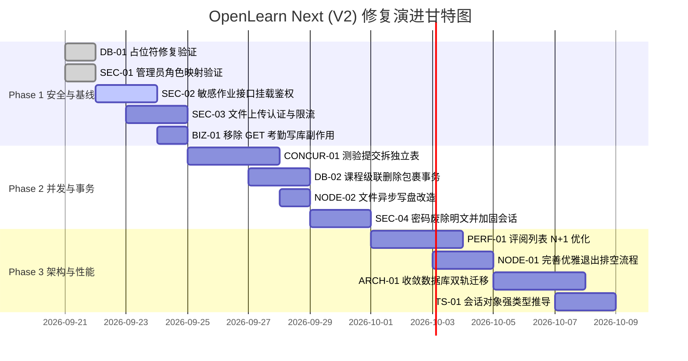

# OpenLearn Next (V2) 架构审计后续修补与优化路线图

> **项目名称**：OpenLearn Next (V2) 全栈教学操作系统 (`openlearn-next@0.3.21`)  
> **制定时间**：2026-09-21  
> **依据规范**：基于《Node.js 在线学习项目代码质量审计报告》确定的 11 项核心缺陷与技术债务  
> **核心原则**：渐进式修复（先安全与数据完整性，次并发与事务，后性能与架构治理）、向后兼容、零大爆炸重构、单点闭环验证。

---

## 路线图全景概览 (Roadmap Matrix)

| 阶段 (Phase) | 周期定位 | 核心目标 | 包含任务 ID | 风险等级 | 交付物 (Deliverables) |
|---|---|---|---|---|---|
| **Phase 1** | **安全基线与阻断性修复** (立即实施) | 阻断越权与匿名文件写入风险，纠正 GET 查询写库副作用，固化已修复 P0/P1 | `DB-01`(已固化), `SEC-01`(已固化), `SEC-02`, `SEC-03`, `BIZ-01` | P0 / P1 (高) | 5 个端点安全拦截器、只读考勤接口、鉴权单元测试 |
| **Phase 2** | **并发控制与事务一致性** (短期演进) | 根治全班同时交卷写覆盖竞争，对多表级联操作引入原子事务，异步化文件写入 | `CONCUR-01`, `DB-02`, `NODE-02`, `SEC-04` | P1 / P2 (中) | 测验关系表迁移脚本、事务级课程操作、异步写盘、并发压力测试 |
| **Phase 3** | **架构治理与性能优化** (中长期维护) | 消除 N+1 数据库排队，完善容器平滑退出生命周期，收敛双轨数据库迁移 | `PERF-01`, `NODE-01`, `ARCH-01`, `TS-01`, `ENG-01` | P2 / P3 (低) | 批量查询联表重构、排空退出控制器、统一迁移基线、强类型定义 |



---

## Phase 1: 安全基线加固与关键运行时缺陷修复

> **目标**：彻底消除系统对公网裸露的数据泄露通道、匿名写盘漏洞与非幂等数据污染，保障核心教学功能零崩溃。

---

### 任务 1.1: 敏感作业批改与学生互评端点挂载鉴权 (`SEC-02`)

- **影响文件**：
  - `/server/routes/lessons.ts` (行 151, 170, 234, 253)
  - `/server/routes/assignments.ts` (行 183)
- **当前现状**：
  以下 5 个端点无任何中间件保护，外网直接拉取敏感数据：
  1. `GET /api/lessons/:lessonId/eval-submissions`
  2. `GET /api/lessons/:lessonId/eval-grades`
  3. `GET /api/eval-submissions/:submissionId/reviews`
  4. `GET /api/lessons/:lessonId/students/:studentId/eval-status`
  5. `GET /api/assignments/:id/submissions`
- **改动步骤**：
  1. 在端点前挂载 `requireAuth('teacher', 'administrator', 'student')`；
  2. 针对学生身份增加 IDOR 水平越权过滤：
     - 若 `session.role === 'student'`，仅允许请求 `studentId === session.userId` 的状态，若查询他人记录则返回 `403 Forbidden`。
- **改动代码对照**：
  ```diff
  - app.get('/api/lessons/:lessonId/eval-grades', (req, res) => {
  + app.get('/api/lessons/:lessonId/eval-grades', requireAuth('teacher', 'administrator'), (req, res) => {
  ```
- **验证标准**：未携带 Cookie 发起 GET 请求返回 401；学生账号查询其他学生成绩返回 403。

---

### 任务 1.2: 公共文件上传接口安全加固 (`SEC-03`)

- **影响文件**：`/server/routes/os.ts` (行 30-55)
- **当前现状**：`POST /api/upload` 允许匿名上传最高 10MB Base64 课件文件。
- **改动步骤**：
  1. 在路由入口增加 `requireAuth('teacher', 'administrator')`；
  2. 增加基于 IP 与会话的限流（例如 `uploadLimiter: 20req/min`）；
  3. 强化扩展名白名单校验（仅允许 `.pptx`, `.pdf`, `.png`, `.jpg`, `.mp4`），杜绝 `.html`, `.js`, `.sh` 等可执行文件上传；
  4. 规整存储路径防止目录穿越攻击（Path Traversal）。
- **验证标准**：匿名请求返回 401；尝试上传非受信任后缀（如 `.exe`, `.svg`）返回 400 Bad Request。

---

### 任务 1.3: 剔除 GET 考勤查询中的写库副作用 (`BIZ-01`)

- **影响文件**：`/server/routes/grading.ts` (行 46-81)
- **当前现状**：`GET /api/classes/:classId/attendance-summary` 当无排课时，利用 `Math.random()` 伪造过去 30 天的排课和考勤记录强行 `INSERT` 入库。
- **改动步骤**：
  1. 删除循环生成随机数据的代码块（Lines 50-74）；
  2. 当查询为空时，返回统计空结果：`{ dates: [], studentStats: [], overallRate: 0 }`；
  3. 前端对应图表组件增加「暂无考勤数据」空状态占位展示。
- **验证标准**：连续发起 10 次 GET 请求，数据库 `schedules` 与 `attendance` 表行数保持不变。

---

### Phase 1 验收检查清单 (Definition of Done)
- [ ] 运行 `npm run lint` 保持 0 错误。
- [ ] 新增或更新 API 测试用例：验证未登录访问拦截与合法教师登录放行。
- [ ] 生产打包 `npm run build` 成功。

---

## Phase 2: 并发控制、数据一致性与事务保障

> **目标**：解决全班学生并发交卷时的严重写覆盖缺陷，为核心多表联动操作引入原子事务，全面保障教学业务数据资产的完整性。

---

### 任务 2.1: 随堂测验提交存储解耦与原子化重构 (`CONCUR-01`)

- **影响文件**：
  - `/migrations/006_lesson_quiz_submissions.sql` (新增迁移)
  - `/server/routes/lessons.ts` (行 561-588)
- **当前现状**：
  学生交卷直接反序列化 `whiteboard_elements.data` JSON 字符串并在内存赋值后整行写回，并发交卷产生严重 Lost Update。
- **改动步骤**：
  1. **新建关系型数据表**：
     ```sql
     CREATE TABLE IF NOT EXISTS lesson_quiz_submissions (
       lesson_id TEXT NOT NULL,
       element_id TEXT NOT NULL,
       student_id TEXT NOT NULL,
       answer TEXT NOT NULL,
       score INTEGER NOT NULL,
       submitted_at INTEGER NOT NULL,
       PRIMARY KEY (element_id, student_id)
     );
     CREATE INDEX IF NOT EXISTS idx_lqs_lookup ON lesson_quiz_submissions(lesson_id, element_id);
     ```
  2. **重写提交端点** (`POST /api/lessons/:id/quiz-submit`)：
     改为原子性的 `INSERT INTO ... ON CONFLICT DO UPDATE`，彻底消除内存对象覆写。
  3. **向后兼容读取**：
     在查询测验结果时，优先从 `lesson_quiz_submissions` 读取；若为空则降级兼容历史 JSON 数据。
- **验证标准**：使用 Vitest 启动 `Promise.all` 模拟 50 个学生并发交卷，数据库精准落库 50 条记录，0 丢失。

---

### 任务 2.2: 课程级联删除与克隆操作事务封装 (`DB-02`)

- **影响文件**：`/server/routes/lessons.ts` (行 700-706, 764-790)
- **当前现状**：连续调用 5 次独立的 `prepare().run()` 执行级联删除或克隆，中途出错会导致孤儿记录产生。
- **改动步骤**：
  使用 `better-sqlite3` 提供的原生事务机制包裹执行：
  ```ts
  const deleteLessonTransaction = kernelContainer.db.transaction((lessonId: string) => {
    kernelContainer.db.prepare('DELETE FROM whiteboard_elements WHERE lesson_id = ?').run(lessonId);
    kernelContainer.db.prepare('DELETE FROM student_lesson_progress WHERE lesson_id = ?').run(lessonId);
    kernelContainer.db.prepare('DELETE FROM schedules WHERE lesson_id = ?').run(lessonId);
    kernelContainer.db.prepare('DELETE FROM assignments WHERE lesson_id = ?').run(lessonId);
    return kernelContainer.db.prepare('DELETE FROM lessons WHERE id = ?').run(lessonId);
  });
  ```
- **验证标准**：在删除中间人为注入异常，验证所有表均被完整回滚（Rollback），未产生脏数据。

---

### 任务 2.3: 文件上传改用异步写盘 (`NODE-02`)

- **影响文件**：`/server/routes/os.ts` (行 49)
- **改动内容**：将 `fs.writeFileSync(filePath, fileBuffer)` 替换为 `await fs.promises.writeFile(filePath, fileBuffer)`，避免大文件上传阻塞 Node.js 主事件循环。

---

### 任务 2.4: 认证凭据与会话注销加固 (`SEC-04`)

- **影响文件**：`/server/routes/roster.ts`
- **改动内容**：
  1. 废除未加密明文密码登录的向下兼容回退，强制所有学生密码在首次激活时哈希化；
  2. 修复注销会话中过于宽泛的 `session_data LIKE ?` 匹配，改为精准比对 `session.id`。

---

## Phase 3: 架构治理、性能调优与长效演进

> **目标**：治理代码坏味道，提升数据库在高负载场景下的响应吞吐量，规整底层迁移脚本，消除潜在系统技术债务。

---

### 任务 3.1: 批改列表与互评 N+1 查询批量化优化 (`PERF-01`)

- **影响文件**：`/server/routes/lessons.ts` (行 184-212)
- **当前现状**：`for (const sub of submissions)` 循环内单条查 reviews 和 grade，50 份提交引发 101 次数据库查询。
- **改动方案**：
  采用 SQL `IN (?)` 批量拉取所有关联 reviews 与 grades，并在 Node.js 内存中利用 `Map<submissionId, Review[]>` 进行 O(1) 关联组装。
- **验证标准**：总 SQL 查询次数从 `1 + 2N` 恒定降为 `3` 次，大幅削减 DB 锁等待时间。

---

### 任务 3.2: 完善进程平滑关闭与连接排空 (`NODE-01`)

- **影响文件**：`/server.ts` (行 518-540)
- **改动方案**：
  在 `startServer()` 导出清理句柄，在接收到 `SIGTERM` / `SIGINT` 时严格按序执行：
  1. `httpServer.close()`：停止接受新请求，等待处理中请求返回；
  2. `io.close()`：平稳断开协同白板客户端；
  3. 终止后台所有活动的 Worker 线程；
  4. 执行 `db.pragma('wal_checkpoint(TRUNCATE)')` 将 WAL 刷回主库；
  5. 调用 `db.close()` 释放文件排他锁并退出进程。

---

### 任务 3.3: 统一数据库版本化迁移基线 (`ARCH-01`)

- **影响文件**：`/packages/core/db/index.ts`, `/server/utils/migrate.ts`
- **改动方案**：
  将 `packages/core/db/index.ts` 中分散的 20 余处 `try/catch ALTER TABLE` 和内联 `CREATE TABLE` 彻底收敛，统一编制为带版本号的 `migrations/00X_xxx.sql` 脚本，由系统启动时通过 `_migrations` 表统一有序调度。

---

### 任务 3.4: 严格化会话对象强类型推导 (`TS-01`)

- **影响文件**：`/server/middleware/auth.ts`, `/src/types.ts`
- **改动方案**：
  废弃 `getValidSession(): any` 的类型逃逸，定义强类型接口 `EduSession` 与权限枚举 `UserRole = 'administrator' | 'teacher' | 'student'`，提供类型收窄保护。

---

## 阶段验收与测试保障机制

每个 Phase 在合并或部署前，必须严格完成以下四道门禁：

1. **类型检查门禁**：
   ```bash
   pnpm lint  # 执行 tsc --noEmit，必须 0 报错
   ```
2. **单元测试门禁**：
   ```bash
   pnpm test  # 执行 Vitest 套件，重点保障 auth、courseware、lessons 测试 100% 通过
   ```
3. **架构漂移门禁**：
   ```bash
   bash audit-tools/run.sh  # 确认 docs facts 与 code facts 维持 drift_count = 0
   ```
4. **全仓编译门禁**：
   ```bash
   pnpm build  # 前端 Vite 产物与后端 esbuild 单文件打包成功
   ```

---

*路线图文件已生成并入库，可通过系统控制台或指定接口一键下载归档。*
