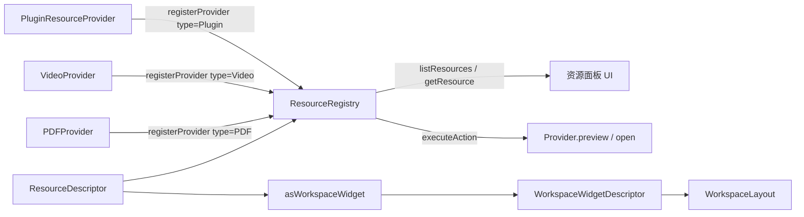

# Teaching Resource Runtime 架构说明

OpenLearn V2 的 **Teaching Resource Runtime**（Sprint P3-01）位于 `src/features/resource-runtime/`，是前端教学资源（PDF / PPT / 视频 / Notebook / Mermaid / GeoGebra 等）的统一注册与适配中心，将任意教学资源转换成 Workspace 控件。

---

## 整体定位

Teaching Resource Runtime 在前端架构中扮演**教学资源与 Workspace 之间的桥梁**：

```
教学资源 (ResourceDescriptor) ─► ResourceRegistry ─► Provider 行为 ─► WorkspaceWidgetDescriptor
                                       ▲
                                       │
                              Plugin / 业务模块 registerProvider()
```

所有教学资源（13 种 ResourceType）通过 `ResourceRegistry` 统一注册和访问。`ResourceProvider` 负责"如何预览/打开/工具栏/右键菜单"的实际行为，registry 根据资源类型自动选择对应 provider。

`asWorkspaceWidget()` 适配器把任何 `ResourceDescriptor` 转为 `WorkspaceWidgetDescriptor`，使其能直接嵌入 Workspace 布局。

---

## 核心数据结构

### ResourceType（13 种资源类型）

```typescript
export type ResourceType =
  | 'PDF' | 'PPT' | 'Image' | 'Video' | 'Markdown' | 'Notebook'
  | 'Mermaid' | 'MindMap' | 'GeoGebra' | 'Blockly' | 'Scratch'
  | 'HTML' | 'Plugin';
```

### ResourceDescriptor（不可变资源描述符）

```typescript
export interface ResourceDescriptor {
  readonly id: string;
  readonly title: string;
  readonly type: ResourceType;
  readonly url?: string;
  readonly content?: unknown;
  pinned?: boolean;            // 可变：pin() 操作翻转
  favorited?: boolean;         // 可变：favorite() 操作翻转
  readonly metadata?: Record<string, unknown>;
}
```

### ResourceProvider（行为提供者）

```typescript
export interface ResourceProvider {
  readonly id: string;
  readonly type: ResourceType;  // 每个 provider 只服务一种 type
  preview?:  (resource: ResourceDescriptor) => unknown;
  open?:     (resource: ResourceDescriptor) => unknown;
  toolbar?:  (resource: ResourceDescriptor) => unknown;
  contextMenu?: (resource: ResourceDescriptor) => unknown;
}
```

### ResourceAction（7 种可执行动作）

```typescript
export type ResourceAction =
  | 'preview' | 'open' | 'pin' | 'favorite'
  | 'annotate' | 'share' | 'fullscreen';
```

---

## 组件关系



---

## 核心 API

### ResourceRegistry

双 `Map` 存储：

| 存储 | Key | Value | 方法 |
|---|---|---|---|
| `providers` | `ResourceType` | `ResourceProvider` | `registerProvider` / `unregisterProvider` / `getProvider` |
| `resources` | `resourceId` | `ResourceDescriptor` | `registerResource` / `unregisterResource` / `getResource` / `listResources` |

### `executeAction()` 行为矩阵

| action | 有 provider 行为 | 无 provider 行为（fallback） |
|---|---|---|
| `preview` | `provider.preview(resource)` | `{ previewUrl: resource.url }` |
| `open` | `provider.open(resource)` | `{ openUrl: resource.url }` |
| `pin` | — | 翻转 `resource.pinned`，返回 `{ pinned }` |
| `favorite` | — | 翻转 `resource.favorited`，返回 `{ favorited }` |
| `annotate` | — | `{ annotate: true, resourceId, params }` |
| `share` | — | `{ shareUrl: resource.url ?? "resource://<id>" }` |
| `fullscreen` | — | `{ fullscreen: true, resourceId }` |

**关键点**：`pin` / `favorite` 是 registry 自身副作用（修改 `ResourceDescriptor` 字段），不需要 provider。`preview` / `open` 优先调用 provider，未注册 provider 时退化为 URL 返回。

---

## Workspace 适配：`asWorkspaceWidget`

```typescript
export const asWorkspaceWidget = (
  resource: ResourceDescriptor,
  targetRegion: WorkspaceRegionType = 'CenterWorkspace',
): WorkspaceWidgetDescriptor;
```

把任意 `ResourceDescriptor` 转成 Workspace 控件描述符：

- `id`：`widget_res_<resourceId>`
- `name`：`<title> (<type>)`
- `componentName`：`ResourceViewer_<type>`（如 `ResourceViewer_PDF`）
- `region`：默认 `CenterWorkspace`，可重定向到其他区域

这意味着所有 13 种资源的**统一 Workspace 挂载点**就是 `ResourceViewer_<type>` 组件——具体实现由对应 provider/组件完成。

---

## 插件贡献协议

```typescript
// 注册一个自定义 Video provider
const reg = container.resolve(RESOURCE_REGISTRY_TOKEN);
reg.registerProvider({
  id: 'my-plugin.video-provider',
  type: 'Video',
  preview: (res) => ({ previewUrl: res.url, customOverlay: true }),
  open: (res) => ({ openUrl: res.url + '?autoplay=1' }),
  toolbar: (res) => ['loop', 'speed', 'subtitles'],
});

// 卸载
reg.unregisterProvider('my-plugin.video-provider');
```

`registerProvider` 校验：`provider.id` 和 `provider.type` 都必须存在，否则抛 `ResourceRegistry Error`。

---

## 在 Layer-2 中的位置

参考 [`platform-kernel.md`](./platform-kernel.md) Layer 2_6 节点。Teaching Resource Runtime 是**前端独有的协作领域引擎**，与 Interaction Runtime、Classroom Runtime 平行存在。

| 维度 | Teaching Resource | Interaction | Classroom |
|---|---|---|---|
| 作用层 | 资源-UI 适配层 | 事件归一化层 | 业务编排层 |
| 状态 | 资源条目可变 | Focus/Selection 状态可变 | 9 阶段状态机 |
| 跨域 | 仅前端 | 仅前端 | 跨前后端 |
| Provider 模型 | 每 type 一个 provider | 每 handler 一个 id | 每 service 一个 id |

---

## 约束与不变量

1. **Provider 与 Resource 是正交维度**：`providers` 按 type 索引，`resources` 按 id 索引；一个 resource 通过 `resource.type` 找到 provider。
2. **Provider type 必须合法**：注册时会隐式校验 `provider.type` 必须是 13 种之一。
3. **`executeAction` 默认值**：未注册 provider 的 type 仍可执行 `preview` / `open`（fallback 到 URL），其他 5 个 action 不依赖 provider。
4. **`pin` / `favorite` 是 in-place 修改**：直接修改 `ResourceDescriptor` 上的可变字段，不是不可变更新。
5. **`listResources(type?)` 返回冻结数组**：调用方不能修改返回值。
6. **`asWorkspaceWidget` 不验证 provider**：纯转换，假设目标 `ResourceViewer_<type>` 组件已注册。

---

## 相关源码

- `src/features/resource-runtime/resource-types.ts`（40 行）— 类型契约
- `src/features/resource-runtime/resource-registry.ts`（89 行）— 注册中心 + executeAction
- `src/features/resource-runtime/resource-widget-adapter.ts`（24 行）— Workspace 适配
- `src/features/resource-runtime/index.ts`（7 行）— 桶导出

合计 160 行 / 4 文件。
