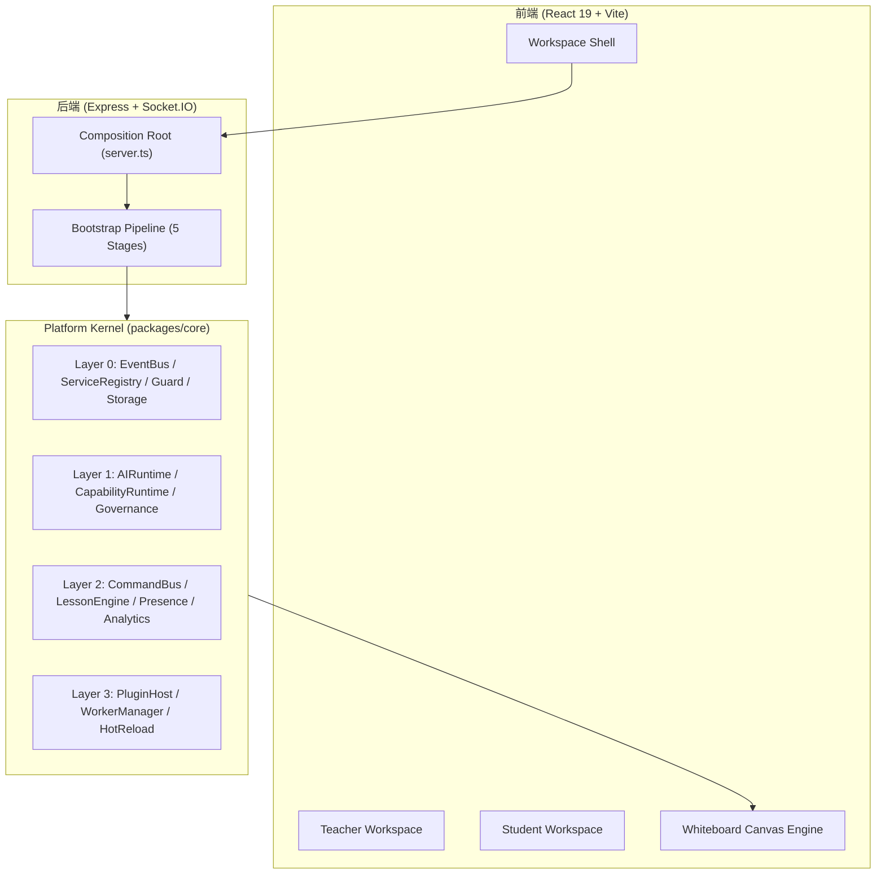

# 平台系统架构全景 (System Overview)

OpenLearn V2 架构遵循“微内核 + 插件化微前端”的设计思想。

---

## 全景架构图

---

## 核心设计标准

1. **绝对组合根原则**: 所有的服务实例与依赖均在组装根中显式解析，零隐式全局依赖。
2. **Worker 沙箱隔离**: 插件运行于 Node.js 独立 Worker Thread 进程，确保宿主应用安全稳定性。
3. **点对点事件与指令**: CQRS 模式下，写指令使用 CommandBus，状态变更通知使用 EventBus。
