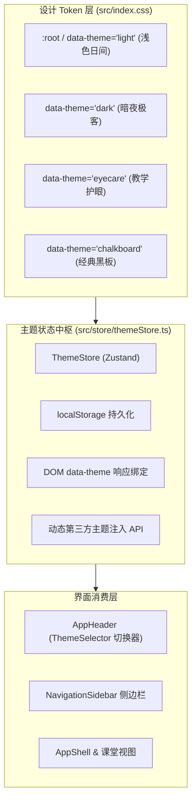

# 现代教育 OS 主题系统 (Theming System Engine)

OpenLearn V2 采用基于 **Tailwind CSS v4 CSS 变量第一公民** 的设计 Token 体系，为平台提供具备零运行时性能开销、针对课堂教学场景定制的多主题换肤引擎。

---

## 1. 架构总览 (Architecture Overview)



---

## 2. 内置四大教学主题预设

| 主题 ID | 主题名称 | 设计意图与采光场景 | 主色与背景规范 |
|---|---|---|---|
| `light` | **浅色日间 (Light)** | 明亮通透，适合白天自然采光充足的标准教室 | 极简灰白底 (`#f8fafc`) + 教学蓝调 (`#4f46e5`) |
| `dark` | **暗夜极客 (Dark)** | 深邃抗暗光，适合计算机房、编程教学与夜间专注备课 | 深曜黑底 (`#0b0f19`) + 极客靛蓝 (`#6366f1`) |
| `eyecare` | **教学护眼 (EyeCare)** | 柔和微暖绿，针对中小学电子白板与交互大屏防眩光设计 | 舒缓柔绿底 (`#f2f7f4`) + 森林墨绿 (`#2d6a4f`) |
| `chalkboard` | **经典黑板 (Chalkboard)** | 沉浸式粉笔黑板质感，为教师提供熟悉的传统板书氛围 | 传统墨绿底 (`#0e1713`) + 清晰粉笔绿 (`#4caf50`) |

---

## 3. 设计 Token 与实用工具类

在 `src/index.css` 中暴露核心语义实用类，组件无需硬编码色值：
- **背景层级**: `bg-app`（应用底色）、`bg-surface`（主卡片/面板）、`bg-surface-secondary`（次级容器）、`bg-surface-elevated`（悬浮浮层）
- **文字层级**: `text-main`（主文本）、`text-muted`（次要文字）、`text-subtle`（弱化提示文字）
- **边框层级**: `border-theme`（标准边框）、`border-theme-subtle`（细弱分割线）
- **品牌交互**: `bg-primary-theme`（主色）、`bg-primary-theme-light`（浅色高亮背景）、`text-primary-theme`（主色文字）

---

## 4. 插件自定义主题扩展机制

平台支持插件或第三方学校机构动态注册专属主题：
```typescript
import { useThemeStore } from './store/themeStore';

useThemeStore.getState().registerTheme(
  {
    id: 'school-custom',
    label: '名校专属·墨蓝金',
    description: '校企定制主题',
    previewBg: '#0f172a',
    previewPrimary: '#f59e0b',
    category: 'plugin',
    pluginId: '@ext/custom-theme',
  },
  {
    '--bg-app': '#0f172a',
    '--bg-surface': '#1e293b',
    '--color-primary': '#f59e0b',
  }
);
```
当插件卸载时，调用 `unregisterTheme(id)`，系统自动清理动态注入的样式标签并安全回滚至默认主题。

---

## 5. 白板渲染引擎与教学工作区深度联动 (Whiteboard & Workspace Synergy)

在 Phase 2 中，主题系统深入连接交互白板渲染管线与教学工作流：

### 5.1 白板主题渲染令牌 (`theme-manager.ts`)
白板渲染引擎原生支持 `light`, `dark`, `eyecare`, `chalkboard` 四组专属 Tokens：
- **`background`**: 画布底色与容器背景联动（例如黑板模式呈现经典深墨绿 `#0e1713`）。
- **`gridDot`**: 极坐标与微网格参考点自适应变色（例如黑板模式下点阵呈现淡绿微光 `#2d5242`）。
- **`pen` / `text`**: 笔触与文本高对比度智能判断。针对暗黑模式与黑板模式，自动反转历史黑色墨迹为粉笔白（`#f8fafc`），杜绝黑底黑字视障问题。
- **自定义令牌订阅**: `themeManager.registerCustomTokens()` 与 `themeManager.subscribe()` 支持第三方白板插件自定义图形与笔迹高对比度滤镜。

### 5.2 白板控件与视图容器全面语义化
- **悬浮工具栏 (`WhiteboardToolbar`)**: 选取、画笔、几何图形、荧光笔色盘与网格开关接入 `--color-primary` 与 `--bg-surface`。
- **分页导航胶囊 (`WhiteboardPageBar`)**: 底部分页器、缩略图大纲抽屉与右键菜单统一遵循主题语义类名。
- **课堂主视图**:
  - `LiveClassroomView`: 步骤时间轴、互动反馈流、学生专注力监控环与课件轨迹分析模态框全面支持 4 套教学主题。
  - `LessonEditorView`: 课程编辑器、工具调色板 (`LessonPalette`) 与空状态均无缝换肤。
  - `StudentView`: 学生端工作台、白板交互面板与大纲面板完全统一视觉语言。

