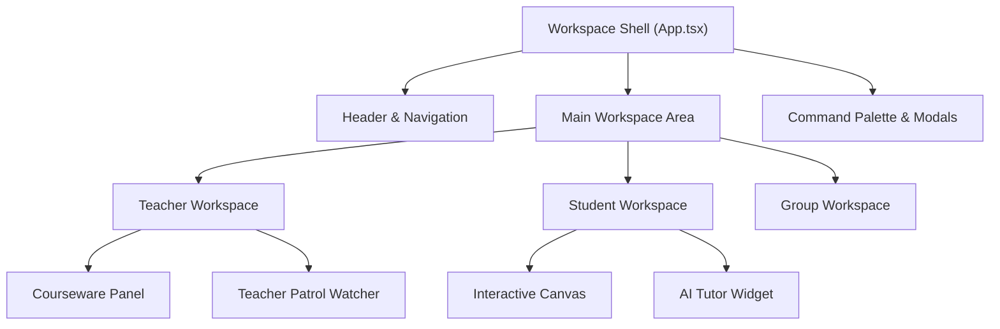

# Workspace Runtime 工作区与 Shell

Workspace 引擎位于 `src/features/` 与前端 Zustand Store 层，提供了针对教师（Teacher Workspace）、学生（Student Workspace）和小组（Group Workspace）的多视口工作区框架。

---

## 核心架构与 Shell 布局

OpenLearn V2 的前端页面采用多视口响应式 Workspace 布局管理器：

- **Teacher Workspace**: 提供课程流程控制面板、学生状态巡视看板（Teacher Patrol）、AI 助教推流工具与白板主控制台。
- **Student Workspace**: 提供互动白板、实时答题卡、随堂笔记面板与 AI 学习伴侣。
- **Group Workspace**: 小组协作视口，支持小组内部对象锁定、实时协同与同步状态共享。



---

## Widget 插件扩展点 (Workspace Widget Guide)

第三方插件可通过扩展点向 Workspace 注入自定义面板（Teacher Tab, Student Lesson Tool, Dashboard Widget）：

```typescript
export interface TeacherTabConfig {
  id: string;
  title: string;
  icon: string;
  component: string; // 插件内导出的 React UI 元素
}
```
